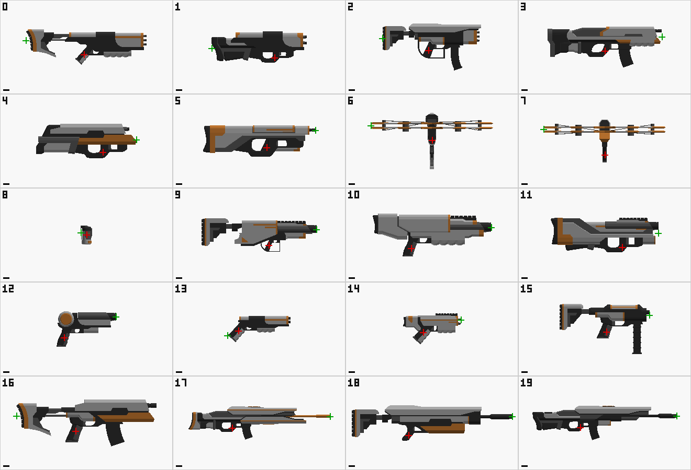
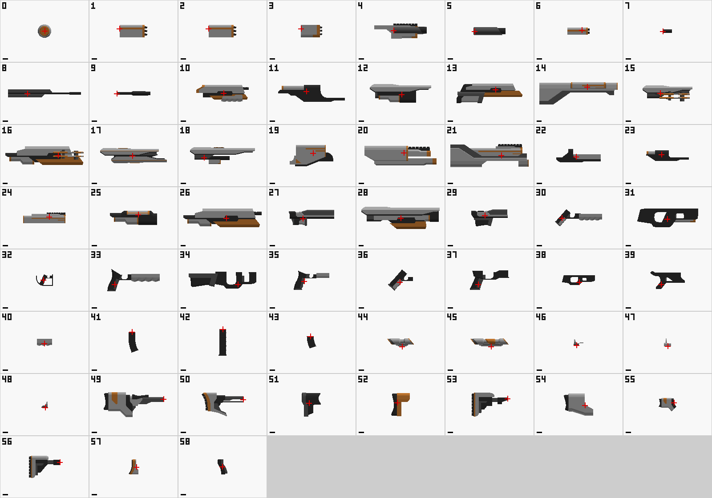

# 09. 에셋 적용 절차 (총기 모델 · 소켓 · 프리팹 · WeaponData)

> **성격**: [08-무기시스템구현기록.md](08-무기시스템구현기록.md) 6장에 남은 에셋·프리팹·그래픽 작업을 실제로 진행하기 위한 **절차서**다. 새로 받은 총기 에셋(`Guns`, `Modular Parts`)의 분석 결과를 함께 담는다.
> **선행 조건**: 무기 스크립트 커밋 `2a25c3a` (08번)
> **작성 일자**: 2026-09-13

## 한눈에 보는 순서

| 단계 | 작업 | 산출물 | 커밋 |
|---|---|---|---|
| 0 | 폴더 정리, Unity 첫 실행 | 스크립트 `.meta` | ✔ 롤백 지점 |
| 1 | FBX 임포트 설정, 공용 재질 | `Assets/GunPack/` | ✔ |
| 2 | 손 소켓 생성 | `WeaponSocket_R` | |
| 3 | 무기·드론 프리팹 | `Assets/Prefabs/Weapons/` | ✔ |
| 4 | WeaponData 에셋 | `Assets/Scripts/Data/Weapons/` | |
| 5 | Player.prefab 연결 | `WeaponController` | ✔ |
| 6 | 소켓 정렬 + 소총 회귀 테스트 | 소켓 값 확정 | ✔ |
| 7 | 다중 무기·스왑·드론 테스트 | — | |
| 8 | 마무리 (선택) | 풀 등록, 이펙트, 애니메이션 | |

**6단계까지가 필수**다. 6단계에서 기존 소총과 똑같이 동작하는 것을 확인한 뒤에 다음 단계로 넘어간다.

### 자동 실행 도구 (`Assets/Editor/WeaponAssetSetup.cs`)

3장의 절차를 Unity 메뉴 **Tools → Weapon Setup**에서 실행할 수 있다. 여러 번 실행해도 안전하다. 이미 있는 프리팹·에셋·소켓은 건너뛴다(손으로 조정한 값을 지키기 위해). 다시 만들려면 해당 파일을 지우고 실행한다.

| 메뉴 | 모드 | 하는 일 | 대응 |
|---|---|---|---|
| 전체 실행 (1~5단계) | 편집 | 아래 1~5를 순서대로 실행한다 | |
| 1. 임포트 설정 · 공용 재질 | 편집 | 재질 5개 생성, `GunPack` FBX 전체에 Rig None·애니메이션 끔·재질 연결 | 1단계 |
| 2. 손 소켓 생성 | 편집 | `WeaponSocket_R` 생성. 스케일은 손 스케일의 역수(100) | 2단계 |
| 3. 무기 프리팹 생성 | 편집 | 프리팹 6개. 총구 방향을 `Barrel_Single`로 판정하고, Muzzle·CasingPoint 위치를 메시에서 계산해 1-2 표와 대조한다 | 3단계 |
| 4. WeaponData 에셋 생성 | 편집 | `WD_*` 5개를 4단계 표의 값으로 만든다 | 4단계 |
| 5. Player 프리팹 연결 | 편집 | `WeaponController` 추가·연결, `AutoAttack` 끄기 | 5단계 |
| 6-1. 소켓 자동 정렬 | Play | 손잡이를 손바닥 중심에 두고, 새 총구가 기존 Muzzle 쪽을 향하게 소켓을 맞춘다. **Play를 멈추면 그 시점의 소켓 값(손으로 고친 값 포함)이 프리팹에 저장된다** | 6-1 |
| 6-2. 기존 AssaultRifle 끄기 | 편집 | 비활성화한다 (삭제하지 않음) | 6-1 |
| 7. 테스트 - 모든 무기 지급 / 드론 레벨업 / 전체 연사 +15% | Play | 업그레이드 UI 없이 `Acquire`·`ApplyGlobalModifier`를 호출한다 | 7단계 |
| 8. Futura 검 A로 W_Sword 교체 | 편집 | `W_Sword`의 모델을 Futura 검 A(주황)로 바꾼다. 색상표 텍스처 설정(Point·무압축·밉맵 끔)과 재질 연결 후, 손잡이·칼날 부품 위치로 방향·길이(1.2m)·손잡이 위치를 계산한다. 프리팹을 새로 만들지 않아 `WD_Sword` 참조가 유지된다 | 3-2 |
| 7. 테스트 - 무기 상태 점검 | Play | 무기마다 켜짐 여부·렌더러·월드 위치·카메라 시야를 로그로 남기고, 근접 무기로 바꿔 한 번 더 기록한다 | 7단계 |
| 9. 검 휘두르기 애니메이션 연결 | 편집 | Human Melee Animations FREE의 한 손 공격·전투 대기를 새 `MeleeLayer`에 연결하고, 속도·Hit Delay·검 쥐는 방향을 맞춘다 | 8단계 |

- 결과는 Console의 `[WeaponSetup]` 로그로 확인한다. 3단계에서 총마다 **"문서 값과 일치 (방향 확인됨)"** 이 떠야 총구 방향이 맞다.
- Player.prefab을 Prefab Mode로 열어 둔 채 2·5·6-2를 실행하지 않는다. 열린 편집 화면과 저장 내용이 엇갈릴 수 있다.
- 실행 중 현재 씬이 수정됨(*)으로 표시될 수 있다. 임시 오브젝트를 만들었다 옮기면서 생기는 표시라 저장해도 바뀌는 것은 없다.

에디터를 닫은 상태라면 1~5단계를 배치 모드로 실행할 수도 있다 (약 30초). 6-1과 7은 Play 모드가 필요하므로 에디터에서 한다.

```
"C:/Program Files/Unity/Hub/Editor/6000.3.7f1/Editor/Unity.exe" -batchmode -projectPath <프로젝트 경로> -executeMethod WeaponAssetSetup.RunAll -quit -logFile setup.log
```

> 2026-09-13에 이 방법으로 1~5단계를 실행했다. 그때 `Assets/Scripts/Data/Weapons` 폴더가 옆의 `WeaponStats.cs` 때문에 `WeaponS`로 만들어져서 이름을 바로잡았다. 폴더를 새로 만들게 되면 실제 이름을 확인할 것.

---

## 1. 에셋 분석 결과

### 1-1. 받은 에셋

| 폴더 | 내용 | 형식 |
|---|---|---|
| `Guns` | 완성 총기 20종 | FBX / OBJ / glTF / blend 각 20개 (같은 모델의 중복) |
| `Modular Parts` | 총기 부품 58종 | FBX / OBJ / glTF / blend 각 58개 + `Barrel_AR_1.glb`(중복) |

- **Unity에는 FBX만 필요하다.** (총기 FBX 20개 약 1.4MB, 네 형식 전체는 59MB)
- 텍스처, 라이선스, readme 파일이 없다. 출처와 라이선스는 따로 확인해야 한다 (6장).
- 원본 zip은 이전 작업 폴더(`NoName_Proj`)에 보관되어 있다.

분석 방법: glTF에서 치수·재질·원점을 계산하고, FBX 바이너리에서 축·단위·Transform 정보를 읽고, 전 모델을 측면도로 렌더링해 눈으로 대조했다.

### 1-2. 총기 20종



> 오른쪽이 +X(glTF 기준), 위가 +Y. **빨간 십자 = 모델 원점**, 초록 십자 = 자동 추정한 총구, 왼쪽 아래 막대 = 10cm. 초록 십자는 0·1·2·13·16번에서 틀렸다 — 실제 총구는 전부 오른쪽 끝이다.
> 번호: 0~5 AR_1~6 / 6·7 Crossbow_1·2 / 8 Grenade(수류탄) / 9~11 Grenade_1~3(유탄발사기) / 12~14 Pistol_1~3 / 15·16 SMG_1·2 / 17~19 Sniper_1~3

**공통 규칙 (20종 전부 확인)**

| 항목 | 내용 | 의미 |
|---|---|---|
| 총구 방향 | 전부 **+X** (glTF 기준) | 프리팹에서 한 번만 돌리면 된다 |
| 원점 | 전부 **권총 손잡이** | 소켓(손바닥)에 오프셋 없이 붙이면 손잡이가 손에 맞는다. **모든 총이 소켓 하나를 공유**할 수 있다 |
| 크기 | 실물의 약 2배 | 기존 소총(약 1.5m로 추정)과 맞는다 → **스케일 1 그대로** |
| 재질 | 전 모델 공통 4색 (+조준경 Glass) | 공용 재질 한 벌로 통일할 수 있다 (1단계) |
| 탄창 | AR_3·AR_4·SMG_1·SMG_2·Sniper_1·Sniper_3은 탄창이 별도 오브젝트 | 나중에 재장전 연출에 쓸 수 있다 |

기존 소총 크기 추정 근거: 기존 `Muzzle`(z 1.553)과 `BulletCase`(z 0.725)의 간격이 0.83m다.

**모델별 치수** (원점 = 손잡이 기준, 단위 m)

| 모델 | 전체 길이 | 손잡이→총구 | 손잡이→개머리판 | Muzzle 위치 ※ | CasingPoint 위치(대략) |
|---|---|---|---|---|---|
| AR_1 | 1.89 | 0.99 | 0.91 | (0, 0.228, 0.986) | (0.08, 0.29, 0.12) |
| AR_2 | 1.49 | 0.50 | 0.99 | (0, 0.280, 0.500) | (0.08, 0.33, 0.12) |
| **AR_3** | 1.55 | 0.83 | 0.72 | (0, 0.278, 0.828) | (0.08, 0.34, 0.12) |
| AR_4 | 1.79 | 0.89 | 0.90 | (0, 0.224, 0.895) | (0.07, 0.31, 0.12) |
| AR_5 | 1.57 | 0.52 | 1.05 | (0, 0.147, 0.524) | (0.07, 0.36, 0.12) |
| AR_6 | 1.76 | 0.76 | 1.00 | (0, 0.275, 0.763) | (0.08, 0.28, 0.12) |
| **SMG_1** | 1.41 | 0.67 | 0.74 | (0, 0.313, 0.671) | (0.09, 0.35, 0.12) |
| SMG_2 | 2.20 | 1.27 | 0.93 | (0, 0.310, 1.271) | (0.10, 0.39, 0.12) |
| **Sniper_1** | 2.22 | 1.53 | 0.69 | (0, 0.184, 1.531) | (0.06, 0.27, 0.12) |
| Sniper_2 | 2.51 | 1.63 | 0.89 | (0, 0.286, 1.627) | (0.10, 0.37, 0.12) |
| Sniper_3 | 2.26 | 1.51 | 0.75 | (0, 0.181, 1.513) | (0.06, 0.27, 0.12) |
| Pistol_1 | 0.93 | 0.82 | 0.12 | (0, 0.332, 0.815) | (0.10, 0.33, 0.12) |
| Pistol_2 | 0.99 | 0.82 | 0.17 | (0, 0.167, 0.823) | (0.07, 0.19, 0.12) |
| Pistol_3 | 0.91 | 0.59 | 0.32 | (0, 0.167, 0.589) | (0.06, 0.24, 0.12) |

※ 3단계 프리팹 구조(총구가 +Z를 향하도록 돌린 상태)에서 무기 루트 기준 로컬 좌표다. 임포트 Scale Factor를 바꾸면 그 배율을 곱한다.

### 1-3. ⚠ FBX 특성 — 가장 중요한 함정

FBX 78개가 전부 같은 설정으로 내보내져 있다.

| 항목 | 값 | 의미 |
|---|---|---|
| 내보낸 도구 | Blender 2.79 FBX exporter | |
| 단위 | cm (`UnitScaleFactor 1.0`) | |
| 오브젝트 회전 | **(-90, 0, 0)** | Z-up → Y-up 보정이 오브젝트 회전으로 들어가 있다 |
| 오브젝트 스케일 | **(100, 100, 100)** | cm 단위 보정이 오브젝트 스케일로 들어가 있다 |

Unity에서 겉보기는 정상이지만, **FBX 인스턴스의 Transform을 Reset하거나 회전·스케일을 직접 고치면 총이 옆으로 눕거나 100배 크기가 된다.**

> **규칙: FBX 인스턴스의 회전과 스케일은 절대 건드리지 않는다.** 빈 오브젝트(`Model`)로 감싸고, 방향·크기 보정은 `Model`에서만 한다. 위치 이동은 괜찮다.

또한 FBX는 Unity로 들어올 때 X축이 뒤집히므로, Unity에서는 총구가 **-X를 향할 가능성이 높다.** 3-1의 방향 확인 절차로 검증한다.

### 1-4. 부품 58종



> 빨간 십자 = 원점. 번호는 파일명 순이다: 0 Accessory_Pistol_1 / 1~9 Barrel (1·2는 Barrel_AR_1의 .glb·.gltf 중복, 7 Barrel_Single) / 10~29 Body / 30~39 Grip / 40 Handguard / 41~43 Magazine / 44·45 Scope_1·2 / 46~48 Sight_1~3 / 49~58 Stock

- 종류: Barrel(총열) 8, Body(몸체) 20, Grip(손잡이) 10, Stock(개머리판) 10, Magazine(탄창) 3, Scope·Sight(조준경) 5, 기타 2
- **원점 = 결합 지점**이다. 총열은 원점에서 앞(+X)으로, 개머리판은 뒤로, 탄창은 아래로, 조준경은 위로 뻗는다.
- 공통 조립 좌표가 아니다. 같은 위치에 겹쳐 놓아도 총이 되지 않으므로 **에디터에서 눈으로 맞춰 조립**해야 한다.
- **칼날 부품은 없다.** 검은 `LowPolyWeapons_LITE/Prefabs/Knife_01`을 계속 쓴다.
- 이름 불일치: `Cylinder_Pistol_1.fbx` 안의 모델 이름은 `Accessory_Pistol_1`이다.
- 활용: 드론 몸체(3-3), 나중에 레벨업할 때 조준경을 다는 식의 성장 연출.

### 1-5. Player 프리팹 쪽 확인 사항

| 항목 | 값 | 영향 |
|---|---|---|
| `Hips` 스케일 | **0.01** → `Hand_Right` 실제 스케일 0.01 | 소켓 스케일을 **100**으로 둬야 한다 (2단계) |
| 기존 `Muzzle` 회전 | (0, 0, 0) — +Z가 정면 | 새 Muzzle도 회전 0 |
| 기존 `BulletCase` 회전 | (0, 90, 0) — +Z가 오른쪽 | 새 CasingPoint도 (0, 90, 0) |
| 기존 소총 실제 수치 | 데미지 **2**, 발사 간격 **0.3**, 탄속 20 | Player.prefab이 스크립트 기본값(10 / 0.5)을 덮어쓰고 있다 |
| 기존 소총이 쓰는 프리팹 | `Bullet_new` / `Effect/Shoot` / `Effect/BulletCase` | WeaponData에 그대로 연결한다 |
| 적 레이어 | 몬스터 `Enemy`(7), **보스 `Default`(0)** | 검 `Hit Layers`에 둘 다 필요하다 |
| 감지 반경 | EnemyDetector 반경 10 | 드론 사거리 12는 실제로 10에서 잘린다 |
| 풀 등록 | 위 3개 프리팹은 PoolConfig 에셋(`Assets/Prefabs/Bullet.asset`, `Effect/Shoot.asset`, `Effect/BulletCase.asset`)으로 스테이지 씬 4개에 **이미 등록**되어 있다 | 기존 프리팹을 쓰는 한 추가 작업이 없다. 새 프리팹을 만들 때만 등록한다 (8단계) |
| `Knife_01` | 콜라이더 1개가 붙어 있음 | 제거해야 한다 (3-2) |

---

## 2. 모델 선정

| 역할 | 모델 | 길이 | 이유 |
|---|---|---|---|
| 소총 | **AR_3** | 1.55m | 기존 소총(약 1.5m)과 크기가 거의 같다 |
| 기관단총 | **SMG_1** | 1.41m | 긴 세로 탄창으로 한눈에 SMG로 보인다. SMG_2는 2.2m로 소총보다 길다 |
| 스나이퍼 | **Sniper_1** | 2.22m | 가늘고 긴 총열 + 조준경 |
| 드론 | **Scope_1 + Barrel_Single** | 약 0.3m | 부품 조합. 센서 포드처럼 보인다 |
| 검 | **Futura 검 A (주황)** | 1.2m | 2026-09-14 교체. 총기 에셋에 칼날이 없어 처음에는 임시로 Knife_01을 썼다 |

길이가 기관단총 < 소총 < 스나이퍼 순이라 **역할과 겉모습이 맞는다.** 대안은 소총 AR_4, 스나이퍼 Sniper_3이다 (치수는 1-2 표).

나중 확장 후보: 권총(보조 무기), 석궁(관통 — 데이터만으로 가능), 유탄발사기(폭발 범위 피해 — `Bullet`에 코드 추가 필요), 수류탄.

---

## 3. 절차

### 0단계 — 폴더 정리 · Unity 첫 실행

**왜**: 지금 두 폴더는 `Assets` 밖(프로젝트 루트)에 있어 Unity가 인식하지 못하고, 59MB가 git에 추적되지 않은 파일로 잡혀 있다.

1. FBX만 `Assets` 안으로 옮긴다.

   | 원본 | 대상 |
   |---|---|
   | `Guns/FBX/*.fbx` (20개) | `Assets/GunPack/Guns/` |
   | `Modular Parts/FBX/Scope_1.fbx`, `Barrel_Single.fbx` | `Assets/GunPack/Parts/` |

   - 부품은 지금 쓰는 것만 옮긴다. 나머지는 원본 zip에 있으니 필요할 때 추가한다.
   - **`.blend`는 넣지 않는다.** Unity가 Blender를 호출해 변환하려 하고, Blender가 없으면 임포트 에러가 난다.
   - `.obj` / `.gltf` / `.mtl`도 넣지 않는다 (같은 모델의 중복).
2. **프로젝트 루트의 `Guns/`, `Modular Parts/` 폴더를 삭제한다.** 원본은 zip으로 남아 있다.
3. Unity를 열고 컴파일이 끝나면 Console 에러가 0개인지 확인한다.
4. **스크립트 `.meta`부터 커밋한다.**
   ```
   git add Assets/Scripts
   git commit -m "무기 스크립트 meta"
   ```
   이유: 에셋은 스크립트를 GUID로 참조한다. 다른 팀원 PC에서 GUID가 따로 생기면 그 PC에서는 "Missing Script"가 된다.

### 1단계 — 임포트 설정 · 공용 재질

**왜**: FBX마다 같은 이름의 재질 4개가 따로 들어 있다. 공용 재질 한 벌로 묶으면 색을 한 곳에서 관리할 수 있다.

1. `Assets/GunPack/Materials/`에 URP/Lit 재질 5개를 만든다. **이름을 정확히 맞춰야 한다.**

   | 이름 | Base Map 색 | 비고 |
   |---|---|---|
   | `Black` | `#333333` | |
   | `Grey` | `#5B5B5B` | |
   | `White` | `#B3B3B3` | |
   | `Main` | `#CC7E33` | 주황 포인트 색 |
   | `Glass` | `#9AB7BF` | Smoothness 0.9. 원하면 Surface Type을 Transparent로 |

2. `Assets/GunPack` 아래 FBX 22개를 모두 선택하고 Inspector에서 한 번에 설정한 뒤 Apply한다.

   | 탭 | 설정 |
   |---|---|
   | Model | 기본값 유지 (Scale Factor 1, Convert Units 켬) |
   | Rig | Animation Type **None** (정적 소품이라 Animator가 필요 없다) |
   | Animation | Import Animation 끔 |
   | Materials | Location `Use Embedded Materials` 상태에서 On Demand Remap → Naming **`From Model's Material`**, Search **`Recursive-Up`** → **Search and Remap** |

   - ⚠ Search에 `Project-Wide`를 쓰지 않는다. 다른 에셋 팩에 있는 같은 이름의 재질(`Black` 등)이 잘못 연결될 수 있다. `Recursive-Up`은 모델 폴더에서 위로 올라가며 `Materials` 폴더만 찾으므로 `GunPack/Materials`만 잡힌다.
   - 여러 개를 선택했을 때 버튼이 동작하지 않으면 하나씩 처리한다.
3. 확인: FBX 하나를 선택해 Materials 탭의 Remapped Materials에 `GunPack/Materials`의 재질이 들어가 있는지 본다.
4. 커밋한다 (FBX + `.meta` + 재질).

### 2단계 — 손 소켓 만들기

**왜**: 08번 설계(W6)대로 무기를 손 본의 자식으로 붙인다. 계층으로 손을 따라가므로 어떤 애니메이션에서도 손에 붙어 있다.

1. `Player.prefab`을 Prefab Mode로 연다.
2. `Hips/Spine/Chest/Shoulder_Right/UpperArm_Right/LowerArm_Right/Hand_Right` 아래에 빈 오브젝트 `WeaponSocket_R`을 만든다.
3. Transform을 이렇게 둔다.

   | 항목 | 값 |
   |---|---|
   | Position | (0, 0, 0) — 6단계에서 맞춘다 |
   | Rotation | (0, 0, 0) — 6단계에서 맞춘다 |
   | **Scale** | **(100, 100, 100)** |

   - ⚠ `Hips` 스케일이 0.01이라 `Hand_Right` 아래는 실제 크기가 1/100이다. 스케일 100으로 되돌리지 않으면 무기가 1/100 크기로 생성되어 보이지 않는다.
   - 이 소켓의 Position 값은 cm 단위로 동작한다 (1 = 1cm).
4. 기존 `AssaultRifle`은 **아직 끄지 않는다.** 6단계에서 새 총을 맞출 기준으로 쓴다.

### 3단계 — 무기 프리팹 만들기

프리팹 위치: `Assets/Prefabs/Weapons/`

#### 3-1. 총 (소총 · 기관단총 · 스나이퍼)

```
W_Rifle                  ← ProjectileWeapon 컴포넌트. Transform 위치 0 / 회전 0 / 스케일 1 유지
 ├ Model                 ← 빈 오브젝트. Rotation (0, 90, 0)
 │   └ AR_3              ← FBX 인스턴스. 회전·스케일 절대 수정 금지
 ├ Muzzle                ← 빈 오브젝트. 위치는 아래 표, 회전 0
 └ CasingPoint           ← 빈 오브젝트. 위치는 아래 표, 회전 (0, 90, 0)
```

| 프리팹 | 모델 | Muzzle | CasingPoint |
|---|---|---|---|
| `W_Rifle` | AR_3 | (0, 0.278, 0.828) | (0.08, 0.34, 0.12) |
| `W_SMG` | SMG_1 | (0, 0.313, 0.671) | (0.09, 0.35, 0.12) |
| `W_Sniper` | Sniper_1 | (0, 0.184, 1.531) | (0.06, 0.27, 0.12) |

만드는 순서:

1. Hierarchy에 빈 오브젝트 `W_Rifle`을 만들고 `ProjectileWeapon`을 추가한다.
2. 자식으로 빈 오브젝트 `Model`을 만들고 Rotation을 (0, 90, 0)으로 둔다.
3. `Assets/GunPack/Guns/AR_3`을 `Model` 아래로 드래그한다. Transform은 그대로 둔다.
4. **방향 확인**: `W_Rifle`을 선택하고 Scene 뷰의 기즈모를 Local로 둔다. 파란 화살표(Z)가 총구 쪽을 가리키면 맞다. **반대면 `Model`의 Rotation을 (0, -90, 0)으로 바꾼다.**
5. 자식으로 `Muzzle`, `CasingPoint`를 만들고 위 표의 값을 넣는다. Muzzle이 총구 끝에 오는지 눈으로 확인한다.
6. `ProjectileWeapon` 인스펙터를 채운다.

   | 필드 | 값 |
   |---|---|
   | Data | **비워둔다** (장착할 때 `Initialize`가 넣는다) |
   | Muzzle | `Muzzle` |
   | Casing Point | `CasingPoint` |

7. Project 창으로 드래그해 프리팹으로 저장한다. `W_SMG`, `W_Sniper`도 같은 방법으로 만든다.

**왜 이렇게 만드는가**

- 루트 Transform을 건드리지 않는 이유: 장착할 때 `WeaponController.SpawnWeapon`이 위치·회전을 0으로 덮어쓴다. 보정값을 루트에 넣으면 사라진다.
- 방향을 `Model`에서만 돌리는 이유: FBX 인스턴스에는 (-90°, ×100)이 들어 있다 (1-3).
- 원점이 손잡이라 `Model` 위치는 (0, 0, 0)이다. **세 총이 같은 소켓을 그대로 공유한다.**
- Muzzle 회전 0과 CasingPoint (0, 90, 0)은 기존 Muzzle·BulletCase와 같은 방향이다. 섬광·탄피 이펙트가 기존과 똑같이 나온다.
- 총알 방향은 타겟 기준으로 계산되므로 Muzzle 회전은 섬광 방향에만 영향을 준다. 반면 **Muzzle 높이는 중요하다.** 총알이 이 높이에서 수평으로 날아간다.
- FBX에는 콜라이더가 없다 (Generate Colliders 꺼짐). 무기는 플레이어(Rigidbody)의 자식이 되므로, 콜라이더가 있으면 플레이어 몸체의 일부가 된다.

#### 3-2. 검

```
W_Sword                  ← MeleeWeapon 컴포넌트
 └ Model
     └ Knife_01          ← LowPolyWeapons_LITE/Prefabs/Knife_01
```

1. `Knife_01`의 **콜라이더를 제거한다** (1-5).
2. 크기와 손잡이 위치는 `Model`의 Position·Scale로 맞춘다. 칼날이 +Z(정면)를 향하게 한다.
3. Muzzle / Casing Point는 비워둔다.

> **2026-09-14 교체**: Futura Weapons의 검 A(주황, `Assets/FuturaWeapons/Models/Sword_A_Orange.fbx`)로 바꿨다 (도구 메뉴 8). 결과는 Model 회전 Y 90°, 배율 ×4.05, 앞으로 0.258 이동이며, 칼끝이 손에서 1.02m 앞, 전체 길이 1.2m다. 칼날의 넓은 면이 위를 향해 위에서 보는 카메라에 잘 보인다.
> Futura 모델은 64×64 색상표 텍스처(`FuturaPalette.png`) 하나를 UV로 나눠 쓰고, FBX가 가리키는 텍스처 경로가 제작자 PC라서 재질(`FuturaPalette.mat`)을 직접 연결해야 흰색으로 보이지 않는다.
> 3단계로 `W_Sword`를 새로 만들면 다시 Knife_01이 들어가므로, 그 뒤에 메뉴 8을 다시 실행한다.

#### 3-3. 드론

드론은 프리팹이 두 개다. `W_Drone`은 슬롯을 차지하는 관리자이고, `DroneUnit`은 플레이어 주위를 도는 개체다.

```
DroneUnit                ← DroneUnit 컴포넌트
 ├ Model                 ← Rotation (0, 90, 0), Scale (0.8, 0.8, 0.8)
 │   ├ Scope_1           ← 몸체 (FBX 인스턴스)
 │   └ Barrel_Single     ← Scope_1의 +Z 쪽 끝에 붙인다 (FBX 인스턴스)
 └ Muzzle                ← 약 (0, 0.06, 0.32), 회전 0

W_Drone                  ← DroneWeapon 컴포넌트. 빈 오브젝트
```

1. 빈 오브젝트 `DroneUnit`에 `DroneUnit` 컴포넌트를 추가하고, `Model` 아래에 `Scope_1`과 `Barrel_Single`을 넣는다.
2. `Barrel_Single`의 위치만 옮겨 `Scope_1`의 **+Z 쪽 끝**(파란 화살표 방향)에 맞춘다.
3. `Muzzle`을 총열 끝에 둔다 (`Model` 스케일 0.8 기준 약 (0, 0.06, 0.32)).
4. **콜라이더가 없는지 확인한다.** 드론은 플레이어의 자식으로 생성되므로, 콜라이더가 있으면 플레이어가 반경 2.5m짜리 몸통을 갖게 된다.
5. `DroneUnit` 인스펙터의 Muzzle에 `Muzzle`을 연결한다.
6. `W_Drone`: 빈 오브젝트에 `DroneWeapon`만 추가한다. 모델은 없다 (드론 개체는 `DroneWeapon`이 `DroneUnit`을 따로 생성한다).
7. 커밋한다 (프리팹 6개).

**왜 총열이 +Z여야 하는가**: `DroneUnit`은 조준 중인 적을 향해 자신의 +Z를 돌린다(`Quaternion.LookRotation`). 총열이 +Z를 향해야 적을 겨누는 것처럼 보인다.

### 4단계 — WeaponData 에셋

- 위치: `Assets/Scripts/Data/Weapons/` (기존 `EnemyData` 에셋이 `Assets/Scripts/Data/`에 있는 관례를 따른다)
- 생성: Project 창 우클릭 → Create → Weapon → Projectile / Melee / Drone Weapon Data

#### 공통 필드

| 필드 | 소총 `WD_Rifle` | 기관단총 `WD_SMG` | 스나이퍼 `WD_Sniper` | 검 `WD_Sword` | 드론 `WD_Drone` |
|---|---|---|---|---|---|
| Weapon Prefab | `W_Rifle` | `W_SMG` | `W_Sniper` | `W_Sword` | `W_Drone` |
| Socket | RightHand | RightHand | RightHand | RightHand | **Root** |
| Fire Interval | 0.3 | 0.12 | 1.6 | 0.7 | 0.8 |
| Damage | 2 | 1.33 | 12 | 6 | 2 |
| Crit Chance / Multiplier | 0.05 / 2 | 0.03 / 2 | 0.25 / 2.5 | 0.10 / 2 | 0.05 / 2 |
| Max Level | 5 | 5 | 5 | 5 | 5 |
| Requires Target | ✔ | ✔ | ✔ | ✔ | ✔ |

#### 투사체 무기 전용

| 필드 | 소총 | 기관단총 | 스나이퍼 |
|---|---|---|---|
| Projectile Prefab | `Bullet_new` | `Bullet_new` | `Bullet_new` (8단계에서 전용 탄으로 교체 가능) |
| Projectile Speed | 20 | 25 | 60 |
| Projectile Life Time | 3 | 2 | 5 |
| Projectile Count | 1 | 1 | 1 |
| Spread Angle | 0 | 5 | 0 |
| Pierce Count | 0 | 0 | **3** |
| Muzzle Flash Prefab | `Effect/Shoot` | `Effect/Shoot` | `Effect/Shoot` |
| Casing Prefab | `Effect/BulletCase` | `Effect/BulletCase` | `Effect/BulletCase` |

#### 검 전용

| 필드 | 값 | 비고 |
|---|---|---|
| Range | 3 | |
| Arc Angle | 120 | |
| Max Targets | 5 | |
| Hit Delay | 0.25 | 모션 확보 후 조정 |
| **Hit Layers** | **Enemy + Default** | 보스가 Default 레이어에 있다 |
| Camera Shake | 0.15 | |

#### 드론 전용

| 필드 | 값 | 비고 |
|---|---|---|
| Drone Prefab | `DroneUnit` | |
| Drone Count / Max Drone Count | 1 / 5 | |
| Orbit Radius / Height / Speed | 2.5 / 1.8 / 60 | |
| Follow Lerp | 8 | |
| Drone Range | 12 | 감지 반경이 10이라 실제로는 10 |
| Projectile Prefab | `Bullet_new` | |
| Muzzle Flash Prefab | `Effect/Shoot` | 소총과 같은 섬광 |
| Projectile Speed / Life Time | 18 / 2.5 | |
| **Per Level Bonus → Sub Unit Add** | **1** | ⚠ 이 값이 없으면 레벨업해도 드론 수가 늘지 않는다 |

**수치 근거**: 소총은 현재 게임 값(2 / 0.3)을 그대로 옮긴다. 6단계 회귀 테스트의 기준이 되기 때문이다. 나머지는 07번 수치에서 데미지만 1/3로 줄였다. 07번은 소총 10 / 0.5를 기준으로 계산되어 있어, 그대로 넣으면 소총보다 약 3배 강해진다. 1/3로 줄이면 07번의 DPS 비율(기관단총 1.63배, 스나이퍼 1.47배, 검 1.35배, 드론 0.38배)이 유지된다. 이 선택은 6장 A1에서 확정한다.

**Per Level Bonus**: 기본값이면 레벨업해도 효과가 없다. 레벨업을 확인하려면 총·검에도 `Damage Add` 같은 값을 넣는다 (예: 소총 Damage Add 0.5).

### 5단계 — Player.prefab 연결

1. Player 루트에 `WeaponController`를 추가한다.

   | 필드 | 값 |
   |---|---|
   | Max Held Slots / Max Sub Unit Slots | 4 / 2 |
   | Starter Weapon | `WD_Rifle` |
   | Detector | 비워둔다 (자식 `EnemyDetector`를 자동으로 찾는다) |
   | Sockets | 2개: RightHand → `WeaponSocket_R`, Root → `Player`(루트 자신) |
   | Enable Direct Swap Input / Swap Key / Swap With Scroll Wheel | 켬 / Q / 켬 |
   | Raise Legacy Stat Events | 켬 (기존 HUD 유지) |

2. **`AutoAttack` 컴포넌트의 체크를 해제한다.** 삭제하지 않는다. 켜두면 총알이 두 번 나가고 경고 로그가 뜬다.
3. `AssaultRifle`과 `WeaponHandFollower`는 아직 그대로 둔다.
4. 커밋한다.

### 6단계 — 소켓 정렬 · 소총 회귀 테스트

#### 6-1. 소켓 정렬

**왜 Play 중에 맞추는가**: 기존 소총은 손이 아니라 애니메이션 커브로 위치가 정해진다. Prefab Mode(기본 자세)에서는 기존 총이 손에 있지 않아 기준으로 쓸 수 없다. 조준 애니메이션이 재생 중일 때만 기존 총이 제자리에 있다.

> 도구 메뉴 **6-1. 소켓 자동 정렬**을 쓰면 아래 2~5가 자동으로 처리된다. 결과가 어긋나면 선택된 소켓을 손으로 고친 뒤 Play를 멈추면 된다.

1. 평소처럼 게임을 실행해 스테이지에 들어간다. 손에 새 소총(AR_3)과 기존 소총이 함께 보인다.
2. 일시정지(Ctrl+Shift+P)한 뒤 Hierarchy에서 `Player(Clone)/…/Hand_Right/WeaponSocket_R`을 선택한다.
3. Position·Rotation을 조정해 **새 총이 기존 총과 겹치게** 맞춘다. 손잡이가 손바닥 안에 오도록 한다.
4. Transform 우클릭 → **Copy Component**.
5. Play를 멈추고 `Player.prefab`의 `WeaponSocket_R`에서 우클릭 → **Paste Component Values**. Play 중에 바꾼 값은 멈추면 되돌아가기 때문이다.
6. 기존 `AssaultRifle` 오브젝트를 **비활성화**한다 (삭제하지 않는다).

원점이 전부 손잡이이므로 이 소켓 하나로 세 총이 모두 맞는다.

#### 6-2. 회귀 테스트 (무기 1개)

| # | 확인 | 관련 |
|---|---|---|
| 1 | 연사 속도·데미지·크리티컬 빈도가 이전과 같은가 | 4단계 소총 값 |
| 2 | 총이 Idle / Run / 사격 / **구르기** 중 손에 붙어 있는가 | 소켓 방식 |
| 3 | 총알이 적 높이에 맞게 날아가는가 | Muzzle 높이 |
| 4 | 섬광·탄피가 기존 방향으로 나오는가 | Muzzle·CasingPoint 회전 |
| 5 | 보스에게 다가갔다 멀어지면 사격이 멈추는가 | C-2 |
| 6 | 범위 안 적이 죽은 뒤 남은 적에게 계속 쏘는가 | C-3 |
| 7 | HUD의 탄 데미지·탄속 표시가 맞는가, **다음 스테이지로 넘어간 뒤에도** 맞는가 | `Gun`을 직접 읽던 경로가 사라짐 |
| 8 | Console에 `[WeaponController]` 경고가 없는가 | 소켓·AutoAttack |

**하나라도 어긋나면 7단계로 넘어가지 않는다.** 통과하면 커밋한다.

### 7단계 — 다중 무기 · 스왑 · 드론 테스트

> 업그레이드 UI가 아직 `WeaponController.Acquire`와 연결되지 않아 게임 안에서는 두 번째 무기를 얻을 수 없다. Play 중 도구 메뉴 **7. 테스트 - 모든 무기 지급**으로 5종을 한 번에 지급하고, **드론 레벨업**·**전체 연사 +15%** 로 8·11번을 확인한다.

| # | 확인 | 관련 |
|---|---|---|
| 1 | Q / 마우스 휠로 스왑되고 모델이 바뀌는가 | W3 |
| 2 | 무기마다 다른 주기로 발사되는가 | 독립 쿨다운 |
| 3 | 기관단총이 원거리에서 퍼져서 빗나가는가 | Spread 5° |
| 4 | 스나이퍼가 일렬로 선 적 4마리를 관통하는가, 같은 총알이 재사용돼도 정상인가 | Pierce, `alreadyHit.Clear()` |
| 5 | 검: 뒤쪽 적은 안 맞고, 한 적을 한 번만 때리고, 5마리까지만 맞는가 | 부채꼴, 중복 제거 |
| 6 | 검을 들면 상체가 소총 자세로 가지 않는가 | ShootLayer 0 |
| 7 | 마우스를 크게 돌려도 드론이 휩쓸리지 않는가 | 월드 좌표 궤도 |
| 8 | 레벨업하면 드론 수가 늘고 궤도에 균등하게 배치되는가 | Sub Unit Add |
| 9 | 스테이지를 넘어가도 드론이 유지되는가 | DontDestroyOnLoad |
| 10 | 사망하면 드론이 전부 사라지는가 | |
| 11 | 업그레이드 3회 후 Play를 멈췄을 때 `WD_*` 에셋 값이 원래대로인가 | SO 3층 구조 |

### 8단계 — 마무리 (선택)

| 작업 | 방법 |
|---|---|
| 새 프리팹 풀 등록 | 기존 `Bullet_new`·`Shoot`·`BulletCase`는 이미 등록되어 있다. 새 투사체·이펙트를 만들 때만 Create → Pool → PoolConfig로 에셋을 만들고(기존 에셋처럼 프리팹 옆에 둔다), Stage1·2·3·StageBoss **씬 4개 각각**의 PoolManager `configs`에 추가한다. 등록하지 않으면 경고와 함께 기본 풀이 생기고 첫 발사 때 프레임이 튈 수 있다 |
| 스나이퍼 전용 탄 | `Bullet_new`를 복제해 `Bullet_Sniper`를 만들고, 길게 늘리거나 Trail Renderer를 추가한다 → `WD_Sniper`의 Projectile Prefab 교체 + 풀 등록 |
| 무기별 색 구분 | `Main` 재질을 복제해 `Main_SMG`(파랑), `Main_Sniper`(초록) 등을 만들고, 각 프리팹의 FBX 렌더러에서 `Main` 슬롯만 교체한다 |
| 검 애니메이션 | **완료 (2026-09-14, 도구 메뉴 9)**. Human Melee Animations FREE(Kevin Iglesias)의 `HumanM@Attack1H01_R`(공격, 1.10초 → 속도 ×1.75)과 `HumanM@CombatIdle1H01`(전투 대기)을 새 `MeleeLayer`(인덱스 2, 상체 마스크, 기본 가중치 0)에 연결했다. 오른손 움직임을 분석한 결과 베는 순간이 0.28초(손 속도·손목 회전 최고점)라서 `WD_Sword` Hit Delay는 0.16초다. 검은 주먹을 관통해 세워 쥐도록 `W_Sword` Model 방향을 손가락 본 기준으로 다시 맞췄다(추정값). 레이어 가중치는 `WeaponController`가 무기 종류에 따라 켠다 |
| 스왑 입력 이관 | `.inputactions`에 `SwapWeapon`을 추가해 `SwapNext()`를 호출하고, `Enable Direct Swap Input`을 끈다 |
| 우회 장치 제거 | 소켓 방식이 검증되면 Player 루트의 `WeaponHandFollower`를 제거한다 |

---

## 4. 함정 체크리스트

| # | 함정 | 증상 | 대책 |
|---|---|---|---|
| 1 | FBX 인스턴스의 회전·스케일 수정 | 총이 눕거나 100배 | `Model`로 감싸서 보정 (1-3) |
| 2 | 소켓 스케일 1 | 무기가 1/100 크기라 안 보임 | 소켓 Scale 100 (2단계) |
| 3 | 총구 방향 반대 | 총이 뒤를 향함 | `Model` Y 회전을 -90으로 (3-1) |
| 4 | 무기 루트에 보정값 입력 | 장착하면 위치가 틀어짐 | 루트는 위치 0 / 회전 0 / 스케일 1 유지 |
| 5 | 재질 검색을 Project-Wide로 | 다른 팩의 재질이 연결됨 | Recursive-Up (1단계) |
| 6 | `.blend` 임포트 | 임포트 에러 | FBX만 옮김 (0단계) |
| 7 | 루트 폴더 커밋 | 저장소에 59MB 추가 | 루트 폴더 삭제 (0단계) |
| 8 | 무기·드론에 콜라이더 | 플레이어 몸체가 커지고 물리가 오작동 | Knife_01, 기본 도형 콜라이더 제거 |
| 9 | AutoAttack을 켜둔 채 전환 | 총알이 두 번 발사 | 체크 해제 (5단계) |
| 10 | 드론 Sub Unit Add 누락 | 레벨업해도 드론이 1대 | Per Level Bonus 설정 (4단계) |
| 11 | 검 Hit Layers를 Enemy만 | 보스를 못 때림 | Enemy + Default |
| 12 | Play 중 소켓 조정 후 그대로 정지 | 조정값이 사라짐 | Copy / Paste Component (6-1) |

## 5. 알려진 코드 이슈 (테스트 중 보일 현상)

| 현상 | 위치 | 원인 |
|---|---|---|
| ~~검을 들고 구르면 상체가 소총 자세로 돌아간다~~ **해결 (2026-09-14)** | `PlayerMove.SetUpperBodyLayers` | 구르기가 끝나면 `WeaponController.ApplyUpperBodyLayers()`가 들고 있는 무기에 맞는 상체 레이어를 켠다 |
| Q·휠 연타로 쿨다운을 건너뛴다 | `WeaponBase.cs:112-113` | 무기를 꺼낼 때 쿨다운을 0으로 초기화한다 |
| ~~검이 3m 밖의 적에게도 휘두르고 쿨다운을 쓴다~~ **해결 (2026-09-14)** | `MeleeWeapon.HasTargetInReach` | 사거리+0.5m, 정면 부채꼴 안에 적이 있을 때만 휘두른다. 대상이 없으면 쿨다운을 쓰지 않는다 |

## 6. 결정 · 준비할 것

| # | 항목 | 선택지 | 권장 |
|---|---|---|---|
| A1 | 무기 수치 | ① 소총 유지(2 / 0.3) + 나머지 데미지 1/3 ② 소총을 07번 값(10 / 0.5)으로 올리고 전부 07번 값 | **①** — 밸런스를 건드리지 않고 로직만 검증할 수 있다. ②는 적 체력 재조정이 필요하다 |
| A2 | 모델 | 2장 추천안 / 대안(AR_4, Sniper_3) | 2장 추천안 |
| A3 | 부품 임포트 범위 | 쓰는 것만 / 58개 전부 | 쓰는 것만 |
| A4 | 에셋 출처·라이선스 | — | 원본 출처를 확인해 크레딧에 기록 |
| P1 | 7단계용 무기 지급 수단 | — | **해결** — 도구 메뉴 `7. 테스트 - 모든 무기 지급`으로 대체 |
| P2 | 5장 코드 이슈 3건 | — | 2건 해결(2026-09-14). 스왑 연타 쿨다운 초기화 1건 남음 |
