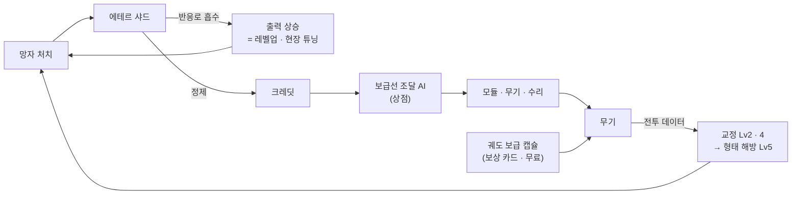

# SF 세계관 · 기술 설정 — 시스템에 개연성 입히기

> 작성 2026-09-30 · 성격: **제안**. 고유명사(행성 · 부대 · 에너지 이름)는 모두 자리표시다. 게임 이름이 정해지면 함께 맞춘다.
> 2026-09-30 — [무기-커스터마이징-조사.md](무기-커스터마이징-조사.md) 에서 나눠 옮겼다 (예전 13장)
>
> 요청: "현재 게임 SF 컨셉에 맞게 게임 내의 기술 컨셉으로 확장하는, 개연성에 맞는 방안이나 흐름도 추가 정리"
>
> 관련 문서:
> - [무기-커스터마이징-조사.md](무기-커스터마이징-조사.md) — 부품 · 근접 성장 구조, **한 판의 흐름도**(12장)
> - [상점-재화-설계.md](상점-재화-설계.md) — 크레딧 · 상점 · 정비 구역
> - [캐릭터-2종-확장-설계.md](캐릭터-2종-확장-설계.md) — 사수 · 검사, 패링

---

## 0. 한눈에

- 판타지 적(해골 · 골렘)과 SF 병사의 대비를 **"차원 균열"** 로 묶는다 (2 · 3장)
- 경험치 = 균열 에너지(에테르), 크레딧 = 정제한 에테르, 보상 = 궤도 보급, 상점 = 궤도 보급선, 정비 구역 = 착륙선 (4장)
- 무기 레벨 = 교정, 3티어 = 형태 해방(오버클럭), 패링 = 키네틱 디플렉터 (4장)
- "검사는 왜 총을 못 드나", "구슬 하나가 왜 경험치와 크레딧 둘 다인가" 같은 규칙마다 설정 속 이유를 붙였다 (4장)
- 먼저 할 것은 **용어 통일 · 카드 문구 · 에테르 색(주황)** — 글자와 색 값만 바꾼다 (6 · 7장)

---

## 1. 지금 화면에 있는 것 — 설정의 재료

| 요소 | 지금 쓰는 에셋 | 인상 |
|---|---|---|
| 플레이어 | SF 강화복 병사 (`SciFiWarriorPBRHPPolyart`) | **SF** |
| 무기 | SF 총 (`GunPack`) · 발광하는 검 · 대검 · 할버드 (`FuturaWeapons`) · 지원 드론 | SF |
| 적 A · B | 나무 칼 · 나무 방패를 든 해골 (`Mini Simple Characters Skeleton`) | **판타지 망자** |
| 적 C | 해골이 **주황 에너지 구체를 모아** 3갈래로 쏜다 | 판타지 + 에너지 |
| 적 D | 달려와 자폭하는 해골 | 판타지 |
| 보스 | 바위 골렘 (`Mini Legion Rock Golem`) — 감속 · 기절 기술 | 판타지 |
| 맵 · UI · 소리 | 격자 바닥 · 우주 탐사 GUI · SF 오케스트라 배경음 | SF |

→ **SF 병사가 판타지 망자와 싸운다.** 이 대비를 설명하는 설정이 있으면 어색함이 개성이 된다.

이 조합은 흔하고 검증돼 있다.

| 게임 | 대비 | 성장 장치 |
|---|---|---|
| **둠 (2016)** | 화성 기지의 해병 × 지옥 악마 | 지옥에서 뽑아낸 **아전트 에너지**를 압축한 셀을 강화복(Praetor)이 흡수해 체력 · 방어 · 탄약을 늘린다. 쓰러진 경비병의 슈트에서 회수한 토큰으로 슈트 기능을 강화 |
| **딥 락 갤럭틱** | — | 우주 정거장 ↔ **드롭 포드 강하** ↔ 동굴. 임무를 마치면 크레딧 · 경험치를 받고 정거장에서 장비를 강화한다 |

## 2. 설정 후보 세 가지

| | **A. 차원 균열** (추천) | B. 고대 유적 행성 | C. 전투 시뮬레이션 |
|---|---|---|---|
| 한 줄 | 채굴 행성 깊은 곳에 열린 균열에서 망자 군단이 쏟아진다 | 사라진 문명의 나노 기술이 뼈와 바위를 움직인다 | 훈련 AI 가 만든 가상 전장 |
| 해골 · 골렘 | 균열 너머에서 스러진 전사들 · 균열 핵의 수호자 | 나노에 감염된 유해 · 유적 방어 골렘 | 가상 적 데이터 |
| 에너지 | 균열에서 새어 나오는 **에테르** | 고대 코어 에너지 | 점수 |
| 스테이지 · 보스 · 엔딩 | 균열 1 · 2 · 3층 → 핵의 수호자 → **균열 봉인** | 유적 구역 → 방어 골렘 → 탈출 | 난이도 단계 → 최종 시험 → 수료 |
| 장점 | 스테이지가 깊어질수록 강해지는 이유 · 보스 · 엔딩이 한 줄로 이어진다 | 탐사 분위기 | 테스트 룸 · 반복 플레이가 자연스럽다 |
| 단점 | 흔한 설정 | 해골이 왜 **나무** 칼을 드는지 약하다 | 전투가 "가짜"라 **긴장감이 없다** |

**추천: A.** C 의 발상은 **테스트 룸에만** 쓴다 (착륙선 안 "모의 전투실").

## 3. 추천 설정 — "균열" 한 단락

> 채굴 행성 **[행성 이름]** 의 광산 최하층에 차원 균열이 열렸다.
> 균열에서 새어 나온 에너지 **"에테르"** 는 죽은 것을 움직인다.
> 오래전 균열 너머에서 스러진 전사들이 **뼈와 녹슨 무기만 남은 채** 기어 나온다.
> 연합 사령부는 강화 전투 프레임을 입은 균열 대응 부대 **[부대 이름]** 을 드롭 포드로 강하시킨다.
> 임무: 균열 3층을 뚫고, 핵을 지키는 **수호 골렘**을 쓰러뜨려 균열을 봉인한다.

- 부대 이름은 게임 이름과 엮을 수 있다. 예) 제목 STEEL VIGIL → **비질(VIGIL) 부대** = 균열 감시대
- 해골이 **나무 칼 · 나무 방패**를 드는 이유: 균열 너머는 기술 문명 이전의 세계다
- 적 C 가 **주황 구체**를 쏘는 이유: 에테르를 다루는 법을 익힌 망자다 → 에테르 = 주황으로 통일한다 (6장)

## 4. 시스템 ↔ 설정 대응표

**전투 · 캐릭터**

| 게임 시스템 | 설정 속 기술 | 왜 그렇게 동작하나 |
|---|---|---|
| 사수 | **레인저 프레임** (강습형) | 사격 통제 장치로 총 · 빔 무장을 운용한다 |
| 검사 | **브레이커 프레임** (돌파형) | 반응로 출력이 **날 방출기**로 몰려 사격 통제 장치가 없다 → **총을 못 드는 규칙**의 이유. 장갑이 두꺼워 체력 140 · 받는 피해 −15% |
| 손 무기 4칸 | 프레임 무장 마운트 4개 | — |
| 구르기 | **스러스터 회피** | 쿨타임 = 추진제 재충전 |
| **패링** | **키네틱 디플렉터** — 날의 에너지 장을 순간 최대 출력으로 | 투사체는 장이 만든 **평면에 거울처럼 반사**된다 (캐릭터-2종-확장-설계 18-2). 불똥 = 장 방전. 5초 쿨타임 = 장 재충전. 성공 뒤 무적 = 남은 장이 몸을 감싼다 |
| 근접 무기의 칼날 | 방출기가 만든 **에너지 날** | 날의 모양은 방출기가 정한다 → 부품 · 형태로 칼날이 바뀌는 이유 |
| 스킬 카드 (번개 · 화염구 · 토네이도) | **전술 모듈** — 아크 방전기 · 플라즈마 구체 발사기 · 소용돌이 발생기 | 반응로 출력으로 돌아간다 |
| 드론 | 지원 드론 | 그대로 |

**성장 · 경제**

| 게임 시스템 | 설정 속 기술 | 왜 그렇게 동작하나 |
|---|---|---|
| 경험치 구슬 | **에테르 샤드** — 망자를 움직이던 에테르가 굳은 결정 | 둠의 아전트 셀처럼 프레임 반응로가 흡수한다 |
| 레벨업 | **출력 상승** | 흡수한 에테르가 쌓여 반응로가 한 단계 오른다 |
| 레벨업 카드 | **현장 튜닝** — 늘어난 출력을 어디에 돌릴지 | 공격력 · 연사 · 이동 · 체력 = 출력 배분 |
| **크레딧** ([상점](상점-재화-설계.md) 3장) | 프레임이 샤드 일부를 **정제해 저장**한 에테르. 보급선이 매입한다 | **구슬 하나가 경험치와 크레딧 둘 다 되는 이유** |
| 스테이지 보상 카드 | **궤도 보급 캡슐** — 구역 확보 신호에 사령부가 3종 중 하나를 투하 | 작전 지원이라 **무료** |
| 상점 ([상점](상점-재화-설계.md)) | **궤도 보급선의 조달 AI** — 크레딧으로 거래하는 민간 조달상 | 사령부 보급(무료)과 따로 논다 |
| 가격이 스테이지마다 오른다 | 균열이 깊을수록 투하 경로가 위험 · 멀어진다 | **운송비** |
| 새로고침 값이 오른다 | 재고를 다시 받을 때마다 **전송 비용** | — |
| 잠금 | **예약 주문** | 값이 고정된다 |
| 판매 50% | **반납 감가** | — |
| 정비 구역 씬 ([상점](상점-재화-설계.md) 4장 B) | **착륙선 격납고** — 스테이지 사이 귀환 · 정비 · 재강하 | 딥 락 갤럭틱의 정거장 ↔ 드롭 포드 |
| 테스트 룸 | 착륙선 안 **모의 전투실** — 훈련용 해골 = 홀로그램 표적 | 설정 C 를 여기만 쓴다 |
| 사망 | **프레임 파손 → 긴급 회수** | 크레딧이 사라지는 이유 = 회수 비용 |
| 판 밖 재화 ([상점](상점-재화-설계.md) 9장) | **전투 기록**을 본부 연구소에 전송 → 새 무기 · 부품 연구 | 다음 판에 해금 |

**무기 커스터마이징**

| 게임 시스템 | 설정 속 기술 | 왜 그렇게 동작하나 |
|---|---|---|
| 총 부품 ([커스터마이징](무기-커스터마이징-조사.md) 4장) | **MX 표준 레일** 모듈 | 규격이 같아 어느 총에나 달린다 |
| 근접 부품 ([커스터마이징](무기-커스터마이징-조사.md) 5장) | **방출기 규격 모듈** — 날 · 코어 셀 · 손잡이 | — |
| 연장 방출기 | 방출기 출력↑ = 에너지 날이 길어진다 | **무기가 실제로 길어지는 이유** |
| 코어(원소) | **에너지 셀** — 플라즈마(열) · 아크(전기) · 극저온 · 그래비톤(중력) | **칼날 색 = 셀 색** |
| 무기 레벨업 | **교정(캘리브레이션)** | 전투 데이터가 쌓여 무기 AI 가 사용자에게 맞춰진다 |
| 1 · 2티어 ([커스터마이징](무기-커스터마이징-조사.md) 11-4) | **교정 프로토콜** 선택 | 예) "배후 감지 루틴" → 등 뒤 치명타. **조건부 효과 = 무기 센서의 판단** |
| 3티어 · 형태 | **형태 해방 (오버클럭)** | 안전 제한을 풀어 방출 형태를 바꾼다 — 딥 락 갤럭틱의 "오버클럭"과 같은 말 |
| 교대 공격 ([커스터마이징](무기-커스터마이징-조사.md) 11-5) | **시동 방출** | 새 무기를 켤 때 방출기에 쌓인 에너지를 한 번에 내보낸다 |

**적 · 스테이지**

| 게임 요소 | 설정 | 개연성 |
|---|---|---|
| 적 A · B | **균열 망자** · 방패 망자 | 균열 너머 전사의 유해 |
| 적 C | **에테르 사수** | 에테르를 모아 구체로 쏜다 → **튕겨내면 되돌아가는** 에너지 탄 |
| 적 D | **불안정체** | 에테르가 넘쳐 스스로 터진다 |
| 보스 골렘 | 균열 핵의 **수호자** — 바위 몸에 핵이 박혀 있다 | 감속 · 기절 = **중력 파동** |
| Stage 1 · 2 · 3 | 균열 **1 · 2 · 3층** | 깊을수록 에테르가 짙다 → 실제 데이터도 스테이지마다 **적이 더 자주(생성 간격 3 → 2 → 1초), 투사체가 더 빨리(6 → 7.5 → 9)** 나온다 |
| IntroScene | 핵에서 수호 골렘이 깨어난다 | 이미 있는 보스 등장 연출 씬 |
| 엔딩 | **균열 봉인** | — |

## 5. 흐름도 — 에테르 순환 (성장 · 경제)

> 한 판의 흐름도(로비 → 스테이지 → 보상 → 상점 → 보스)는 [무기-커스터마이징-조사.md](무기-커스터마이징-조사.md) 12장에 있다. 설정 이름을 괄호에 함께 적었다.

**한 번 처치가 세 갈래로 돌아온다**

1. 즉시: 출력 상승 (레벨업)
2. 스테이지 사이: 크레딧 → 모듈
3. 무기를 쓸수록: 교정 → 형태 해방

## 6. 보여 주는 방법 — 싼 것부터

| 방법 | 예 | 비용 |
|---|---|---|
| **용어 통일** | 카드 · HUD · 상점 문구를 7장 용어로 | 글자만 |
| 카드 설명 한 줄 | "MX 레일 호환 · 반동 억제 모듈" · "그래비톤 셀 — 칼날이 보라로 빛난다" | 글자만 |
| 스테이지 전환 문구 | "균열 2층으로 강하 — 에테르 농도 상승" (지금 스테이지 클리어 UI 자리) | 글자만 |
| **색 통일** | 에테르 = 주황: 경험치 구슬 · 적 C 구체 · 패링 불똥을 같은 계열로. "적이 쓰는 힘을 내가 흡수한다"가 보인다 | 색 값만 |
| 보급 캡슐 연출 | 보상 카드를 고르면 하늘에서 캡슐이 떨어지는 짧은 파티클 | 작다 |
| 보스 등장 · 엔딩 문구 | IntroScene · EndingScene 에 두세 줄 | 작다 |
| 로비 = 모선 격납고 | 로비 배경 문구 · 캐릭터 이름을 프레임 이름으로 | 작다 |

- 경험치 구슬은 값에 따라 셰이더로 색이 바뀐다 (`ExpOrb` · `_ExpValue`)
- 주황으로 맞출 때는 패링 불똥에서 겪은 대로 **초록 · 파랑 성분을 낮게** 잡는다 (톤매핑이 노랗게 누른다, 캐릭터-2종-확장-설계 18-1)

## 7. 용어집 — UI 에 쓸 말

| 지금 | 설정 용어 | 쓰는 곳 |
|---|---|---|
| 사수 / 검사 | 레인저 프레임 / 브레이커 프레임 | 로비 캐릭터 선택 |
| 경험치 | 에테르 | HUD |
| 레벨업 | 출력 상승 | 레벨업 알림 |
| 레벨업 카드 | 현장 튜닝 | 레벨업 창 제목 |
| 스테이지 보상 | 궤도 보급 | 보상 창 제목 |
| 크레딧 | 크레딧 (정제 에테르) | HUD · 상점 |
| 상점 | 보급선 조달 | 상점 창 제목 |
| 부품 | 모듈 (MX 레일 / 방출기) | 카드 |
| 무기 레벨 | 교정 단계 | 무기 슬롯 HUD |
| 3티어 · 형태 | 형태 해방 | 카드 |
| 패링 | 디플렉트 | HUD 아이콘 |
| 구르기 | 스러스트 | HUD 아이콘 |
| 테스트 룸 | 모의 전투실 | 로비 버튼 |
| Stage1 ~ 3 | 균열 1 ~ 3층 | 스테이지 표시 |
| 보스 | 수호 골렘 | 보스 체력 바 |

> "사수 · 검사"는 한눈에 알기 쉽다. 프레임 이름은 **부제**로 붙이는 방법도 있다 — "사수 · 레인저 프레임"

## 8. 결정이 필요한 것

| 질문 | 선택지 |
|---|---|
| 설정 | **A. 차원 균열** (추천) / B. 고대 유적 / C. 시뮬레이션 (테스트 룸에만 추천) |
| 고유명사 | 행성 · 부대 · 에너지 이름 — 게임 이름과 함께 정한다 |
| 캐릭터 이름 | 사수 · 검사 유지 / 프레임 이름 / 둘 다 (부제) |
| 에테르 색 | 주황 (적 C · 불똥과 통일, 추천) / 다른 색 |
| 반영 범위 | 용어 · 카드 문구만 / 스테이지 전환 · 보스 · 엔딩 문구까지 / 로비 연출까지 |
| 스토리 전달 | 문구만 (추천, 캡스톤 범위) / 대사 · 컷신 |

---

## 참고

- [Argent cell — The Doom Wiki](https://doomwiki.org/wiki/Argent_cell) · [Praetor suit — The Doom Wiki](https://doomwiki.org/wiki/Praetor_suit)
- [Drop Pod — Official Deep Rock Galactic Wiki](https://deeprockgalactic.wiki.gg/wiki/Drop_Pod) · [Space Rig — Official Deep Rock Galactic Wiki](https://deeprockgalactic.wiki.gg/wiki/Space_Rig)
