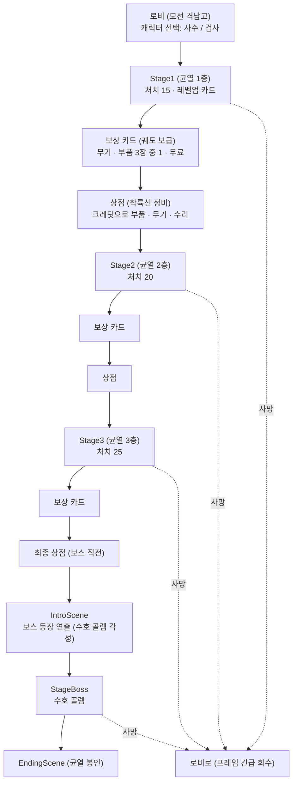

# 주무기 커스터마이징 — 조사 · 제안

> 작성 2026-09-29 · 성격: **조사 · 제안** (구현 전)
> 추가 2026-09-30 — **근접 무기 타 게임 조사** (11장) · **한 판의 흐름** (12장)
> 정리 2026-09-30 — 상점 · 재화는 [상점-재화-설계.md](상점-재화-설계.md), SF 세계관 · 기술 설정은 [SF-세계관-설정.md](SF-세계관-설정.md) 로 나눠 옮겼다
>
> 요청: "스테이지를 클리어하면 추가 총기나 무기를 선택하는 시스템에서, 새로운 총기도 좋지만 부착 스코프(총기 커스터마이징)…
> 근접무기는 떠오르는 게 없지만 각 주 무기들을 커스터마이징할 수 있는 요소들을 선택하는 것도 좋을 것 같다"
>
> 관련 문서: [주무기-확장-후보.md 8장](주무기-확장-후보.md#8-무기-획득--스테이지-사이에서) (보상 흐름) · [9장](주무기-확장-후보.md#9-밸런스-기준선) (밸런스 기준선) ·
> [근접무기-에너지검-에셋조사.md](근접무기-에너지검-에셋조사.md) · [캐릭터-2종-확장-설계.md](캐릭터-2종-확장-설계.md)

---

## 0. 한눈에

- 보상 카드에 **"들고 있는 무기 하나에 부품 달기"** 를 섞는다.
  - 총: 조준경 · 총구 · 하부 · 탄창 · 탄
  - 근접: 날 · 코어 · 손잡이
  - 여기에 무기마다 **전용 개조**(공격 방식 자체가 바뀌는 것)를 하나 둔다
- 레벨업 카드(경험치)는 **모든 무기에 같은 수치**를 조금씩 올린다. 그래서 스테이지 보상은
  **한 무기에만 · 눈에 보이게 · 대가를 치르고 크게** 바뀌는 쪽으로 나눈다 (딥 락 갤럭틱 · 하데스 방식)
- 보상 흐름은 이미 준비돼 있다. `StageReward` 를 상속한 `AttachmentReward` 하나로 카드 · 매니저 · UI 를 **고치지 않고** 넣을 수 있다
- 특히 **검사에게 필요하다.** 근접 무기가 3종뿐이라 보상 카드가 매번 검 · 대검 · 창 **같은 3장**만 나온다 (1-1)
- 위에서 내려다보는 시점이라 총 위 스코프는 몇 픽셀밖에 안 된다. 부품은 모델보다
  **조준선 · 탄 색 · 칼날 빛 · 무기 길이 · 소리**로 보여 준다 (8장)
- **근접 무기**는 액션 게임 11종을 더 조사했다 (11장)
  - 무기 **레벨업마다 둘 중 하나를 고르게** 한다 (로스트아크 트라이포드). 3번째는 공격 모양이 바뀌는 **형태**(하데스)
  - 조건부 치명타(데드 셀), 무기 교체 순간의 **교대 공격**(스컬)을 붙인다
- **한 판의 흐름** — 보상 카드 · 상점 · 보스 직전 정비에서 무기를 만난다 (12장)

**함께 보는 문서**

| 문서 | 내용 |
|---|---|
| [상점-재화-설계.md](상점-재화-설계.md) | 부품을 더 자주 만나게 하는 **상점 · 크레딧** — 가격 · 새로고침 · 정비 구역 씬 |
| [SF-세계관-설정.md](SF-세계관-설정.md) | 부품 · 레벨 · 상점 · 패링에 **SF 설정 속 이유**를 붙인다 — 차원 균열 · 에테르 · 용어집 |

---

## 1. 지금 구조에서 본 필요성

### 1-1. 보상 기회와 슬롯

| | 사수 | 검사 |
|---|---|---|
| 시작 무기 | 1 (로비에서 고름) | 1 |
| 스테이지 보상 | 3번 (Stage1 · 2 · 3 클리어) | 3번 |
| 손 슬롯 | 4칸 | 4칸 |
| 보상 후보가 되는 무기 | 총 6종 | **근접 3종** |
| 카드 3장의 모습 | 6종 중 무작위 3장 (새 무기 / 레벨업) | **매번 검 · 대검 · 창 3장 고정** (가진 것은 레벨업으로) |

- 후보는 `WeaponController.CanAcquire()` 가 캐릭터 규칙으로 거른다
  - 검사에게는 총이 나오지 않는다
  - 풀에 9종이 있어도 검사에게 남는 것은 3장뿐이다
- 사수도 무기를 3개 모으면 이후는 레벨업 카드가 대부분이다
- "새 무기"와 "레벨업" 사이에 **세 번째 선택지**가 있으면 두 캐릭터 모두 고르는 재미가 생긴다

### 1-2. 레벨업 카드와 겹치지 않게

지금 레벨업 카드(`Upgrade/Data`, 경험치로 산다)는 다음을 준다.

- 탄 공격력 +1, 연사 증가
- 최대 체력 +10, 회복 +10, 이동 속도 +0.5
- 스킬 3종: 번개 · 화염구 · 토네이도

**모든 무기 공통의 작은 수치**다.

| | 레벨업 카드 (지금) | 스테이지 보상 — 부품 (제안) |
|---|---|---|
| 빈도 | 경험치마다 여러 번 | 한 판에 3번 |
| 대상 | 모든 무기 · 캐릭터 | **무기 하나** |
| 크기 | +10% 안팎 | 성격이 바뀐다 (대가 포함) |
| 보이는 것 | 수치만 | 조준선 · 탄 색 · 칼날 빛 · 공격 모양 |

### 1-3. 이미 준비된 것 / 없는 것

**있다**

| 준비된 것 | 쓰임 |
|---|---|
| `StageReward` 확장점 | 코드 주석에 `AttachmentReward` 예시까지 있다 — 주무기-확장-후보 8-4 |
| `WeaponController.ApplyModifierTo(data, modifier)` | 특정 무기에만 수치를 더한다 → **수치형 부품은 이 한 줄** |
| `WeaponModifier` 필드 | 피해(+ · ×) · 연사 × · 치명타 확률 · 배율 · 탄속 · 투사체 수 · 관통 · 탄창 · 장전 × · 사거리 |
| `Bullet.OnHit` 가상 함수 | 파생 탄(전격탄 등)이 명중 효과를 넣는 자리 |
| 전격 소총의 **연쇄**, 패링의 **밀쳐내기** | 원소 · 넉백 부품이 재사용할 수 있는 동작 |
| 무기 길이 사양 (`CharacterSetup` 의 `Length`) | 근접 "연장 날"이 실제로 무기를 길게 만들 수 있다 |

**없다**

- 퍼짐 · 휘두르기 각도 · 최대 타격 수를 올리는 수치
- 근접 무기의 "명중 시" 알림
- 부품 **교체**: 지금 누적분(`accumulated`)은 더하기만 되고 빼기가 없다
- **적 상태이상**: 지금 상태이상은 보스가 플레이어에게 거는 감속 · 기절뿐이다. 적을 감속 · 빙결시키려면 적 코드(Enemy 폴더)를 건드려야 한다

---

## 2. 레퍼런스 조사

### 2-1. 게임별

| 게임 | 방식 | 얻는 법 | 가져올 점 |
|---|---|---|---|
| **Call of Duty — 건스미스** | 부위별 슬롯(조준경 · 총구 · 총열 · 하부 · 탄창 · 손잡이 · 개머리판 · 레이저 · 사격 개조). 조준경은 같은 계열 무기 공용, 나머지는 무기 전용. 옛 작품은 장점과 단점이 함께 붙었다 (긴 총열 = 사거리↑ 이동↓) | 무기 레벨로 해금 | **부위 = 슬롯**, 장점 / 단점 표기, 공용 + 전용 |
| **Deep Rock Galactic** | 단계별 개조 + **오버클럭 3등급**: Clean(대가 없음) · Balanced(효과와 같은 크기의 대가) · Unstable(가장 큰 효과 + 큰 대가, 새 메커니즘). 오버클럭은 무기 하나 전용 | 임무 보상 | **등급 = 대가의 크기**, 테두리 색으로 구분 (초록 · 노랑 · 빨강) |
| **Hades — 다이달로스의 망치** | 무기마다 **전용 강화 풀**. 3개 중 1개, 한 판에 보통 2개. 공격 모양 자체를 바꾼다. 예) 창 *Flurry Jab* — 회전 대신 연속 찌르기, 검 *World Splitter* — 무거운 내려찍기, 창 *Chain Skewer* — 특수 공격이 최대 7번 튕김, 창 *Exploding Launcher* — 특수를 폭발 투사체로 | 방 보상 | **근접 커스터마이징의 정답에 가깝다**, 개수 제한 |
| **20 Minutes Till Dawn** (같은 장르) | 20레벨에 무기 진화 **3개 중 1개**. 리볼버: Headshot · Trickshot · Volley / 샷건: Melee Shot · Dual Wield · Focused Blast / Cyclone Sword: Death Sickle · Wind Katana · Light Blade | 레벨 | 무기별 3지선다, "한 번에 크게" |
| **Vampire Survivors** | 최대 레벨 무기 + 짝이 되는 패시브 → 보스 상자에서 **진화** | 보스 상자 | 부품 + 최대 레벨 = 진화 (장기 목표로 쓸 만하다) |
| **Returnal** | 무기 특성(Trait) I ~ III 단계 + 보조 사격(Alt-Fire) | 사용해서 해금 | 부품에도 단계를 둘 수 있다 |
| **Gunfire Reborn** | 무기마다 무작위 **각인**(inscription). 두 원소를 한 적에 겹치면 융합 효과 | 드롭 · 대장장이 | 원소 조합 |
| **Warframe** | 원소 모드 — 열(화상 + 방어 반감) · 냉기(감속, 10중첩 빙결) · 전기(연쇄) · 독(지속 피해). 두 원소를 합치면 새 원소 (독 + 전기 = 부식) | 모드 장착 | 근접 **코어(원소)** 발상, SF 설정에 잘 맞는다 |
| **Elden Ring — 전회 · 속성** | 무기에 전회(기술)를 끼우고 속성 부여 — Heavy(근력) · Keen(기량) · Quality · 화염 · 번개 … | 필드 | 근접 **"무거운 날 / 예리한 날"** 성향 |
| **Dead Cells** | 전설 접두사 — Double Stack(상태이상 2배) · Fire on Hit · Double Bullets · Mega Crit(치명타 피해 +75%) | 드롭 | "명중 시" 효과 |

### 2-2. 공통 패턴

1. **부위마다 한 칸** (CoD). 같은 부위는 교체라 무엇이 바뀌는지 알기 쉽다
2. **공용 부품 + 전용 개조** (CoD). 하데스 · 20MTD 는 전부 무기 전용이다
3. **대가가 클수록 효과도 크다** (DRG). 좋은 것만 있으면 고민이 없다
4. **근접은 수치보다 "공격 모양"** 을 바꾼다 (하데스): 연속 찌르기, 내려찍기, 날아가는 참격
5. **원소 부여**는 총 · 근접 모두 통한다 (Warframe · Gunfire Reborn · Elden Ring)

---

## 3. 설계 원칙 (제안)

| 원칙 | 내용 |
|---|---|
| 한 무기에 붙는다 | 카드에 **대상 무기 아이콘**이 함께 나온다 — "소총 · 확장 탄창" |
| 부위마다 1개 | 총 5부위, 근접 3부위, 전용 개조 1칸. 같은 부위를 다시 받으면 **교체** |
| 3등급 | 아래 표 참고 |
| 보이게 | 조준선 · 탄 색 · 트레일 · 총구 섬광 · 칼날 발광 · 무기 길이 · 소리 (8장) |
| 레벨과 따로 논다 | 무기 레벨이 올라도 부품은 그대로 |
| 밸런스 | 주무기-확장-후보 9장의 **장전 포함 DPS 5.5 ~ 9** 를 기준으로, 부품 하나가 DPS 를 +15% 넘게 올리지 않게. 넘으면 대가를 붙인다 |

**등급** — 카드 테두리 색으로 구분한다.

| 등급 | 색 | 내용 |
|---|---|---|
| 기본 | 초록 | 대가 없음, 효과는 작다 |
| 균형 | 노랑 | 장점과 같은 크기의 대가 |
| 개조 | 빨강 | 공격 방식이 바뀐다, 큰 대가 |

---

## 4. 총기 부품 후보

**구현 표시**

| 표시 | 뜻 |
|---|---|
| ● | 지금 필드로 끝난다 (`ApplyModifierTo`) |
| ◐ | 수치를 하나 더 받아야 한다 (Player 폴더 안에서) |
| ○ | 새 동작이 필요하다 |

### 4-1. 조준경

| 이름 | 효과 | 대가 | 등급 | 보이는 것 | 구현 |
|---|---|---|---|---|---|
| 홀로그램 조준경 | 탄 퍼짐 −50% | — | 기본 | — | ◐ 퍼짐 |
| 레이저 조준기 | 탄 퍼짐 −30%, 치명타 확률 +5%p | — | 기본 | **붉은 조준선** (위에서도 잘 보인다) | ◐ |
| 2배율 스코프 | 치명타 확률 +10%p, 탄속 +30% | 연사 −10% | 균형 | 총 위 스코프 모델 | ● |
| 저격 광학장치 | 치명타 배율 +1.0 | 연사 −15% | 균형 | 조준선 | ● |
| 표적 추적 조준경 | 커서에서 15° 안의 적에게 조준을 끌어당긴다 | — | 기본 | 표적 테두리 | ○ |

### 4-2. 총구

| 이름 | 효과 | 대가 | 등급 | 보이는 것 | 구현 |
|---|---|---|---|---|---|
| 확장 총열 | 탄속 +40%, 피해 +10% | 연사 −10% | 균형 | 긴 트레일 | ● |
| 보정기 | 퍼짐 −30%, 연사 +5% | — | 기본 | 총구 섬광이 작아진다 | ◐ |
| 플라즈마 소음기 | 치명타 배율 +0.75 | 탄속 −15% | 균형 | 푸른 총구 섬광 · 작은 발사음 | ● |
| 초크 (샷건) | 퍼짐 −45% — 산탄이 모인다 | — | 기본 | — | ◐ |
| 확산기 (샷건 · 기관단총) | 투사체 +2, 퍼짐 +30% | 피해 −15% | 균형 | — | ◐ |

### 4-3. 하부

| 이름 | 효과 | 대가 | 등급 | 보이는 것 | 구현 |
|---|---|---|---|---|---|
| 총검 | 2m 안의 적을 1초마다 자동으로 찌른다 (총 피해 ×3) | — | 균형 | 총검 모델 (Quaternius, CC0) | ○ — 사수의 근접 방어 수단 |
| 유탄 발사기 | 8발마다 유탄 한 발 (반경 2m 폭발) | — | 균형 | 폭발 | ○ |
| 손잡이 | 장전 −20% | — | 기본 | — | ● |

### 4-4. 탄창

| 이름 | 효과 | 대가 | 등급 | 구현 |
|---|---|---|---|---|
| 확장 탄창 | 탄창 +50% | 장전 시간 +15% | 균형 | ● (`magazineAdd` 는 정수라 무기마다 값을 따로 둔다) |
| 빠른 탄창 | 장전 −35% | 탄창 −20% | 균형 | ● |
| 드럼 탄창 (소총 · 기관단총) | 탄창 ×2 | 이동 속도 −5% | 균형 | ◐ 이동 속도 |
| 자동 급탄기 | 2초 동안 안 쏘면 탄창이 서서히 찬다 | — | 기본 | ○ |
| 마지막 탄 강화 | 탄창의 마지막 3발 피해 ×2 | — | 기본 | ○ |

### 4-5. 탄 — 원소

| 이름 | 효과 | 대가 | 등급 | 보이는 것 | 구현 |
|---|---|---|---|---|---|
| 철갑탄 | 관통 +2 | 피해 −10% | 균형 | — | ● |
| 소이탄 | 명중 시 3초 화상 (초당 탄 피해의 25%) | — | 균형 | 주황 트레일 | ○ — 플레이어 쪽에서 피해를 반복해 넣으면 적 코드 수정 없이 된다 |
| 전격탄 | 25% 확률로 가까운 적 1명에게 연쇄 | 피해 −10% | 균형 | 푸른 번개 | ○ — 전격 소총의 연쇄 재사용 |
| 폭발탄 | 명중 지점 반경 1.5m 에 피해 40% | 연사 −20% | 개조 | 작은 폭발 | ○ |
| 극저온탄 | 명중 시 2초 동안 30% 감속 | — | 균형 | 하늘색 | ○ — **적 이동을 바꿔야 해서 Enemy 폴더 협의 필요** |

### 4-6. 무기 전용 개조 — 가장 큰 변화 (무기당 2개 중 1개)

| 무기 | 개조 A | 개조 B |
|---|---|---|
| 소총 | **3점사** — 한 번에 3발, 간격 ×2.2. DPS 는 비슷하고 한 번이 무겁다 | **지정사수** — 연사 −40%, 피해 +80%, 관통 +1 |
| 기관단총 | **이중 탄창** — 탄창 ×2, 장전 ×1.6 | **난사** — 연사 +35%, 퍼짐 ×2 |
| 샷건 | **슬러그** — 산탄 1발, 피해 ×6, 관통 +2 | **용의 숨결** — 산탄에 화상, 탄 수명(사거리) −40% |
| 스나이퍼 | **레일건** — 관통 무제한, 탄속 ×3, 장전 +30% | **반자동** — 연사 ×2, 피해 −45% |
| 전격 소총 | **과부하 코일** — 연쇄 +2, 연쇄마다 피해 −15% | **방전** — 장전을 시작할 때 주변 4m 에 전격 |
| 충전 레이저 | **분광 프리즘** — 빔이 3갈래 (각 피해 50%) | **과충전** — 충전 시간 ×1.5, 피해 ×2.2 |

---

## 5. 근접 무기 부품 후보

SF 설정에 맞춰 근접 무기를 **"날을 만드는 장치"** 로 본다.

| 부위 | 역할 |
|---|---|
| 날 (방출기) | 베는 성질 |
| 코어 (에너지 셀) | 원소 — 칼날 색이 바뀐다 |
| 손잡이 | 자세와 방어 |

여기에 무기 전용 개조를 둔다. 검사의 정체성인 **패링과 엮는 부품**을 손잡이에 모았다.

### 5-1. 날 — 베는 성질

| 이름 | 효과 | 대가 | 등급 | 보이는 것 | 구현 |
|---|---|---|---|---|---|
| 연장 방출기 | 사거리 +1m, **무기가 실제로 길어진다** | 공격 속도 −10% | 균형 | 무기 길이 | ● 사거리 + 모델 크기 (`Length` 사양 재사용) |
| 고주파 진동날 | 공격 속도 +25% | 피해 −12% | 균형 | 칼날 떨림 · "윙" 소리 | ● |
| 중량 날 | 피해 +35%, 맞은 적이 1m 밀린다 | 공격 속도 −20% | 균형 | 무거운 타격음 | ◐ 넉백 (패링 밀쳐내기 재사용) |
| 예리한 날 | 치명타 확률 +15%p | — | 기본 | — | ● |
| 광폭 날 | 휘두르기 각도 +40°, 최대 타격 +2 | 피해 −10% | 균형 | 넓은 궤적 | ◐ 각도 · 타격 수 |

### 5-2. 코어 — 원소 (칼날 색이 바뀐다)

| 이름 | 효과 | 대가 | 칼날 색 | 구현 |
|---|---|---|---|---|
| 플라즈마 코어 | 맞은 적 3초 화상 | — | 주황 | ○ |
| 아크 코어 | 맞은 적마다 30% 확률로 옆 적 1명에게 번개 | — | 파랑 | ○ — 연쇄 재사용 |
| 중력 코어 | 휘두를 때 사거리 안의 적을 0.8m 끌어당긴다 | 피해 −10% | 보라 | ◐ — 밀쳐내기의 반대 방향 |
| 극저온 코어 | 맞은 적 감속 | — | 하늘색 | ○ — Enemy 폴더 협의 필요 |

### 5-3. 손잡이 — 자세 · 방어 (패링과 엮는다)

| 이름 | 효과 | 대가 | 등급 | 구현 |
|---|---|---|---|---|
| 반응 손잡이 | 패링 쿨타임 −1.5초 | — | 기본 | ◐ |
| 반사 증폭기 | 튕겨낸 투사체 피해 ×2, 속도 +30% | — | 균형 | ◐ |
| 반격 회로 | 패링 성공 뒤 다음 3번 휘두르기 피해 ×2 | — | 기본 | ○ |
| 흡수 손잡이 | 명중할 때마다 체력 +0.5 (초당 최대 3) | 최대 체력 −10 | 균형 | ○ |

### 5-4. 무기 전용 개조 — 공격 모양이 바뀐다 (하데스 방식)

| 무기 | 개조 A | 개조 B |
|---|---|---|
| 검 | **검기** — 휘두를 때 칼끝에서 참격파가 6m 날아간다 (피해 60%, 관통) | **연속 베기** — 공격 속도 ×1.8, 각도 −40%, 가로베기만 |
| 대검 | **대지 가르기** — 세로베기만, 앞으로 5m 충격파 + 넉백 | **회전 베기** — 360° 회전, 공격 속도 −25% (회전 모션이 필요하다 — 지금 모션 파일에 있는지 확인 필요) |
| 창 | **삼연 찌르기** — 찌르기가 부채꼴 3갈래 (각 60%) | **투창** — 4번째 공격마다 창을 던져 8m 관통 |

- 검기 · 투창 · 충격파는 **투사체 무기의 탄(`Bullet`)을 재사용**하면 된다. 근접 무기가 휘두를 때 탄을 하나 쏘는 방식이다
- 무거운 개조는 20MTD 진화처럼 **무기 레벨 3 이상**에서만 나오게 할 수 있다 (10장)

---

## 6. 보상 카드에 넣는 방법

### 6-1. 카드가 무기를 가리키게

| 방식 | 내용 | 장단점 |
|---|---|---|
| **A. 카드 한 장 = (부품 × 대상 무기)** (추천) | "소총 — 확장 탄창". 카드에 무기 아이콘 + 부품 아이콘 | 클릭 한 번. **지금 카드 UI 그대로** |
| B. 부품을 고른 뒤 무기를 고른다 | 두 번째 창에서 대상 무기 선택 | 창이 두 단계. UI 를 새로 만들어야 한다 |

### 6-2. 후보 규칙 — `CanOffer`

| 상황 | 처리 |
|---|---|
| 대상 무기를 들고 있지 않다 | 뺀다 |
| 캐릭터가 못 쓰는 무기 | 뺀다 (검사에게 총 부품 없음) — 1번에 포함된다 |
| 그 부위가 이미 찼다 | **교체로 제시**("교체" 꼬리표) / 뺀다 — 결정 필요 |
| 전용 개조 | 언제나 / 무기 레벨 3 이상일 때만 — 결정 필요 |

### 6-3. 카드 3장의 비율 — "부품 상자" 카드

지금 `StageRewardPool` 은 줄 수 있는 후보 중 **균등하게** 뽑는다.
부품 에셋을 수십 개 넣으면 부품이 무기 카드를 밀어낸다 (무기 9 : 부품 40 → 대부분 부품).

- **추천 — 부품 에셋을 풀에 직접 넣지 않는다**
  - 풀에는 `AttachmentReward` 를 **2 ~ 3장만** 넣는다
  - 그 한 장이 제시될 때 "지금 들고 있는 무기 × 달 수 있는 부품" 중 하나를 골라 기억한다
  - 무기 : 부품 비율을 **풀에 넣는 장수로 조절**한다 — 풀 코드를 고치지 않는다
- 검사는 무기 후보가 3장뿐이라 부품이 자연스럽게 섞인다
- 비중 기능을 풀에 넣는 방법도 있지만, `StageRewardPool` 은 Stage 폴더의 기존 스크립트라 **팀 협의**가 필요하다

---

## 7. 구현 구조 (초안)

```
AttachmentData (ScriptableObject, 새 파일)
  ├ 이름 · 아이콘 · 설명 · 부위(Slot) · 등급(Tier)
  ├ 대상: 무기 종류(총 / 근접) 또는 특정 WeaponData 목록
  ├ WeaponModifier modifier            ← 수치형(●)은 이것만
  ├ 추가 수치(◐): 퍼짐 × · 각도 + · 최대 타격 + · 넉백 · 패링 쿨타임 …
  └ AttachmentBehaviour (선택, ○)      ← 발사 시 · 명중 시 동작 (화상 · 연쇄 · 참격파 · 총검)

AttachmentReward : StageReward (새 파일, Stage/Reward)
  ├ CanOffer: 들고 있는 무기 중 달 수 있는 (무기 × 부품) 하나를 골라 기억
  ├ Title / Icon: "소총 — 확장 탄창", 무기 · 부품 아이콘
  └ Apply: 그 무기에 부착
```

**고칠 파일**

| 파일 | 내용 |
|---|---|
| `WeaponBase` (Player 폴더) | 부위별 부착 목록을 들고, 스탯을 만들 때 부품 수치를 얹는다 |
| `Bullet` · `ProjectileWeapon` · `MeleeWeapon` (Player 폴더) | 명중하면 쏜 무기에 알린다 → 부품 동작이 받는다 |
| `WeaponSlotUI` (Player 폴더) | 무기 슬롯 옆에 부품 아이콘 · 등급 색 |
| 편집기 도구 (새 파일) | 부품 에셋 · 보상 에셋 · 아이콘 생성 (지금 도구들처럼 멱등) |

- **교체**: 부품은 누적분에 섞지 않고 따로 들고 합성한다. 지금 누적분은 빼기가 안 되기 때문이다
- **Player 폴더 안에서 끝낸다**: 탄 생성 정보(`ProjectileSpawnInfo`)는 Data 폴더에 있다. 탄이 쏜 무기를 알게 하는 것은 생성 뒤 `Bullet` 에 따로 알려 주면 된다
- **고치지 않는 것**: `StageRewardManager` · `StageRewardUI` · `StageRewardCard` · `StageRewardPool` · `GameManager`
  - 예외: 카드의 "레벨 업" 꼬리표는 `is WeaponReward` 로만 붙는다
  - 부품 카드에 "교체" 같은 꼬리표를 붙이려면 카드(Stage 폴더)를 고쳐야 한다
- **주의**: `AttachmentReward` 가 고른 대상은 ScriptableObject 에 **저장하지 않는 필드**(`[NonSerialized]`)로 들고, 제시할 때마다 새로 고른다. 저장되는 필드에 두면 에디터에서 에셋에 남는다

---

## 8. 에셋 — 모델보다 "보이는 신호"

### 8-1. 왜 모델이 덜 중요한가

- 게임 카메라에서 플레이어는 1080p 기준 **키 약 50 ~ 60px** 이다 (패링 연출 캡처 기준)
- 총 위 스코프 모델은 몇 픽셀이라 거의 보이지 않는다

그래서 부품마다 **게임 화면에서 보이는 신호**를 하나씩 붙인다.

| 신호 | 예 |
|---|---|
| 조준선 | 레이저 조준기 — 붉은 선 |
| 탄 색 · 트레일 | 소이탄 주황, 전격탄 파랑, 철갑탄 흰 긴 트레일 |
| 총구 섬광 · 발사음 | 플라즈마 소음기 — 푸른 섬광 · 작은 소리 |
| 칼날 발광 색 | 근접 코어 — 주황 / 파랑 / 보라 / 하늘색 |
| 무기 길이 | 연장 방출기 — 실제로 길어진다 |
| HUD | 무기 슬롯 옆 부품 아이콘 · 등급 색 |

### 8-2. 모델 · 아이콘 후보

| 에셋 | 내용 | 라이선스 |
|---|---|---|
| 프로젝트 `GunPack/Parts` | `Scope_1` · `Barrel_Single` 두 개뿐 | **출처 미상** (`MODEL_LICENSES.md` 에 `?`) — 먼저 확인 필요 |
| [Quaternius — Ultimate Guns Pack](https://poly.pizza/bundle/Ultimate-Guns-Pack-cpgUfI4t2F) | 총 25개 중 부품: 스코프 · **총검** · 양각대 · 삼각대 | **CC0** |
| [CGTrader — Lowpoly scopes and suppressors](https://www.cgtrader.com/free-3d-models/military/gun/lowpoly-scopes-and-suppressors) | 스코프 · 소음기 | 무료 — 라이선스 확인 필요 |
| 프로젝트 `Space_Exploration_GUI_Kit/Icons` | `scope-*.png` 등 아이콘 | 프로젝트에 이미 있음 |
| 무기 아이콘 렌더 도구 (`WeaponIconRender`) | 부품 아이콘도 같은 방식으로 찍을 수 있다 | — |

- 근접 칼날 색: Futura 무기는 색상표 텍스처 한 장을 같이 쓴다
  - 재질을 바꾸지 말고 **발광 색만** 무기마다 따로 준다 (MaterialPropertyBlock)
  - 패링 불똥에서 겪은 대로, 스테이지 톤매핑이 밝은 색을 노랗게 누르니 초록 · 파랑 성분을 낮춰 잡는다 (캐릭터-2종-확장-설계 18-1)

---

## 9. 단계별 추천

| 단계 | 내용 | 필요한 것 |
|---|---|---|
| **1단계** | 수치형 부품만 (●) — 총 8 · 근접 5 정도. `AttachmentData` · `AttachmentReward` · 슬롯 HUD 아이콘 | 지금 필드 |
| 2단계 | 퍼짐 · 각도 · 넉백 · 패링 쿨타임 (◐) + 조준선 · 칼날 색 | Player 폴더 안에서 수치 추가 |
| 3단계 | 원소 · 명중 효과 (○) — 화상 · 연쇄 · 폭발 · 총검 | 명중 알림 |
| 4단계 | 무기 전용 개조 — 발사 방식 · 공격 모양 | 발사 · 휘두르기 코드, 모션 |

1단계만으로도 "새 무기 / 레벨업 / 부품" 세 갈래가 생기고, 검사의 카드 3장이 매번 같은 문제가 풀린다.

---

## 10. 결정이 필요한 것

| 질문 | 선택지 |
|---|---|
| 카드 3장 중 부품 비율 | 풀에 넣는 "부품 상자" 카드 장수로 조절 (추천) / 풀에 비중 기능 추가 (Stage 폴더 협의) |
| 카드가 무기를 가리키는 방식 | 카드 한 장 = 부품 × 무기 (추천) / 부품 고른 뒤 무기 선택 |
| 같은 부위를 다시 받으면 | 교체 / 후보에서 빼기 |
| 전용 개조 조건 | 언제나 / 무기 레벨 3 이상 |
| 등급 표기 | 테두리 색 / 이름 앞 [균형] 표기 |
| 적 감속 · 빙결 | 넣는다 (Enemy 폴더 협의) / 빼고 화상 · 연쇄 · 넉백만 |
| 부품 모델 | 신호(조준선 · 색)만 / 모델까지 (Quaternius CC0) |
| 보스 클리어 보상 | 지금은 바로 엔딩 — 부품 하나를 줄지 |

---

## 11. 근접 무기 커스터마이징 — 타 게임 심층 조사

> 2026-09-30 요청: "근접무기 커스터마이징 다른 타 게임들(하데스, 스컬, 다른 액션 게임들 등)에 대해서 조사해서 추가 내용 정리"
>
> 2장에서 본 엘든 링(전회 · 속성) · 워프레임(원소)은 여기서 반복하지 않는다.

### 11-1. 한눈에

| 장치 | 대표 게임 | 한 줄 | 우리 게임 |
|---|---|---|---|
| **무기 형태** | 하데스 (Aspect) | 같은 무기의 다른 형태 — 공격 방식이 바뀐다 | ★★★ 전용 개조를 "형태"로 |
| **단계별 선택** | 로스트아크 (트라이포드) | 스킬 레벨 4 · 7 · 10 에서 1 · 2 · 3티어를 하나씩 고른다 | ★★★ **무기 레벨업마다 선택** |
| **조건부 효과** | 데드 셀 · 할로우 나이트 | 뒤에서 · 경직된 적에게 · 체력이 가득일 때만 | ★★★ 싸고 판단이 생긴다 |
| **패링 확장** | 세키로 (의수 도구) | 우산을 펼쳐 회전 방어, 탄을 끌어당긴다 | ★★★ 검사 전용 |
| **교대 공격** | 스컬 (머리 교체) | 바꾸는 순간 새 머리가 기술을 쓴다 | ★★☆ 무기 교체(Q)에 |
| **세트 효과** | 스컬 (각인) | 아이템마다 태그 2개, 같은 태그를 모으면 단계별 보너스 | ★★☆ 부품에 태그 |
| **용량 제한** | 할로우 나이트 (부적 칸) · 니어 (칩 용량) | 강한 것일수록 칸을 많이 먹는다 | ★★☆ "부위마다 1개"의 대안 |
| **기술 칸** | 갓 오브 워 (룬 공격) · DMC5 (데빌 브레이커) | 무기에 기술을 끼운다 / 쓰면 부서지는 의수 | ★☆☆ 조작 키가 늘어난다 |
| **자세 전환** | 고스트 오브 쓰시마 | 적 종류마다 맞는 자세 | ★☆☆ 적이 4종뿐 |
| **확률 강화** | 던전앤파이터 | 실패하면 단계가 내려가거나 부서진다 | ★☆☆ 짧은 판에 좌절이 크다 |

### 11-2. 게임별

#### 하데스 — 무기 형태(Aspect) + 망치

- 무기마다 **형태 4종**. 판을 시작할 때 고르고, 보스에게서 얻는 재화(타이탄의 피)로 풀고 5단계까지 올린다
- 같은 무기인데 핵심이 바뀐다

| 무기 | 형태 | 효과 |
|---|---|---|
| 검 | Nemesis | 특수 공격 뒤 3초 동안 일반 공격이 치명타를 낼 수 있다 |
| 검 | Arthur | 성검(Holy Excalibur)으로 바뀌고 최대 체력 +50 |
| 창 | Achilles | 특수(창 던지기) 뒤 창에게 돌진하며 회수 |
| 창 | Guan Yu | 다른 창(Frost Fair Blade)으로 바뀌는 대신 체력 · 회복이 줄어든다 |
| 창 | Hades | 회전 공격이 다른 기술(Punishing Sweep)로 바뀐다 |

- 판 안에서는 **망치**(2장)로 공격 모양을 더 바꾼다. 형태 = 판 밖, 망치 = 판 안

**우리 게임에** — 5-4 의 전용 개조를 "형태"로 부른다

- 무기 모델 색 · 길이도 함께 바뀌어 눈에 보이게 한다
- 판 밖 재화([상점-재화-설계.md](상점-재화-설계.md) 9장)로 형태를 풀어 두는 방식도 가능하다

#### 스컬 — 머리 교체 · 교대 스킬 · 각인 · 정수

국산 액션 로그라이트(사우스포게임즈).

- **머리(스컬) 2개**를 들고 다닌다. 머리마다 기본 공격 · 스킬 · 이동이 다르다
  - 바꾸는 순간 **교대 스킬**이 나간다. 쿨타임 동안은 다시 바꿀 수 없다
- **각인**: 아이템마다 태그가 **2개** 붙는다. 같은 각인을 2 · 4 · 6개 모으면 단계별 보너스
  - 예) "신속" 2개: 공격 속도 · 기본 공격 피해 증가, 4개: 추가 효과
- **정수**: 하나만 들 수 있는 사용형 아이템 (무적 · 넉백 · 강한 한 방)

**우리 게임에**

- 검사는 이미 무기 4칸과 교체 키(Q · 휠)가 있다 → **교대 공격**을 붙이면 "언제 바꿀까"가 전투 판단이 된다 (11-5)
- 부품에 태그 2개를 붙여 **세트 보너스**를 줄 수 있다 (11-3)

#### 데드 셀 — 조건부 치명타

무기마다 **치명타 조건**이 다르다.

| 무기 | 치명타 조건 |
|---|---|
| Assassin's Dagger | 적의 등 뒤에서 |
| Nutcracker | 경직 · 빙결 · 속박된 적에게 |
| Twin Daggers | 연속 3번째 공격 |
| Broadsword | 3연타의 2 · 3번째 |
| Valmont's Whip | 채찍 **끝**으로 맞힐 때 |
| Rhythm n' Bouzouki | 무기가 빛날 때 박자를 맞추면 |

**우리 게임에** — 근접 무기가 이미 아는 정보로 대부분 판단된다

| 조건 | 판단 방법 |
|---|---|
| 뒤에서 | 적이 바라보는 방향 |
| 경직 | 적 상태(`EnemyState.Hit`) — 패링도 이미 읽는다 |
| 사거리 끝 | 거리 비율 |
| n번째 휘두르기 | 휘두르기 수 |

→ **적 코드를 고치지 않고** 만들 수 있다 (11-4 의 2티어)

#### 할로우 나이트 — 부적과 칸 수

- 부적은 **칸(notch)** 을 차지한다. 가진 칸 안에서만 끼울 수 있고, 강한 부적일수록 칸을 많이 먹는다
- 근접(못)을 바꾸는 부적:

| 부적 | 효과 |
|---|---|
| Longnail · Mark of Pride | 사거리 증가 |
| Quick Slash | 공격 간격이 크게 줄어든다 |
| **Grubberfly's Elegy** (3칸) | **체력이 가득할 때만** 못을 휘두르면 빛줄기가 날아간다 |

- 조합이 재미를 만든다 — Quick Slash + Grubberfly = 빛줄기가 빨리 나간다. 반면 Longnail 은 빛줄기 사거리를 늘리지 않는다

**우리 게임에**

- 검 "검기"를 **체력이 가득할 때만**으로 하면 맞지 않게 싸울 이유가 생긴다
- 부품을 "부위마다 1개" 대신 **무기마다 용량(예: 6칸)** 으로 제한하는 방식도 있다

#### 갓 오브 워 (2018) — 룬 공격 칸 · 자루 장식

- 도끼에 **룬 공격 칸 2개**(가벼운 · 강한). 쿨타임 기술을 끼우고 레벨을 올린다
- 광역 · 직선 · 근접, 원소 피해 · 경직 등
- 자루 끝 장식(Pommel)을 바꿔 수치와 부가 효과를 더한다

**우리 게임에** — 근접 공격은 자동이라 기술을 쓰려면 **키가 하나 더 필요하다**. 조작이 바뀌므로 뒤로 미룬다

#### 데빌 메이 크라이 5 — 데빌 브레이커

- 네로의 의수를 **갈아 끼운다** (기본 8종). 의수마다 기술 2개 (누르기 · 누르고 있기)
- 쓰다 보면 에너지가 다해 **부서지고**, 일부러 터뜨려 적을 날리고 다음 의수로 넘어갈 수 있다

**우리 게임에** — 상점 소모품으로 쓸 수 있다

- 예) "과부하 코어 — 다음 10번 휘두르기에 번개, 끝나면 사라짐"
- 상점([상점-재화-설계.md](상점-재화-설계.md) 5장)의 생존 칸에 섞는다

#### 니어 오토마타 — 플러그인 칩과 저장 용량

- 공격 · 방어 · 지원 등 칩을 끼운다
- 칩마다 용량(1 ~ 31)을 먹고, 전체 용량(최대 128)은 상점에서 늘린다
- 무기 강화보다 **칩 조합이 전투 방식을 정한다**

**우리 게임에** — 할로우 나이트와 같은 용량제. 상점에서 "용량 +2"를 팔 수 있다

#### 세키로 — 의수 도구: 패링을 넓힌다

- **로디드 우산**:
  - 짧게 누르면 패링 (정신력 1 소모), 누르고 있으면 모든 방향을 막는 방패
  - 강화형 Magnet: **회전하는 동안 모든 공격이 완벽 패링**, 총탄 · 표창을 조금 **끌어당긴다**

**우리 게임에** — 검사 패링 부품 (5-3 손잡이에 추가)

| 부품 | 효과 |
|---|---|
| **회전 방어** | 판정 창 0.2 → 0.5초 (쿨타임 +1초) |
| **자석** | 패링 범위 밖 3m 까지 투사체를 끌어와 튕긴다 |

#### 고스트 오브 쓰시마 — 자세 전환

- 자세 4종이 각각 검사 · 방패병 · 창병 · 거한에게 강하다
- 전투 중 바꾸면 **시간이 잠깐 느려진다**

**우리 게임에** — 적이 4종(A ~ D)뿐이고 자동 공격이라 효과가 작다. 넣지 않는다

#### 로스트아크 — 트라이포드

- 스킬 레벨이 **4 · 7 · 10** 에 닿을 때마다 **1 · 2 · 3티어** 칸이 열린다. 칸마다 여러 선택지 중 하나를 고른다
- 속성 · 공격 형태 · 기능이 바뀌어 **같은 스킬도 사람마다 다르다**
- 포인트를 쓰지 않아 자유롭게 바꿀 수 있다

**우리 게임에** — 가장 잘 맞는다

- 지금 무기 레벨업(최대 5)은 **수치만** 오른다
- 레벨 2 · 4 · 5 에 티어를 붙이면 보상 · 상점의 "레벨업"이 **매번 고르는 순간**이 된다 (11-4)

#### 던전앤파이터 — 강화 · 증폭 · 마법부여

- 강화 · 증폭은 **둘 중 하나**만, 마법부여는 따로 겹친다
- **확률 강화**: 무기는 10강까지 실패해도 그대로다
  - 11 ~ 12강 실패는 3단계 하락, 12 → 13강부터는 **파괴**
  - 보호권으로 막을 수 있다
- 국내 플레이어에게 익숙하지만 "실패"가 핵심이다

**우리 게임에** — 한 판에 보상 3번 · 상점 3번뿐이라 한 번의 실패가 너무 크다

- 넣는다면 상점의 **"도박 강화" 서비스**로만
  - 실패하면 크레딧만 잃는다
  - 하락 · 파괴는 없다

### 11-3. 세트 효과 · 용량 — 부품을 묶는 방법 (선택)

5장의 부품은 "부위마다 1개"다. 부품끼리 엮이는 재미를 더하려면 둘 중 하나를 고른다.

| 방식 | 내용 | 예 |
|---|---|---|
| **세트(각인)** — 스컬 | 부품마다 태그 2개. 같은 태그 **2개 / 3개**에 보너스 (한 판 부품이 10개 안팎이라 문턱을 낮게) | [열] 2개: 화상 피해 +30% · 3개: 화상 적 처치 시 폭발 / [속도] 2개: 공격 속도 +10% · 3개: 패링 쿨타임 −1초 |
| **용량** — 할로우 나이트 · 니어 | 무기마다 용량 6. 기본 부품 1칸 · 균형 2칸 · 개조 3칸 | 강한 부품 2개 or 약한 부품 여러 개 |

**추천**

- 1단계는 지금처럼 **부위마다 1개** — 이해가 가장 쉽다
- 부품 수가 20개를 넘으면 **세트**를 붙인다. 용량제는 관리 화면이 필요해 상점([상점-재화-설계.md](상점-재화-설계.md))과 함께 볼 때 검토

### 11-4. 제안 — 근접 무기 성장 구조

트라이포드(단계별 선택) + 하데스 형태 + 데드 셀 조건부 치명타를 합친다.

| 무기 레벨 | 무엇을 고르나 | 성격 | 참고 |
|---|---|---|---|
| Lv2 | **1티어** — 둘 중 하나 | 수치 성향 (속도 / 범위 / 무게) | 로스트아크 1티어 |
| Lv4 | **2티어** — 둘 중 하나 | **조건부 효과** | 데드 셀 · 할로우 나이트 |
| Lv5 | **3티어 = 형태** — 둘 중 하나 | **공격 모양이 바뀐다** · 무기 색 · 길이 변화 | 하데스 형태 · 망치 |

- 무기 레벨업은 스테이지 보상 · 상점([상점-재화-설계.md](상점-재화-설계.md))에서 온다. 그 순간 **카드 2장**으로 고르게 한다
  - "검 Lv2 — 빠른 베기" / "검 Lv2 — 넓은 베기" 를 각각 보상(`StageReward`)으로 만들면 **새 UI 없이** 지금 카드 창에 나온다
- Lv3 은 지금처럼 수치만 오른다 — 숨 돌리는 칸

**검** (빠르게 파고들어 여럿을 벤다)

| 티어 | A | B | 구현 |
|---|---|---|---|
| 1 | **빠른 베기** — 공격 속도 +20% | **넓은 베기** — 각도 +30° | ● / ◐ |
| 2 | **그림자 베기** — 적의 **등 뒤 · 옆**을 벨 때 항상 치명타 (데드 셀 Assassin's Dagger) | **반격 자세** — 패링 성공 뒤 3초 동안 치명타 확률 +50% (하데스 Nemesis) | ◐ |
| 3 | **검기** — **체력이 가득할 때** 휘두르면 참격파가 6m 날아간다 (할로우 나이트 Grubberfly) | **연속 베기** — 공격 속도 ×1.8, 각도 −40%, 가로베기만 (하데스 Flurry) | ○ |

**대검** (느리고 무겁게 한 번에 쓸어 낸다)

| 티어 | A | B | 구현 |
|---|---|---|---|
| 1 | **무게 실은 일격** — 피해 +25%, 맞은 적 1m 밀림 | **넓은 휘두르기** — 각도 +30°, 최대 타격 +2 | ◐ |
| 2 | **갑옷 깨기** — **경직된 적**에게 항상 치명타 (데드 셀 Nutcracker) | **세 번째 일격** — 3번째 휘두르기마다 치명타 · 넉백 (데드 셀 Broadsword) | ◐ |
| 3 | **대지 가르기** — 세로베기만, 앞으로 5m 충격파 (하데스 World Splitter) | **성검** — 공격 속도 −20%, 피해 +50%, 휘두를 때 주변 2m 에 피해 감소 구역 (하데스 Arthur) | ○ |

**창** (길게 찔러 줄 선 적을 꿰뚫는다)

| 티어 | A | B | 구현 |
|---|---|---|---|
| 1 | **긴 창대** — 사거리 +1m, 무기도 길어진다 | **빠른 찌르기** — 공격 속도 +20% | ● |
| 2 | **창끝 일격** — 사거리 **끝 30%** 로 맞힌 적에게 치명타 (데드 셀 Valmont's Whip) | **꿰뚫기** — 최대 타격 +2, 줄 선 적 뒤까지 | ◐ |
| 3 | **삼연 찌르기** — 부채꼴 3갈래 (하데스 Triple Jab) | **돌진 회수** — 4번째 공격마다 창을 던지고, 창까지 돌진하며 회수 (하데스 Achilles) | ○ |

**2티어 조건은 모두 지금 코드가 아는 정보로 판단된다**

| 조건 | 어디서 |
|---|---|
| 등 뒤 · 옆 | 적 방향과 휘두르는 방향의 각도 |
| 경직 | 적 상태 (패링이 이미 읽는 값) |
| 사거리 끝 | 적까지 거리 ÷ 사거리 |
| n번째 휘두르기 | `MeleeWeapon` 이 휘두르기 수를 센다 |
| 체력 가득 | `PlayerStats` |
| 패링 성공 뒤 | `ParryController.OnParryResolved` |

→ 전부 Player 폴더(`MeleeWeapon`) 안에서 끝난다. 적 코드는 읽기만 한다.

### 11-5. 교대 공격 — 스컬식 무기 교체 (검사)

**검사가 무기를 바꾸는 순간, 새로 든 무기가 한 번 크게 휘두른다.**

| 새로 든 무기 | 교대 공격 | 쓰는 모션 |
|---|---|---|
| 검 | 앞으로 3m 돌진하며 가로베기 | 가로베기 |
| 대검 | 주변 360° 내려찍기 + 넉백 | 양손 내려찍기 |
| 창 | 일직선 6m 찌르기, 관통 | 양손 찌르기 |

- 쿨타임 6초. 교체 자체는 지금처럼 언제든 되고, **교대 공격만** 쿨타임이 있다 (스컬은 교체 자체를 막는다)
- "적이 몰리면 대검으로 바꿔 쓸어 내고, 다시 검으로" 같은 판단이 생긴다
- 무기 교체 → 새 무기에 알림 → 모션 재사용. 전부 Player 폴더

사수에게는 "교체한 총의 첫 탄창 연사 +30%" 같은 가벼운 버전을 줄 수 있다.

### 11-6. 결정이 필요한 것 (근접)

| 질문 | 선택지 |
|---|---|
| 무기 레벨업 | 지금처럼 수치만 / **레벨 2 · 4 · 5 에서 둘 중 선택** (추천) |
| 3티어 이름 | 전용 개조 / 형태 / 각성 |
| 부품 묶기 | 부위마다 1개 (추천, 1단계) / 세트(각인) / 용량제 |
| 교대 공격 | 검사만 / 두 캐릭터 모두 / 넣지 않음 |
| 패링 부품 (세키로) | 손잡이 부위에 넣는다 / 넣지 않음 |
| 기술 키 (갓 오브 워 · DMC) | 넣지 않음 (추천 — 조작 유지) / 새 키 |
| 확률 강화 (던파) | 넣지 않음 (추천) / 상점 도박 서비스로만 |

---

## 12. 한 판의 흐름 — 커스터마이징이 들어가는 자리

> 게임 용어로 쓰고, SF 설정 이름([SF-세계관-설정.md](SF-세계관-설정.md))을 괄호에 둔다.
> 상점 단계는 아직 없는 제안이다 — 자세한 내용은 [상점-재화-설계.md](상점-재화-설계.md).



**어디서 무엇을 만나나**

| 때 | 무엇 | 무기에 일어나는 일 | 자세히 |
|---|---|---|---|
| 전투 중 | 레벨업 카드 (경험치) | 모든 무기 공통 수치 · 스킬 | 1-2 |
| 전투 중 (선택) | 보급 상자 | 크레딧으로 열어 무작위 부품 1개 | [상점-재화-설계.md](상점-재화-설계.md) 7장 |
| 스테이지 클리어 | 보상 카드 3장 중 1 | 새 무기 · 무기 레벨업(근접은 티어 선택, 11-4) · 부품 | 6장 |
| 보상 뒤 | 상점 | 부품 · 무기 · 전용 개조 · 수리 · 장갑 판 | [상점-재화-설계.md](상점-재화-설계.md) 5장 |
| 보스 직전 | 최종 상점 | 모아 둔 크레딧을 크게 쓴다 | [상점-재화-설계.md](상점-재화-설계.md) 6장 |

- 지금 흐름은 `클리어 → 보상 카드 → 다음 씬` 이다. 상점은 **보상 카드 뒤에 끼워 넣는다** — 방법은 [상점-재화-설계.md](상점-재화-설계.md) 4장
  - 상점 창(A)이면 정비 = 창, 정비 구역 씬(B)이면 정비 = 착륙선 격납고
- 보스 직전(Stage3 뒤) 상점이 가장 중요하다 — 크레딧을 모아 두었다 쓰는 곳
- 한 판에 무기 · 부품을 고르는 순간: 지금 **3번** → 상점까지 넣으면 **12 ~ 15번** ([상점-재화-설계.md](상점-재화-설계.md) 6장)

---

## 참고

- [Weapon Overclocks — Official Deep Rock Galactic Wiki](https://deeprockgalactic.wiki.gg/wiki/Weapon_Overclocks)
- [Daedalus Hammer — Hades Wiki (Fextralife)](https://hades.wiki.fextralife.com/Daedalus+Hammer)
- [Hades: The Best Daedalus Hammer Upgrade For Each Weapon — Game Rant](https://gamerant.com/hades-best-daedalus-hammer-upgrade-each-weapon/)
- [All Daedalus Hammer Upgrades — Hades 2 (Game8)](https://game8.co/games/Hades-2/archives/453728)
- [Attachment — Call of Duty Wiki](https://callofduty.fandom.com/wiki/Attachment)
- [Gunsmith — Call of Duty Wiki](https://callofduty.fandom.com/wiki/Gunsmith)
- [Black Ops 6 Weapons & Attachments — Call of Duty 공식 블로그](https://www.callofduty.com/blog/2024/10/call-of-duty-black-ops-6-launch-comms-weapons-attachments-intel)
- [Weapon Evolutions — 20 Minutes Till Dawn Wiki](https://20minutestilldawn.wiki.gg/wiki/Template:Weapon_Evolutions)
- [Evolution — Vampire Survivors Wiki](https://vampire.survivors.wiki/w/Evolution)
- [Weapon Traits — Returnal Wiki](https://returnal.fandom.com/wiki/Weapon_Traits)
- [Alt-Fire — Returnal Wiki](https://returnal.fandom.com/wiki/Alt-Fire)
- [Inscriptions — Gunfire Reborn Wiki](https://gunfirereborn.fandom.com/wiki/Inscriptions)
- [Damage — WARFRAME Wiki](https://wiki.warframe.com/w/Damage)
- [Heat Damage — WARFRAME Wiki](https://wiki.warframe.com/w/Damage/Heat_Damage) · [Cold](https://wiki.warframe.com/w/Damage/Cold_Damage) · [Electricity](https://wiki.warframe.com/w/Damage/Electricity_Damage)
- [Ashes of War — Elden Ring Wiki (Fextralife)](https://eldenring.wiki.fextralife.com/Ashes_of_War) · [Affinities](https://eldenring.wiki.fextralife.com/Affinities)
- [Affixes — Official Dead Cells Wiki](https://deadcells.wiki.gg/wiki/Affixes)
- [Ultimate Guns Pack by Quaternius — Poly Pizza (CC0)](https://poly.pizza/bundle/Ultimate-Guns-Pack-cpgUfI4t2F)
- [Lowpoly scopes and suppressors — CGTrader](https://www.cgtrader.com/free-3d-models/military/gun/lowpoly-scopes-and-suppressors)

**근접 무기 — 타 게임 (11장)**

- [Hades Infernal Arms & Weapon Aspects guide — RPG Site](https://www.rpgsite.net/feature/10254-hades-infernal-arms-weapon-aspects-guideevery-weapon-aspect-and-upgrade-unlock) · [Titan Blood — Hades Wiki](https://hades.fandom.com/wiki/Titan_Blood)
- [Inscriptions — Skul Wiki](https://skul.fandom.com/wiki/Inscriptions) · [Skulls — Skul Wiki](https://skul.fandom.com/wiki/Skulls) · [Items and Quintessences — Steam 가이드](https://steamcommunity.com/sharedfiles/filedetails/?id=2383839934)
- [Melee items — Dead Cells Wiki](https://deadcells.fandom.com/wiki/Melee_items) · [Gear — Official Dead Cells Wiki](https://deadcells.wiki.gg/wiki/Gear)
- [Grubberfly's Elegy — Hollow Knight Wiki](https://hollowknight.wiki.fextralife.com/Grubberfly's+Elegy) · [Quick Slash](https://hollowknight.wiki.fextralife.com/Quick+Slash) · [Longnail](https://hollowknight.wiki.fextralife.com/Longnail)
- [Runic Attacks (2018) — God of War Wiki](https://godofwar.fandom.com/wiki/Runic_Attacks_(2018)) · [Leviathan Axe — God of War Wiki](https://godofwar.fandom.com/wiki/Leviathan_Axe)
- [Devil Breaker — Devil May Cry Wiki](https://devilmaycry.fandom.com/wiki/Devil_Breaker)
- [Plug-in Chips — Nier Automata Wiki](https://nierautomata.wiki.fextralife.com/Plug-in+Chips)
- [Loaded Umbrella — Sekiro Wiki](https://sekiroshadowsdietwice.wiki.fextralife.com/Loaded_Umbrella) · [Loaded Umbrella - Magnet](https://sekiroshadowsdietwice.wiki.fextralife.com/Loaded_Umbrella_-_Magnet)
- [Stances — Ghost Franchise Wiki](https://ghostfranchise.fandom.com/wiki/Stances)
- [트라이포드 가이드 — 로스트아크 공식](https://lostark.game.onstove.com/News/GMNote/Views/12?page=3&searchtext=&searchtype=0)
- [장비 강화 가이드 — 던전앤파이터 공식](https://df.nexon.com/guide?no=710) · [던전앤파이터/강화 — 나무위키](https://namu.wiki/w/%EB%8D%98%EC%A0%84%EC%95%A4%ED%8C%8C%EC%9D%B4%ED%84%B0/%EA%B0%95%ED%99%94)
