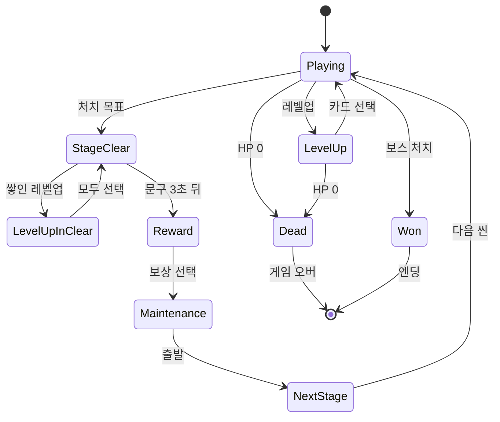

# 이벤트 겹침 버그 분석 — 레벨업 · 스테이지 클리어 · 사망

> 작성 2026-10-02 · 성격: 분석 · 수정 방향 제안 → **1단계 수정 완료 (2026-10-02, 9장)** · 2 · 3단계는 미정
>
> 보고된 증상: "레벨업이나 스테이지 클리어, HP 가 0 이 된 순간 몬스터를 다 잡아서 스테이지가 넘어가는 등 여러 이벤트가 겹치면
> **업그레이드 카드가 스킵**되거나, **죽었는데도 다음 스테이지로 가는데 HP 가 0 이라 안 움직여지는** 버그"
>
> 근거: 코드를 따라가 찾은 경로를 **재현 테스트로 확인했다** — 고치기 전 7개 실패 → 고친 뒤 21개 모두 통과 (9장).
>
> 관련 문서: [정비-상점-구현계획.md](정비-상점-구현계획.md) — 같은 `GameManager` 클리어 흐름을 고친다 (6장 참고)

---

## 0. 한눈에

- **뿌리는 하나다.** 판의 상태(전투 / 레벨업 / 클리어 / 보상 / 사망)를 **한 곳에서 관리하지 않는다**
  - 각 시스템이 이벤트에 제각각 반응하고, 서로의 상태를 확인하지 않는다
- 원인은 세 갈래다
  1. **사망이 판을 멈추지 않는다** — 죽은 뒤에도 처치 카운트 · 스테이지 클리어 · 경험치 · 적 생성이 돈다
  2. **스테이지 클리어가 전투를 멈추지 않는다** — "Stage Clear" 문구 3초 동안 적이 공격하고 구슬이 먹힌다
  3. **`Time.timeScale` 을 7곳이 직접 덮어쓴다** — 마지막에 쓴 쪽이 이긴다
- 수정은 3단계로 제안한다
  1. **1단계** — 사망 · 클리어 우선순위와 레벨업 처리 순서 (보고된 두 버그는 여기서 막힌다)
  2. 2단계 — 시간 정지를 한 창구로
  3. 3단계 — 판의 상태 머신
- 고칠 곳이 Core · Stage · Enemy · Items 폴더에 걸쳐 있어 **팀 협의**가 필요하다. 정비(상점) 작업과 같은 `GameManager` 를 고치므로 **한 번에 묶어 머지**하는 것을 권한다

---

## 1. 관련 코드 — 지금의 흐름

```
처치 ──▶ StageManager ──(처치 수 ≥ 목표면 처치마다)──▶ OnStageClear
                                                         │
GameManager.StageClearFlow ◀───────────────────────────────┘
  1. 남은 레벨업 카드 처리를 기다린다         ← 시작할 때 한 번만
  2. "Stage Clear" 문구 3초 (실제 시간)       ← 이동안 게임 시간은 흐른다
  3. 보상 카드 (timeScale 0 → 고르면 1)
  4. 다음 씬 (빌드 순서 + 1)

피격 ──▶ PlayerStats.TakeDamage ──(HP 0)──▶ Die ──▶ OnPlayerDeadStart
                                            └─ 사망 애니메이션 이벤트 ─▶ 3초(게임 시간) ─▶ OnPlayerDeadEnd ─▶ 게임 오버 창 (timeScale 0)

구슬 ──▶ PlayerStats.AddExp ──(레벨업)──▶ OnPlayerLevelUp ──▶ GameManager: 카드 창 (timeScale 0 → 고르면 1)
```

| 코드 | 내용 |
|---|---|
| [GameManager.cs:85-116](../../../Assets/Scripts/Core/GameManager.cs#L85-L116) | 클리어 흐름. **사망을 확인하지 않는다.** 레벨업 대기는 시작 때 한 번(98행) |
| [GameManager.cs:71-83](../../../Assets/Scripts/Core/GameManager.cs#L71-L83) | 카드를 고르면 다음 프레임에 `timeScale = 1` — 다른 창이 떠 있어도 |
| [GameManager.cs:124-154](../../../Assets/Scripts/Core/GameManager.cs#L124-L154) | 보상 창 — 고르면 `timeScale = 1` |
| [PlayerStats.cs:64-85](../../../Assets/Scripts/Player/PlayerStats.cs#L64-L85) | `AddExp` — **죽어도 경험치를 받는다** |
| [PlayerStats.cs:180-185](../../../Assets/Scripts/Player/PlayerStats.cs#L180-L185) | 사망 연출 뒤 3초 대기가 **게임 시간** 기준 — 다른 창이 시간을 멈추면 같이 멈춘다 |
| [GameAppManager.cs:83](../../../Assets/Scripts/Core/GameAppManager.cs#L83) | 다음 스테이지에서 상태 되돌리기가 **주석 처리**됨 (`//PlayerStats.ResetState();`) |
| [StageManager.cs:34](../../../Assets/Scripts/Stage/StageManager.cs#L34) | 목표를 넘긴 뒤에도 **처치할 때마다** `OnStageClear` 를 다시 보낸다 |
| [SuicideAttack.cs:62](../../../Assets/Scripts/Enemy/Attack/SuicideAttack.cs#L62) → [67](../../../Assets/Scripts/Enemy/Attack/SuicideAttack.cs#L67) | 자폭 적: 플레이어에게 피해 → **직후** 자기 사망(처치 카운트) |
| [ExpOrb.cs:82](../../../Assets/Scripts/Items/ExpOrb.cs#L82) | 죽은 플레이어에게도 구슬이 끌려와 `AddExp` |
| [GameOverUI.cs:20](../../../Assets/Scripts/Core/GameOverUI.cs#L20) | 게임 오버 창 — `timeScale = 0` |
| `EnemyManager` | 사망 신호를 듣지 않아 **죽은 뒤에도 적을 계속 만든다** |

---

## 2. 증상별 경로

### 2-1. 죽었는데 다음 스테이지로 가고, HP 0 이라 못 움직인다

| 순서 | 일어나는 일 |
|---|---|
| 1 | 마지막 남은 처치를 자폭 적이 채운다. 폭발이 플레이어 HP 를 0 으로 만든다 → `Die` → `OnPlayerDeadStart` |
| 2 | 같은 프레임에 자폭 적이 자기 사망을 알린다 → 처치 수가 목표에 닿는다 → `OnStageClear` |
| 3 | `GameManager` 는 사망을 확인하지 않고 클리어 흐름을 시작한다 |
| 4 | 클리어 문구 · 보상 대기가 **실제 시간** 기준이라, 게임 오버 창이 시간을 0 으로 멈춰도 흐름은 계속된다 |
| 5 | 보상을 고르면 `timeScale = 1` → 다음 씬 |
| 6 | 플레이어 오브젝트는 씬을 넘어 살아남고, 상태 되돌리기가 주석이라 **사망 상태 그대로** 다음 스테이지에 놓인다 → 이동 · 공격 불가 |

- 자폭 적이 아니어도 같다. 죽은 뒤에 이미 날아가던 탄 · 스킬(화염구 · 토네이도 등) · 다른 자폭 적이 마지막 처치를 채우면 똑같이 넘어간다
- **클리어 문구 3초 동안** 맞아 죽어도 같은 흐름을 탄다 — 그동안 게임 시간이 흘러 적이 계속 공격한다
- 사망 연출 대기(3초)는 게임 시간 기준이라 보상 창이 멈춰 둔 동안 같이 멈춘다 → 게임 오버 창이 **다음 스테이지에서 갑자기** 뜰 수도 있다

### 2-2. 업그레이드(레벨업) 카드가 스킵된다

| 순서 | 일어나는 일 |
|---|---|
| 1 | 클리어 흐름은 **시작할 때만** 남은 레벨업을 기다린다 |
| 2 | 마지막 적의 구슬은 날아와야 해서, 대개 **클리어 문구 3초 사이**에 먹힌다 → 레벨업 → 카드 창 열림, `timeScale = 0` |
| 3 | 클리어 흐름은 실제 시간으로 계속 가서 **레벨업 창 위에 보상 창을 겹쳐 연다** |
| 4-a | 보상을 먼저 고르면 → `timeScale = 1` → 다음 씬. `GameManager` 는 **씬마다 새로 생겨** 남은 레벨업 수가 사라진다 → **카드 스킵** |
| 4-b | 카드를 먼저 고르면 → `timeScale = 1` → **보상 창이 떠 있는데 적이 움직인다** → 그사이 맞아 죽으면 2-1 로 이어진다 |

### 2-3. 그 밖에 코드에서 찾은 것

| 문제 | 결과 |
|---|---|
| 죽은 뒤에도 구슬이 끌려와 레벨업 | 사망 연출 중에 카드 창이 열리고 시간이 멈춘다. 카드를 고르면 다시 흐른다 |
| `StageManager` 가 목표 뒤 처치마다 클리어를 다시 보냄 | 지금은 `GameManager` 의 플래그 하나로만 막는다. 씬 이동 직전 같은 틈에 흐름이 두 번 돌 위험 |
| 적 생성기가 사망 신호를 듣지 않음 | 죽은 뒤에도 적이 계속 생기고, 그 적들이 처치되면 클리어로 이어질 수 있다 |
| 보스와 플레이어가 같은 프레임에 죽음 | 엔딩 이동과 게임 오버 창이 동시에 진행된다 |
| 설정창(ESC)으로 멈춘 사이 보상 흐름이 `timeScale = 1` | 설정창이 열려 있는데 게임이 흐른다 |

---

## 3. 원인 정리

### 3-1. 판의 상태를 한 곳에서 관리하지 않는다

상태가 여러 곳에 흩어져 있고, 서로 묻지 않는다.

| 상태 | 어디에 |
|---|---|
| 레벨업 창 · 대기 수 | `GameManager.isUpgradeOpen` · `pendingLevelUps` |
| 클리어 · 보상 | `GameManager.isStageClearing` · `isRewardOpen` |
| 사망 | `PlayerStats.isDead` (그리고 `PlayerMove` · `WeaponController` 의 각자 플래그) |
| 게임 오버 · 승리 | `GameOverUI` · `WinUI` (상태 없이 창만) |
| 일시정지 | `GameSettingsUI.pausedByMe` |

### 3-2. `Time.timeScale` 을 직접 쓰는 곳이 7곳

| 파일 | 쓰는 값 | 문제 |
|---|---|---|
| `GameManager` | 레벨업 0 → 1, 보상 0 → 1, 씬 이동 · 승리 1 | **다른 창이 떠 있어도 1 로 되돌린다** |
| `GameOverUI` | 0 | 다른 흐름이 곧 1 로 덮을 수 있다 |
| `WinUI` | 0 · 1 | (지금은 구독이 꺼져 있다) |
| `GameSettingsUI` | 0 · 1 | 자기가 멈춘 경우에만 되돌린다 — 그래도 다른 흐름이 덮는다 |
| `ParryController` (멈칫) | 0.05 → 1 | 1 일 때만 시작 · 자기 값일 때만 되돌린다 |
| `GameAppManager` · `LobyManager` | 1 | 씬 이동 때 |

### 3-3. 씬을 넘어 살아남는 것과 사라지는 것이 섞여 있다

- 살아남는다: 플레이어 (사망 상태 포함)
- 사라진다: `GameManager` · 카드 창 · 보상 창 (씬 오브젝트) → 처리 중이던 레벨업 · 창이 증발한다

---

## 4. 수정 방향 — 동시에 일어날 때의 우선순위

**원칙: 사망 > 클리어 > 레벨업.** 한 번 정한 상태는 다른 이벤트가 뒤집지 못한다.

| 겹치는 상황 | 지금 | 바꾼 뒤 |
|---|---|---|
| 마지막 처치와 사망이 동시 (자폭) | 다음 스테이지로, HP 0 | **사망 우선** — 클리어 무시, 게임 오버 |
| 클리어 문구 중 피격 | 죽을 수 있다 | 클리어 순간 **전투 잠금** — 플레이어 무적 · 적 생성 정지 |
| 클리어 뒤 구슬로 레벨업 | 보상 창과 겹침, 씬 이동 때 사라짐 | 클리어 흐름 안에서 **레벨업을 다 처리한 뒤** 보상 |
| 죽은 뒤 구슬 | 레벨업 창이 열림 | 죽으면 경험치를 받지 않는다 |
| 창이 겹쳐 시간을 덮어씀 | 마지막에 쓴 쪽이 이김 | **멈춤 요청을 쌓는다** — 요청이 모두 풀려야 시간이 흐른다 |
| 보스와 동시 사망 | 엔딩과 게임 오버 동시 | 규칙 하나로 (8장 결정) |

---

## 5. 단계별 수정안

### 5-1. 1단계 — 우선순위와 처리 순서 (보고된 두 버그를 막는다)

**`GameManager` (Core)**

```csharp
bool playerDead;

// OnEnable / OnDisable 에 추가
GameEvents.OnPlayerDeadStart += OnPlayerDeadStart;

void OnPlayerDeadStart() => playerDead = true;

void OnPlayerLevelUp(int level)
{
    if (playerDead) return;

    pendingLevelUps++;

    // 클리어 흐름 중에는 쌓아만 두고, 흐름이 정한 때에 연다
    if (!isStageClearing) OpenNextUpgrade();
}

void OnStageClear()
{
    if (isStageClearing || playerDead) return;   // 사망 우선
    StartCoroutine(StageClearFlow());
}

IEnumerator StageClearFlow()
{
    isStageClearing = true;
    LockCombat();                       // 무적 + 적 생성 정지 — StartCoroutine 안에서 바로(같은 프레임에) 걸린다

    yield return DrainLevelUps();       // 클리어 전에 쌓인 레벨업

    GameEvents.OnShowStageClearUI?.Invoke();
    yield return new WaitForSecondsRealtime(3f);
    GameEvents.OnHideStageClearUI?.Invoke();

    yield return DrainLevelUps();       // 문구 동안 구슬로 생긴 레벨업 ← 스킵 버그의 핵심
    yield return StageRewardFlow();
    yield return DrainLevelUps();       // 혹시 남은 것
    // yield return MaintenanceFlow();  // 정비(상점) — 정비-상점-구현계획.md 4-2

    isStageClearing = false;
    GameEvents.OnNextStage?.Invoke();
}

/// <summary>쌓인 레벨업 카드를 하나씩 열고 모두 고를 때까지 기다린다.</summary>
IEnumerator DrainLevelUps()
{
    while (pendingLevelUps > 0 || isUpgradeOpen)
    {
        if (!isUpgradeOpen) OpenNextUpgrade();
        yield return null;
    }
}
```

- `LockCombat()` — 가장 작게는 플레이어 무적(`PlayerStats.SetInvulnerable`)만으로도 "클리어 뒤 사망"이 막힌다. 적 생성 정지는 `EnemyManager` 쪽 작업(아래)
- 같은 프레임 순서도 안전하다: 자폭처럼 **사망이 먼저**면 `playerDead` 가 서서 클리어가 무시되고, **처치가 먼저**면 클리어 흐름이 시작되는 그 자리에서 무적이 걸려 뒤따르는 피해가 막힌다
- `OnGameWin` 도 같은 방식으로 `playerDead` 를 확인한다 (8장 결정에 따라)

**`PlayerStats` (Player)**

```csharp
public void AddExp(int amount)
{
    if (isDead || amount <= 0) return;   // 죽은 뒤 구슬 무시
    ...
}
```

**`GameAppManager` (Core) — 안전장치**

- 다음 스테이지를 열 때 플레이어가 죽어 있으면 이어가지 않고 오류를 남긴 뒤 로비로 (1단계가 맞으면 일어나지 않는다)
- 스테이지 시작 때 클리어 무적을 푼다 (`ClearInvulnerable`)
- 주석 처리된 `ResetState()` 를 그대로 살리는 것은 권하지 않는다 — 체력은 되돌리지 않아 "HP 0 으로 살아 있는" 상태가 된다

**다른 폴더 (협의)**

| 파일 | 폴더 | 바꿀 것 |
|---|---|---|
| `StageManager` | Stage | 클리어를 **한 번만** 보낸다 (`cleared` 플래그) |
| `EnemyManager` | Enemy | `OnPlayerDeadStart` · 클리어 때 적 생성을 멈춘다 |
| `ExpOrb` | Items | (선택) 클리어 순간 남은 구슬을 끌어당긴다 — 레벨업이 클리어 흐름 안에서 정리된다 |

### 5-2. 2단계 — 시간 정지를 한 창구로

창마다 "멈춰 줘 / 이제 됐어"를 요청하고, **요청이 하나라도 남아 있으면 0** 을 유지한다.

```csharp
/// <summary>timeScale 의 유일한 주인. 창 · 연출은 직접 쓰지 않고 여기에 요청한다.</summary>
public static class GamePause
{
    static readonly HashSet<object> holders = new HashSet<object>();
    static float hitStop = 1f;

    public static void Request(object who) { holders.Add(who); Apply(); }
    public static void Release(object who) { holders.Remove(who); Apply(); }

    /// <summary>패링 멈칫처럼 잠깐 느리게. 멈춤 요청이 있으면 0 이 우선한다.</summary>
    public static void SetHitStop(float scale) { hitStop = scale; Apply(); }

    /// <summary>씬 이동 · 로비 복귀 때 남은 요청을 비운다.</summary>
    public static void Clear() { holders.Clear(); hitStop = 1f; Apply(); }

    static void Apply() => Time.timeScale = holders.Count > 0 ? 0f : hitStop;
}
```

| 지금 직접 쓰는 곳 | 바꿀 것 |
|---|---|
| `GameManager` 레벨업 · 보상 | `Request(this)` / `Release(this)` |
| `GameOverUI` · `WinUI` | `Request` (풀지 않는다 — 판이 끝남) |
| `GameSettingsUI` | `Request` / `Release` — 지금의 "내가 멈췄을 때만" 판단이 필요 없어진다 |
| `ParryController` 멈칫 | `SetHitStop(0.05)` → `SetHitStop(1)` |
| 씬 이동 · 승리 · 로비 | `Clear()` |

### 5-3. 3단계 — 판의 상태 머신

`GameManager` 한 곳에서 판의 상태를 하나만 들고, 정해진 길로만 옮긴다.



- 클리어 이후(StageClear · Reward · Maintenance)는 전투가 잠겨 있어 **Dead 로 가는 길이 없다**
- 정비(상점) 단계가 자연스럽게 한 칸으로 들어간다

---

## 6. 정비(상점) 작업과 묶기

[정비-상점-구현계획.md](정비-상점-구현계획.md) 4장도 같은 `GameManager.StageClearFlow` 에 단계를 하나 끼운다.

| 순서 | 내용 |
|---|---|
| 1 | 팀에 알리고 진행 중인 작업 머지 |
| 2 | 이 문서 **1단계** (사망 · 클리어 우선순위, 레벨업 처리 순서) |
| 3 | 정비 1단계 (`MaintenanceFlow` 를 위 흐름의 자리에) |
| 4 | 2단계 (시간 정지 창구) — 정비 창도 처음부터 이 창구를 쓴다 |

`GameManager` 충돌을 한 번으로 끝낼 수 있다.

---

## 7. 검증 — 재현 테스트

배치 모드 임시 테스트로 **고치기 전에 재현**하고, 고친 뒤 같은 테스트로 확인한다.

| # | 상황 | 고친 뒤 기대 |
|---|---|---|
| 1 | HP 1, 처치 수 = 목표 − 1, 자폭 적이 터진다 | 게임 오버. 다음 스테이지로 가지 않는다 |
| 2 | 클리어 문구 중 적의 공격을 맞는다 | 피해 없음 (전투 잠금) |
| 3 | 클리어 문구 중 구슬로 레벨업 | 문구 뒤 **레벨업 카드 → 보상 카드** 순서. 창이 겹치지 않는다 |
| 4 | 한 번에 두 번 레벨업 + 클리어 | 카드 두 번 모두 고른 뒤 보상 |
| 5 | 죽은 뒤 구슬이 닿는다 | 경험치 · 레벨업 없음 |
| 6 | 클리어 중 ESC 설정창 열고 닫기 | 다른 창이 남아 있으면 계속 멈춰 있다 (2단계) |
| 7 | 보스 처치와 사망이 같은 프레임 | 8장에서 정한 규칙대로 하나만 |
| 8 | 목표 뒤 추가 처치 | 클리어 흐름이 한 번만 돈다 |
| 9 | 기존 흐름 회귀 | 일반 클리어 → 보상 → 다음 스테이지, 레벨업 카드, 게임 오버 → 로비 |

---

## 8. 결정이 필요한 것

| 질문 | 선택지 |
|---|---|
| 보스와 동시 사망 | **먼저 일어난 쪽** (추천) / 승리 우선 / 사망 우선 |
| 클리어 때 남은 적 | 그대로 두고 무적만 (가장 작다) / 멈춘다 / 사라지게 한다 (연출 필요) |
| 클리어 때 남은 구슬 | 그대로 / 끌어당겨 모두 먹게 (레벨업이 흐름 안에서 정리된다, 크레딧과도 맞물린다) |
| 클리어 문구 동안 시간 | 지금처럼 흐른다 (전투 잠금 전제) / 멈춘다 |
| 어디까지 할까 | 1단계만 / 1 + 2단계 (추천) / 3단계까지 |
| 누가 할까 | 고칠 곳이 Core · Stage · Enemy · Items 에 걸친다 — 커밋 기준 주 작업자: Core · Stage · Enemy · Items · Boss 는 parkjunyoung, 레벨업 카드는 ParkJongmin, 플레이어는 Tired-ch. 한 사람이 묶어 고치고 리뷰받는 방식을 권한다 |

---

## 9. 구현 결과 — 1단계 (2026-10-02)

### 9-1. 고친 파일

**Core · Player 세 파일만** 고쳤다. 몬스터 · 보스 · 맵 · 마법 쪽 코드는 건드리지 않았다.

| 파일 | 폴더 | 바꾼 것 |
|---|---|---|
| `GameManager.cs` | Core | 사망을 들으면 판 종료(`runEnded`) — 이후 클리어 · 레벨업 · 승리를 무시 · 클리어한 순간 플레이어 무적 · 클리어 흐름 중 레벨업은 쌓아 두고 `DrainLevelUps` 로 **클리어 문구 뒤 · 보상 앞 · 보상 뒤**에 처리 · 카드를 고른 뒤 보상 창이 떠 있으면 시간을 되돌리지 않음 · 승리도 먼저 일어난 쪽만 |
| `GameAppManager.cs` | Core | 다음 스테이지 시작 때 클리어 무적 해제 · 죽은 플레이어로 다음 스테이지에 들어가면 오류 로그 후 로비로 (안전장치) |
| `PlayerStats.cs` | Player | 죽은 뒤에는 경험치를 받지 않음 |

8장 결정은 다음 기본값으로 넣었다. 바꾸고 싶으면 `GameManager` 몇 줄이다.

| 질문 | 넣은 값 |
|---|---|
| 보스와 동시 사망 | **먼저 일어난 쪽** |
| 클리어 때 남은 적 | 그대로 두고 **플레이어 무적만** |
| 클리어 때 남은 구슬 | 그대로 (문구 동안 먹은 구슬의 레벨업은 문구 뒤에 처리) |
| 클리어 문구 동안 시간 | 지금처럼 흐른다 (무적이라 안전) |

### 9-2. 검증 — 재현 테스트

배치 모드 임시 테스트 (로비 → Stage1 → Stage2, 실제 적 · 자동 공격은 끄고 처치 · 피격 · 경험치를 정해진 순서로 일으킨다). 확인 뒤 지웠다.

| # | 확인 | 고치기 전 | 고친 뒤 |
|---|---|---|---|
| C1 | 평소 전투 중 레벨업 → 카드가 바로 열리고, 고르면 다시 흐른다 (회귀) | — | 통과 |
| A1 | 목표 뒤 추가 처치에도 클리어 흐름은 한 번 | 통과 | 통과 |
| A2 | 클리어 문구 중 피격 | **실패** (HP 100 → 90) | 통과 (피해 없음) |
| A3 | 문구 중 레벨업 두 번 → 카드 창은 문구가 끝날 때까지 기다린다 | **실패** (바로 열림) | 통과 |
| A4 | 레벨업 카드 2장을 차례로, 그동안 보상 창은 열리지 않는다 | **실패** (두 창이 겹침) | 통과 |
| A5 | 그다음 보상 카드, 게임은 멈춘 채 | **실패** (보상 창 아래에서 시간이 흐름) | 통과 |
| A6 | 보상 선택 → Stage2, 시간 정상 | 통과 | 통과 |
| B1 | 다음 스테이지에서 피해가 다시 들어온다 (클리어 무적 해제) | 통과 | 통과 |
| B2 | 자폭처럼 **피해 → 마지막 처치**가 같은 프레임 | **실패** (클리어 · 보상 진행) | 통과 (클리어 없음) |
| B3 | 죽은 뒤 구슬 | **실패** (레벨업) | 통과 |
| B4 | 죽은 뒤 승리 신호 | **실패** (엔딩으로 이동) | 통과 |
| B5 | 게임 오버 창이 뜬다 | (B4 에서 끊김) | 통과 |

### 9-3. 아직 하지 않은 것

| 항목 | 이유 · 담당 |
|---|---|
| `StageManager` 클리어 한 번만 보내기 | `GameManager` 가 이제 씬이 바뀔 때까지 클리어 흐름 플래그를 유지해 중복이 막힌다. 깔끔하게 하려면 Stage 폴더에서 |
| `EnemyManager` 사망 · 클리어 때 생성 정지 | 버그 재발과는 무관해졌다 (사망 뒤 처치는 무시). 연출상 원하면 몬스터 담당 |
| 스킬(`Skill/*`) 사망 시 발사 정지 | 같은 이유로 무관해졌다. 죽은 뒤에도 쏘는 게 어색하면 마법 담당 |
| 클리어 때 남은 구슬 흡수 (`ExpOrb`) | 선택 — 몬스터 담당 |
| 2단계 시간 정지 창구 · 3단계 상태 머신 | 정비(상점) 작업 때 함께 (6장) |

정비(상점)는 이제 `StageClearFlow` 의 **마지막 `DrainLevelUps` 다음**에 `MaintenanceFlow` 를 넣으면 된다 ([정비-상점-구현계획.md](정비-상점-구현계획.md) 4-2).
