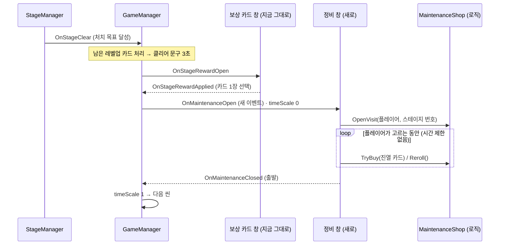

# 정비(상점) 구현 계획 — 무기 구매 · 부품(악세서리)

> 작성 2026-10-01 · 상태: **1단계 구현 완료 (2026-10-02, 15장)** — 재화는 요청에 따라 "몬스터가 떨어뜨리는 코인"으로 바꿨다. 부품(악세서리)은 다음 단계
>
> 요청: "스테이지 클리어 후 나오는 정비 구간에서 추가 주무기 구매(새로운 총기나 검) / 주무기에 부착할 악세서리 등의 공간을 먼저 계획.
> 정교한 맵은 다른 사람이 개발할 예정이라 추가 로직 부분만. 지금은 스테이지를 깬 후 업그레이드 카드처럼 마우스로 클릭해서 선택하는 흐름"
>
> **정한 것** (2026-10-01)
> - 순서: 스테이지 클리어 → **보상 카드(무료, 지금 그대로)** → **정비** → 다음 스테이지
> - 재화: **크레딧** = 경험치 구슬을 먹을 때 같은 양 + 스테이지 클리어 보너스
> - 화면: 지금은 **카드를 마우스로 클릭해 사는 창**. 걸어 다니는 정비 맵은 다른 담당자가 나중에 이 로직에 연결한다
> - `GameManager` · `GameEvents`(Core 폴더) 수정은 **팀에 미리 알리고 머지한 뒤** 진행한다 (4장)
>
> 관련 문서: [상점-재화-설계.md](상점-재화-설계.md) (경제 설계 근거) · [무기-커스터마이징-조사.md](무기-커스터마이징-조사.md) (부품 후보) · [튜토리얼-설계.md](튜토리얼-설계.md) (T9 정비방)
>
> ⚠ 같은 `GameManager` 클리어 흐름을 고치는 [이벤트-겹침-버그-분석.md](이벤트-겹침-버그-분석.md) 1단계를 **먼저** 하고, 정비 단계를 그 흐름에 끼운다 (그 문서 6장)

---

## 0. 한눈에

- 정비 창에서 할 수 있는 것 (1단계)
  - **새 주무기 구매** — 캐릭터가 쓸 수 있고 아직 없는 무기 (사수 = 총, 검사 = 근접)
  - **부품 구매 · 교체** — 들고 있는 무기에 다는 수치형 부품 15종 (총 9 · 근접 6)
  - **새로고침** — 크레딧을 내고 진열을 바꾼다
  - **출발** — 다음 스테이지로
- 구조를 **데이터 · 로직 · 화면** 세 층으로 나눈다. 지금 화면(클릭 창)을 나중에 정비 맵(받침대 · 터미널)으로 바꿔도 **로직은 그대로** 쓴다 (13장)
- 고칠 기존 파일
  - Core 2개(`GameManager` · `GameEvents`) — 몇십 줄, **팀 협의**
  - Player 폴더 4개(`WeaponBase` · `IWeapon` · `WeaponController` · `PlayerStats`)
  - **씬 · 빌드 목록은 건드리지 않는다** — 정비 창은 실행 중에 만든다 (설정창과 같은 방식)

---

## 1. 범위

| 단계 | 내용 | 비고 |
|---|---|---|
| **1단계 (이번 계획)** | 크레딧 · 정비 흐름 · 무기 구매 · 부품 구매/교체 · 새로고침 · 정비 창 · 편집기 도구 · 검증 | 이 문서 전체 |
| 2단계 | 잠금 · 판매 · 수리 / 장갑 판 · HUD 크레딧 표시 · 무기 슬롯 HUD 에 부품 표시 · 보상 카드에 부품(`AttachmentReward`) | [상점-재화-설계.md](상점-재화-설계.md) 5장 규칙 |
| 3단계 | 수치 추가가 필요한 부품(퍼짐 · 휘두르기 각도 · 넉백 · 패링 쿨타임) · 원소(화상 · 연쇄) · 전용 개조 · 근접 티어 | [무기-커스터마이징-조사.md](무기-커스터마이징-조사.md) 4 · 5 · 11장 |
| 맵 연결 | 정비 맵의 받침대 · 터미널 · 출격 게이트 | **다른 담당자** — 13장 연결 방법 |

---

## 2. 흐름



- 정비 창이 없으면(`OnMaintenanceOpen` 구독자가 없으면) **지금처럼 건너뛴다** — 보상 카드 단계와 같은 규칙
- 정비에는 **60초 강제 진행을 걸지 않는다** (보상 카드 창에만 있다)
- Stage3 뒤 정비 = **보스 직전 정비**. 보스 스테이지는 클리어 흐름이 없으므로 정비도 없다

---

## 3. 구조 — 세 층

| 층 | 무엇 | 지금 | 맵이 생기면 |
|---|---|---|---|
| **데이터** | `AttachmentData` (부품) · `ShopCatalog` (팔 것 · 가격) | ScriptableObject 에셋 | 그대로 |
| **로직** | `CreditWallet` (지갑) · `MaintenanceShop` (진열 · 구매 · 새로고침) · `WeaponBase` 부품 장착 | 화면과 무관한 C# | **그대로** |
| **화면** | `MaintenanceUI` (카드 클릭 창) | 실행 중 생성되는 오버레이 | 받침대 · 터미널이 같은 로직을 부른다 |

로직은 화면을 모른다. 화면은 `MaintenanceShop` 의 진열을 읽고 `TryBuy` 를 부를 뿐이다.

---

## 4. 머지 전에 팀과 맞출 것 — 기존 파일 수정 목록

| 파일 | 폴더 | 바뀌는 것 | 크기 |
|---|---|---|---|
| `GameEvents.cs` | **Core** | 이벤트 2개 추가 (`OnMaintenanceOpen` · `OnMaintenanceClosed`) | +6줄 |
| `GameManager.cs` | **Core** | 보상 카드 뒤에 정비 단계 (`MaintenanceFlow`) | +25줄 |
| `PlayerStats.cs` | Player | 경험치를 얻을 때 알림 (`OnExpGained`) | +3줄 |
| `IWeapon.cs` | Player | 부품 장착 계약 3개 | +10줄 |
| `WeaponBase.cs` | Player | 부위별 부품 보관 · 스탯에 합성 · 교체 | +60줄 |
| `WeaponController.cs` | Player | `TryAttach` (장착 + HUD 알림) | +20줄 |
| 씬 · 빌드 목록 · 프리팹 | — | **없음** | — |

### 4-1. `GameEvents.cs` (Core)

```csharp
// 정비 (스테이지 사이 상점)
/// <summary>정비 창을 띄울 때. 스테이지 흐름이 보상 카드 다음에 발행한다.</summary>
public static Action OnMaintenanceOpen;

/// <summary>정비를 마쳤을 때 ("출발"). 스테이지 흐름이 이 신호를 기다렸다 다음 씬으로 넘어간다.</summary>
public static Action OnMaintenanceClosed;
```

### 4-2. `GameManager.cs` (Core)

```csharp
bool isMaintenanceOpen;

// OnEnable / OnDisable 에 추가
GameEvents.OnMaintenanceClosed += OnMaintenanceClosed;   // OnDisable 에서는 -=

void OnMaintenanceClosed() => isMaintenanceOpen = false;

// StageClearFlow 안 — 보상 카드와 그 뒤 레벨업 정리 다음 (2026-10-02 이벤트 겹침 수정 반영)
yield return StageRewardFlow();
yield return DrainLevelUps();
yield return MaintenanceFlow();   // ← 추가

/// <summary>
/// 정비 창을 띄우고 "출발"을 누를 때까지 기다린다.
/// 창이 없으면(구독자가 없으면) 건너뛴다. 보상 카드와 달리 시간 제한을 두지 않는다 — 고민하는 것이 정비다.
/// </summary>
IEnumerator MaintenanceFlow()
{
    if (GameEvents.OnMaintenanceOpen == null)
        yield break;

    isMaintenanceOpen = true;
    Time.timeScale = 0f;

    GameEvents.OnMaintenanceOpen.Invoke();

    while (isMaintenanceOpen)
        yield return null;

    Time.timeScale = 1f;
}
```

- 시간 제한이 없으므로 **정비 창은 어떤 실패에서도 `OnMaintenanceClosed` 를 보내야 한다** (9장 "멈추지 않게")
- 병합 충돌 위험: `GameManager.cs` 를 다른 사람이 고치고 있으면 그 작업을 먼저 머지한다

---

## 5. 새 파일 목록

| 파일 | 역할 |
|---|---|
| `Scripts/Player/Economy/CreditWallet.cs` | 크레딧 잔액 · 얻기 · 쓰기 · 클리어 보너스 |
| `Scripts/Player/Attachments/AttachmentData.cs` | 부품 한 종류 (ScriptableObject) |
| `Scripts/Player/Attachments/AttachmentTypes.cs` | `AttachmentSlot` · `AttachmentTier` · `WeaponFamily` |
| `Scripts/Maintenance/ShopCatalog.cs` | 팔 무기 · 부품 · 가격 · 배율 (ScriptableObject) |
| `Scripts/Maintenance/ShopOffer.cs` | 진열 카드 한 장 (실행 중 객체) |
| `Scripts/Maintenance/MaintenanceShop.cs` | 진열 만들기 · 구매 · 새로고침 (로직) |
| `Scripts/Maintenance/MaintenanceUI.cs` | 정비 창 — 열기 · 카드 채우기 · 출발 |
| `Scripts/Maintenance/MaintenanceOfferCard.cs` | 카드 한 장 (클릭 = 구매) |
| `Scripts/Maintenance/ModifierText.cs` | 수치를 "치명타 확률 +10%p" 같은 글로 |
| `Editor/MaintenanceSetup.cs` | 부품 에셋 · 카탈로그 · 정비 창 프리팹 생성 (멱등) |
| `Resources/UI/Maintenance.prefab` | 정비 창 (도구가 만든다) |
| `Data/Attachments/AT_*.asset` · `Data/Shop/ShopCatalog.asset` | 부품 15종 · 카탈로그 (도구가 만든다) |

---

## 6. 클래스 설계

### 6-1. `CreditWallet` — 플레이어에 붙는 지갑

```csharp
public class CreditWallet : MonoBehaviour
{
    [SerializeField] int[] clearBonus = { 10, 15, 20 };   // 스테이지 1 · 2 · 3

    public int Credits { get; private set; }
    public event Action<int> OnChanged;

    public void Add(int amount);              // 0 이하는 무시
    public bool CanSpend(int amount);
    public bool TrySpend(int amount);         // 모자라면 false, 아무것도 바꾸지 않는다

    // PlayerStats.OnExpGained 를 구독 → 같은 양을 Add
    // GameEvents.OnStageClear 를 구독 → 그 씬에서 한 번만 clearBonus[stageIndex - 1]
}
```

- **플레이어가 씬을 넘어 살아 있으므로** 저장하지 않아도 판 끝까지 유지된다. 죽거나 로비로 가면 플레이어와 함께 사라진다
- 붙이는 곳: 정비 시스템이 `OnPlayerSpawned` 를 받아 **없으면 붙인다** — 플레이어 프리팹을 고치지 않는다
- ⚠ `StageManager` 는 처치 목표를 넘긴 뒤에도 **처치할 때마다 `OnStageClear` 를 또 보낸다.** 보너스는 씬마다 한 번만 준다 (씬 핸들을 기억)
- 스테이지 번호: `FindFirstObjectByType<StageManager>().currentStage.stageIndex` (읽기만)

`PlayerStats.cs` 변경 (Player):

```csharp
/// <summary>경험치를 얻을 때 (얻은 양). 크레딧이 같은 양을 따라 얻는다.</summary>
public event Action<int> OnExpGained;

public void AddExp(int amount)
{
    if (amount <= 0) return;
    OnExpGained?.Invoke(amount);   // ← 추가
    ...
}
```

### 6-2. `AttachmentData` — 부품

```csharp
public enum AttachmentSlot { Optic, Muzzle, Underbarrel, Magazine, Ammo, Blade, Core, Grip }
public enum AttachmentTier { Basic, Balanced, Overclock }      // 초록 · 노랑 · 빨강

[Flags] public enum WeaponFamily
{
    Ballistic = 1,   // ProjectileWeaponData — 소총 · 기관단총 · 샷건 · 스나이퍼
    Chain     = 2,   // ChainBeamWeaponData  — 전격 소총
    Charge    = 4,   // ChargeBeamWeaponData — 충전 레이저
    Melee     = 8,   // MeleeWeaponData      — 검 · 대검 · 창
}

[CreateAssetMenu(menuName = "Weapons/Attachment")]
public class AttachmentData : ScriptableObject
{
    public string displayName;
    [TextArea] public string flavor;           // 한 줄 설명 (세계관 문구)
    public Sprite icon;
    public AttachmentSlot slot;
    public AttachmentTier tier;
    public WeaponFamily families;              // 달 수 있는 계열
    public WeaponData[] onlyFor;               // 비우면 계열 전체. 특정 무기 전용일 때만

    public WeaponModifier modifier = WeaponModifier.Identity;
    [Range(-0.9f, 2f)] public float magazinePercent;   // 탄창 ±% — 무기마다 기본 탄창이 달라 장착 때 정수로 바꾼다

    public int basePrice;

    public static WeaponFamily FamilyOf(WeaponData data);   // 데이터 타입으로 판별. 드론은 0 (부품 없음)
    public bool Fits(WeaponData weapon);                     // 계열 · onlyFor 확인
    public WeaponModifier Resolve(WeaponData weapon);        // magazinePercent → magazineAdd 로 바꾼 최종 증분
}
```

- **계열이 필요한 이유** — 무기 종류마다 반영되는 수치가 다르다 (지금 코드 기준)

| 수치 | 총 (Ballistic) | 전격 소총 (Chain) | 충전 레이저 (Charge) | 근접 (Melee) |
|---|---|---|---|---|
| 피해 · 연사 · 치명타 | ● | ● | ● | ● |
| 탄속 | ● | — | — | — |
| 투사체 수 | ● | — | — | ● **최대 타격 수**로 쓰인다 |
| 관통 | ● | ● **연쇄 수**로 쓰인다 | — (무한 관통) | — |
| 탄창 · 장전 | ● | ● | ● | — |
| 사거리 | — | ● | ● | ● |

### 6-3. 무기 쪽 변경 (Player)

`IWeapon.cs`:

```csharp
AttachmentData GetAttachment(AttachmentSlot slot);   // 없으면 null
bool CanAttach(AttachmentData attachment);           // 계열이 맞는가
AttachmentData Attach(AttachmentData attachment);    // 같은 부위에 있던 부품을 돌려준다 (교체)
```

`WeaponBase.cs`:

```csharp
readonly Dictionary<AttachmentSlot, AttachmentData> attachments = new();
WeaponModifier attachmentModifier = WeaponModifier.Identity;   // 달린 부품들의 합

// 부품은 업그레이드 누적분(accumulated)과 따로 든다 — 누적분은 빼기가 안 되어 교체를 못 한다
protected WeaponModifier TotalModifier =>
    WeaponModifier.Combine(WeaponModifier.Combine(accumulated, attachmentModifier),
                           data.perLevelBonus.Scaled(level - 1));

public AttachmentData Attach(AttachmentData a)
{
    // 1. 맞지 않으면 null
    // 2. 같은 부위에 있던 것을 replaced 로 꺼내고 새 부품을 넣는다
    // 3. attachmentModifier 를 다시 합성 (각 부품의 Resolve(data))
    // 4. 탄창이 커졌으면 늘어난 만큼 탄을 채우고, 작아졌으면 탄창 크기로 자른다
    // 5. OnStatsChanged() · 탄약 HUD 갱신
    // 6. return replaced;
}
```

`WeaponController.cs`:

```csharp
/// <summary>가진 무기에 부품을 단다. 성공하면 HUD 에 스탯 변경을 알린다.</summary>
public bool TryAttach(WeaponData target, AttachmentData attachment, out AttachmentData replaced)
// Find(target) → CanAttach → Attach → RaiseLegacyStats()
```

- 레벨업 · 범용 업그레이드와 부품은 **곱해서 함께** 적용된다 (`Combine`)
- `WeaponData`(에셋)는 절대 고치지 않는다 — 지금 규칙 그대로

### 6-4. `ShopCatalog` — 팔 것과 가격

```csharp
[CreateAssetMenu(menuName = "Stage/Maintenance/Catalog")]
public class ShopCatalog : ScriptableObject
{
    public WeaponData[] weapons;            // 살 수 있는 주무기 (총 6 + 근접 3). 캐릭터 규칙이 걸러 준다
    public int weaponPrice = 28;
    public AttachmentData[] attachments;    // 부품 15종

    public int weaponSlots = 3;             // 진열 — 무기 카드 수
    public int attachmentSlots = 4;         // 진열 — 부품 카드 수

    public float priceStepPerStage = 0.1f;  // 스테이지마다 +10% (Stage1 ×1.0 · 2 ×1.1 · 3 ×1.2)
    public int rerollBase = 3;              // 새로고침: 3 + (스테이지 − 1) + 2 × 이번 방문 새로고침 수
    public int rerollStep = 2;

    public int PriceOf(int basePrice, int stageIndex);   // 반올림
}
```

### 6-5. `ShopOffer` — 진열 카드 한 장

```csharp
public enum OfferKind { Weapon, Attachment }

public class ShopOffer
{
    public OfferKind Kind;
    public WeaponData Weapon;           // 무기 카드: 살 무기 / 부품 카드: 달 대상 무기
    public AttachmentData Attachment;   // 부품 카드만
    public int Price;
    public bool Sold;
    public AttachmentData WillReplace;  // 같은 부위에 이미 달린 부품 ("교체" 표시)
}
```

### 6-6. `MaintenanceShop` — 로직

```csharp
public class MaintenanceShop
{
    public IReadOnlyList<ShopOffer> WeaponOffers { get; }
    public IReadOnlyList<ShopOffer> AttachmentOffers { get; }
    public int RerollCost { get; }
    public CreditWallet Wallet { get; }
    public event Action OnChanged;                  // 화면을 다시 그린다

    public void OpenVisit(GameObject player, ShopCatalog catalog, int stageIndex);
    public bool CanBuy(ShopOffer offer, out string reason);   // "크레딧 부족" · "슬롯이 가득 찼다" · "이미 샀다"
    public bool TryBuy(ShopOffer offer);
    public bool TryReroll();
}
```

**진열 만들기**

| 칸 | 규칙 |
|---|---|
| 무기 3칸 | 카탈로그 무기 중 `CanAcquire(w) && !Has(w)` (캐릭터 규칙 · 빈 슬롯) → 섞어서 3개 |
| 부품 4칸 | (들고 있는 손 무기 × 맞는 부품) 짝 중, **같은 부품이 이미 달려 있으면 뺀다** → 섞어서 4개. 같은 짝은 두 번 나오지 않는다 |

**구매**

| 종류 | 처리 |
|---|---|
| 무기 | `CanAcquire` 다시 확인 → `Acquire(w) == Equipped` 일 때만 크레딧을 쓴다 |
| 부품 | `TryAttach(대상, 부품)` 성공일 때만 크레딧을 쓴다. 같은 부위에 있던 부품은 사라진다 (판매는 2단계) |
| 공통 | 산 카드는 "구매함"으로 남는다. 다른 카드가 더 이상 살 수 없게 되면(슬롯이 가득 등) 그 카드는 이유를 보여 주며 꺼진다 |

- 순서: **확인 → 적용 → 크레딧 차감.** 적용이 실패하면 크레딧을 쓰지 않는다
- 무기를 사도 부품 진열은 바꾸지 않는다 (새 무기용 부품은 새로고침 · 다음 정비에서)

### 6-7. `MaintenanceUI` · `MaintenanceOfferCard` — 화면

- **실행 중에 만든다**: `Resources/UI/Maintenance` 프리팹을 게임 시작 때 하나 만들어 씬을 넘어 살려 둔다 (설정창 `GameSettingsUI` 와 같은 방식) → **씬 파일을 고치지 않는다**
- `OnMaintenanceOpen` → 플레이어(`GameAppManager.Instance.Player`) · 카탈로그 · 스테이지 번호로 `OpenVisit` → 창 켜기
- **출발** 버튼 → 창 끄기 → `OnMaintenanceClosed`
- 캔버스 정렬 800 — 설정창(900)이 위에 뜬다. ESC 설정창은 그대로 열린다 (이미 멈춰 있어 시간을 건드리지 않는다)
- 카드 클릭 = 구매 (업그레이드 카드와 같은 한 번 클릭). 사지 못하는 카드는 흐리게 + 이유

### 6-8. `ModifierText` — 효과를 글로

`WeaponModifier` 와 대상 무기를 받아 줄 목록을 만든다. 좋은 쪽은 초록, 나쁜 쪽은 빨강.

| 수치 | 글 |
|---|---|
| `critChanceAdd` 0.10 | 치명타 확률 +10%p |
| `fireIntervalMul` 1.10 | 공격 속도 −9% (간격 배율의 역수로 계산) |
| `projectileSpeedAdd` 6 | 탄속 +6 |
| `rangeAdd` 1 | 사거리 +1m |
| `projectileCountAdd` 2 (근접) | 최대 타격 +2 |
| `pierceAdd` 1 (전격 소총) | 연쇄 +1 |
| `magazinePercent` 0.5 | 탄창 +50% (소총 30 → 45) |

---

## 7. 데이터 — 1단계 부품 15종 · 가격

**수치형만** — 지금 `WeaponModifier` 로 바로 되는 것 ([무기-커스터마이징-조사.md](무기-커스터마이징-조사.md) 의 ●).
값은 그 문서의 후보를 지금 코드 단위로 옮긴 것이다. 가격 = 기본 12 · 균형 18 (Stage1 기준).

**총 (9종)**

| 이름 | 부위 | 등급 | 효과 (`WeaponModifier`) | 계열 | 가격 |
|---|---|---|---|---|---|
| 2배율 스코프 | Optic | 균형 | 치명타 확률 +0.10 · 탄속 +6 · 간격 ×1.10 | 총 | 18 |
| 저격 광학장치 | Optic | 균형 | 치명타 배율 +1.0 · 간격 ×1.15 | 총 · 충전 레이저 | 18 |
| 확장 총열 | Muzzle | 균형 | 탄속 +8 · 피해 ×1.10 · 간격 ×1.10 | 총 | 18 |
| 플라즈마 소음기 | Muzzle | 균형 | 치명타 배율 +0.75 · 탄속 −3 | 총 | 18 |
| 손잡이 | Underbarrel | 기본 | 장전 ×0.80 | 총 · 전격 · 충전 | 12 |
| 확장 탄창 | Magazine | 균형 | 탄창 +50% · 장전 ×1.15 | 총 · 전격 · 충전 | 18 |
| 빠른 탄창 | Magazine | 균형 | 장전 ×0.65 · 탄창 −20% | 총 · 전격 · 충전 | 18 |
| 철갑탄 | Ammo | 균형 | 관통 +2 · 피해 ×0.90 | 총 | 18 |
| 연쇄 증폭기 | Ammo | 균형 | 연쇄 +1 (`pierceAdd`) · 피해 ×0.90 | 전격 소총 | 18 |

**근접 (6종)**

| 이름 | 부위 | 등급 | 효과 | 가격 |
|---|---|---|---|---|
| 연장 방출기 | Blade | 균형 | 사거리 +1 · 간격 ×1.10 | 18 |
| 고주파 진동날 | Blade | 균형 | 간격 ×0.80 · 피해 ×0.88 | 18 |
| 중량 날 | Blade | 균형 | 피해 ×1.35 · 간격 ×1.25 (넉백은 3단계) | 18 |
| 예리한 손잡이 | Grip | 기본 | 치명타 확률 +0.15 | 12 |
| 광폭 손잡이 | Grip | 균형 | 최대 타격 +2 · 피해 ×0.90 | 18 |
| 과충전 코어 | Core | 균형 | 피해 ×1.15 · 치명타 배율 +0.3 · 간격 ×1.08 | 18 |

- 커스터마이징 문서 5장과 **부위 배치가 조금 다르다**
  - 예리한 · 광폭을 "날"에서 **"손잡이"** 로 옮겼다
  - 원소가 없는 1단계에 코어 부품("과충전 코어")을 하나 둔다
  - 그래야 1단계에서도 부위마다 고를 거리가 생긴다. 원소 코어(3단계)가 들어오면 과충전 코어는 그대로 남긴다
- 밸런스: 균형 부품은 단일 대상 DPS 를 **+10% 안팎**으로 맞췄다. 예) 중량 날 1.35 ÷ 1.25 = +8%, 고주파 0.88 ÷ 0.80 = +10%
- 이름 · 설명 문구는 세계관이 정해지면 바꾼다 ([SF-세계관-설정.md](SF-세계관-설정.md) 용어집 — "MX 레일 · 방출기 모듈")

**무기 · 그 밖의 가격**

| 상품 | Stage1 | Stage2 (×1.1) | Stage3 (×1.2) |
|---|---|---|---|
| 새 무기 | 28 | 31 | 34 |
| 부품 — 기본 | 12 | 13 | 14 |
| 부품 — 균형 | 18 | 20 | 22 |
| 새로고침 (첫 번) | 3 | 4 | 5 |

**수입 추정** (상점-재화-설계 3장): Stage1 ≈ 37 · Stage2 ≈ 51 · Stage3 ≈ 65 → 한 번 들러 **2개 안팎**.

---

## 8. 화면 — 정비 창

```
┌──────────────────────────────────────────────────────────────────┐
│  정비                                             ◆ 크레딧 37      │
│                                                                  │
│  무기 ─────────────────────────────────────────────────────────  │
│  ┌────────┐ ┌────────┐ ┌────────┐                                │
│  │ [아이콘] │ │        │ │        │                                │
│  │ 기관단총 │ │  샷건  │ │ 스나이퍼│                                │
│  │ 연사형  │ │        │ │        │                                │
│  │   28   │ │   28   │ │   28   │                                │
│  └────────┘ └────────┘ └────────┘                                │
│                                                                  │
│  부품 ─────────────────────────────────────────────────────────  │
│  ┌────────┐ ┌────────┐ ┌────────┐ ┌────────┐                     │
│  │[부품][소총]│ │        │ │  교체  │ │        │                     │
│  │2배율 스코프│ │확장 탄창│ │철갑탄  │ │손잡이  │                     │
│  │치명 +10%p│ │탄창+50%│ │관통 +2 │ │장전−20%│                     │
│  │속도 −9% │ │장전+15%│ │피해−10%│ │        │                     │
│  │   18   │ │   18   │ │   18   │ │   12   │                     │
│  └────────┘ └────────┘ └────────┘ └────────┘                     │
│                                                                  │
│  내 무기  [소총 · 스코프 · 탄창]  [샷건 · —]  [ 빈 칸 ]  [ 빈 칸 ]   │
│                                                                  │
│                              [새로고침 ◆3]          [출발 ▶]      │
└──────────────────────────────────────────────────────────────────┘
```

| 요소 | 내용 |
|---|---|
| 카드 테두리 | 등급 색 — 기본 초록 · 균형 노랑 · 개조 빨강. 무기 카드는 청록 |
| 부품 카드 | 부품 아이콘 + **대상 무기 아이콘(작게)** · 이름 · 효과 줄(초록 / 빨강) · 가격 |
| "교체" 꼬리표 | 같은 부위에 이미 달린 부품이 있으면 — 마우스를 올리면 무엇이 빠지는지 |
| 살 수 없는 카드 | 흐리게 + 이유 ("크레딧 부족" · "무기 슬롯이 가득 찼다") |
| 산 카드 | "구매함" — 그 자리에 남는다 |
| 진열이 비면 | "살 수 있는 무기가 없다" 같은 문구 (검사가 근접 3종을 다 가진 경우 등) |
| 내 무기 줄 | 손 무기 4칸과 달린 부품 — 무엇을 달았는지 한눈에 |
| 소리 | 무기 구매는 무기 획득음이 저절로 난다(`SoundManager` 가 이미 듣는다). 부품 장착음 · 크레딧 부족음은 정비 창이 따로 낸다 |
| 글자 재질 | 설정창처럼 **전용 재질** — 글꼴 기본 재질은 색을 하얗게 포화시킨다 |
| 색 · 글꼴 | 설정창 · 테스트 룸과 같은 팔레트 (Ink · Accent) |

---

## 9. 규칙 · 예외

| 상황 | 처리 |
|---|---|
| 정비 창 프리팹이 없다 | 창이 생기지 않으면 구독자가 없어 `GameManager` 가 **정비를 건너뛴다** |
| 플레이어 · 카탈로그를 못 찾았다 | 오류 로그 → **즉시 `OnMaintenanceClosed`** (멈추지 않게) |
| 연 뒤 예외 | 열기 과정을 감싸 실패하면 창을 닫고 `OnMaintenanceClosed` |
| 크레딧 부족 | 카드를 흐리게. 눌러도 아무 일 없음 + 짧은 경고음 |
| 무기 슬롯 4칸이 가득 | 무기 카드가 진열되지 않는다 (판매는 2단계) |
| 캐릭터 규칙 | `CanAcquire` 가 거른다 — 검사에게 총, 사수에게 검이 나오지 않는다 |
| 드론(서브유닛) | 부품을 달지 않는다 (계열 0) |
| 레벨업 카드가 남아 있다 | 지금처럼 클리어 흐름 맨 앞에서 먼저 처리된다 |
| 보스 스테이지 | 클리어 흐름이 없어 정비도 없다 |
| 테스트 룸 | `GameManager` 가 없어 정비가 열리지 않는다 (2단계: 테스트 룸 HUD 에 "정비 열기" 버튼) |
| 시간 | 정비 동안 `timeScale` 0. 창은 시간 정지와 무관하게 동작한다 (UI 는 시간 비례 연출을 쓰지 않는다) |

---

## 10. 편집기 도구 — `MaintenanceSetup`

메뉴 `Tools / 정비 / 전체 만들기` · 배치 `MaintenanceSetup.RunBatch`. 지금 도구들처럼 **멱등**이다.

1. 부품 15종 에셋 (`Data/Attachments/AT_*.asset`) — 7장 표 그대로
2. 카탈로그 (`Data/Shop/ShopCatalog.asset`) — 무기 9종(드론 제외) · 부품 15종 · 가격
3. 정비 창 프리팹 (`Resources/UI/Maintenance.prefab`) — 8장 배치. 카드 3 + 4개, 새로고침 · 출발 버튼, 내 무기 줄
4. 글자 전용 재질 (`Resources/UI/MaintenanceText.mat`)
5. 부품 아이콘: 1단계는 **부위별 아이콘 8개**를 우주 탐사 GUI 킷에서 고른다 (조준경 = `scope-*.png` 등). 부품마다 그린 아이콘은 2단계

씬 · 플레이어 프리팹 · 빌드 목록은 **건드리지 않는다**.

---

## 11. 검증 계획

배치 모드 임시 테스트로 확인하고 지운다 (지금까지 하던 방식).

| # | 확인 | 기대 |
|---|---|---|
| 1 | 로비 → 사수 · 소총 → Stage1, 경험치 구슬 12 획득 | 크레딧 12 |
| 2 | 처치 목표 달성 | 클리어 보너스 +10 **한 번만** (목표 뒤 추가 처치에도 다시 주지 않음) |
| 3 | 보상 카드 선택 | 정비 창이 열리고 `timeScale` 0 |
| 4 | 무기 진열 | 사수: 총만, 가진 무기 · 드론 없음 / 검사: 근접만 |
| 5 | 무기 구매 | 슬롯 +1 · 크레딧 −28 · 카드 "구매함" · 무기 획득음 |
| 6 | 부품 구매 | 대상 무기 스탯 변화 (예: 2배율 스코프 → 치명타 확률 +0.10) · 크레딧 −18 |
| 7 | 같은 부위 교체 | 이전 부품 수치가 빠지고 새 부품만 남는다 |
| 8 | 확장 탄창 | 탄창 30 → 45, 늘어난 15발이 채워진다 |
| 9 | 크레딧 부족 | 카드가 흐리고 눌러도 변화 없음 |
| 10 | 새로고침 | 비용 3 → 5 → 7, 진열이 바뀜, 산 카드 기록은 사라짐 |
| 11 | 출발 | `OnMaintenanceClosed` → Stage2 로드, 크레딧 · 부품 유지 |
| 12 | 60초 이상 머물기 | 강제로 넘어가지 않는다 |
| 13 | 정비 창 프리팹을 지운 상태 | 정비를 건너뛰고 지금처럼 다음 스테이지 |
| 14 | 레벨업 뒤 | 부품 효과가 유지되고 레벨 보너스와 함께 적용 |
| 15 | 기존 테스트 | `TestRoomValidation` 통과 (무기 계산 회귀 없음) |

---

## 12. 구현 순서 — 요청이 오면 이 순서로

- [ ] **0. 머지 확인** — `GameManager` · `GameEvents` 를 다른 작업이 고치고 있지 않은지, 최신을 받았는지
- [ ] 1. `AttachmentTypes` · `AttachmentData` · `ShopCatalog` · `ShopOffer` (데이터)
- [ ] 2. `IWeapon` · `WeaponBase` · `WeaponController.TryAttach` (부품 장착) — 오프라인 컴파일
- [ ] 3. `PlayerStats.OnExpGained` · `CreditWallet`
- [ ] 4. `GameEvents` · `GameManager.MaintenanceFlow` (Core)
- [ ] 5. `MaintenanceShop` (로직) · `ModifierText`
- [ ] 6. `MaintenanceUI` · `MaintenanceOfferCard`
- [ ] 7. `MaintenanceSetup` 도구 → 배치 실행 → 에셋 · 프리팹 생성
- [ ] 8. 11장 검증 (임시 테스트) → 캡처로 화면 확인 → 임시 테스트 삭제
- [ ] 9. 문서 갱신 — 이 문서에 "구현 결과", [플레이어-시스템-정리.md](플레이어-시스템-정리.md) 상태 변경

---

## 13. 정비 맵 연결 — 다른 담당자용

맵이 생기면 **화면(클릭 창)만 바뀌고 로직은 그대로**다.

| 맵의 것 | 부를 것 |
|---|---|
| 무기 받침대 · 부품 진열대 | `MaintenanceShop.WeaponOffers` · `AttachmentOffers` 의 한 장을 보여 주고, 상호작용(E) 때 `TryBuy(offer)` |
| 새로고침 터미널 | `TryReroll()` |
| 크레딧 표시 | `CreditWallet.Credits` · `OnChanged` |
| 출격 게이트 | `GameEvents.OnMaintenanceClosed` 발행 |
| 진열이 바뀔 때 | `MaintenanceShop.OnChanged` 를 받아 받침대를 다시 그린다 |

- 정비 맵을 **스테이지 씬 안의 한 구역**으로 만들면 지금 흐름 그대로 쓴다
  - 정비 창 대신 카메라 · 플레이어를 그 구역으로 옮긴다
- **별도 씬**으로 만들면 두 가지가 달라진다
  - `GameManager` 가 그 씬을 열고 돌아갈 스테이지를 기억하도록 바꿔야 한다. 지금은 "빌드 순서 + 1" 로 다음 씬을 고른다 ([상점-재화-설계.md](상점-재화-설계.md) 4장 B)
  - 정비 맵 씬의 이름을 `Stage` 로 시작하면 `GameAppManager` 가 플레이어 배치 · 카메라를 자동으로 해 준다

---

## 14. 남은 결정

| 질문 | 기본값 (이 계획) | 다른 선택 |
|---|---|---|
| 부품 교체 시 이전 부품 | 사라진다 | 2단계 판매와 함께 50% 환불 |
| 무기 진열 수 · 부품 진열 수 | 3 · 4 | 2 · 4 / 3 · 3 |
| 가진 무기 레벨업도 팔까 | 1단계는 팔지 않는다 (보상 카드가 맡는다) | 무기 칸에 섞기 (14 크레딧) |
| 부품 아이콘 | 부위별 8개 (GUI 킷) | 부품마다 렌더링 |
| 크레딧 HUD | 1단계는 정비 창에만 | 전투 HUD 에도 (2단계) |

---

## 15. 구현 결과 (2026-10-02)

> 요청: "몬스터 잡을 때 재화 시스템과 스테이지 클리어 후 상점 시스템. 재화는 땅에 코인 형태로. 추후 수정에 용이하게.
> 클리어 후 업그레이드 카드처럼 카드 UI 를 선택하고 '다음 스테이지' 버튼으로 진행 (추후 중간 맵 등 수정에 용이하게). 무기 코스트는 직접 잡아 줘"

### 15-1. 계획과 달라진 점

| 항목 | 계획 (1 ~ 14장) | 구현 |
|---|---|---|
| 재화 출처 | 경험치 구슬과 같은 양 | **몬스터가 땅에 떨어뜨리는 코인** (종류별 개수) + 클리어 보너스 |
| 상품 | 새 무기 + 부품 15종 | **새 무기 + 보유 무기 강화**. 부품은 다음 단계 — 상품을 "공급원"으로 끼우는 구조를 먼저 만들었다 (15-4) |
| 진열 | 무기 3 + 부품 4 | 카드 5장 = 새 무기 3 + 강화 2. 적으면 있는 카드만 가운데로 |
| 크레딧 HUD | 2단계 | 지금 넣었다 — 스테이지 오른쪽 위 |

### 15-2. 흐름

```
몬스터 처치 ─▶ 코인이 튀어 나와 바닥에 놓인다 ─▶ 3.5m 안에 들어가면 날아와 지갑으로
스테이지 클리어 ─▶ 클리어 보너스 · 남은 코인이 모두 날아온다
  ─▶ 클리어 문구 ─▶ 레벨업 카드 ─▶ 보상 카드(무료) ─▶ 정비 창 ─▶ [다음 스테이지 ▶] ─▶ 다음 씬
```

- 정비 창: 카드를 **클릭하면 산다** (업그레이드 카드처럼). [새로고침] 은 크레딧을 내고 진열을 바꾼다
- Stage3 뒤에는 버튼이 "보스전으로 ▶" 가 된다
- 정비 동안 시간은 멈추고, 시간 제한이 없다. 정비 창을 열기 전에 땅에 남은 코인은 바로 지갑에 들어간다

### 15-3. 수치 (처음 값 — 에셋에서 바로 바꾼다)

**무기 가격** (Stage1 기준, 스테이지마다 +10%)

| 무기 | 가격 | 근거 |
|---|---|---|
| 소총 · 검 | 20 | 기본형 |
| 기관단총 · 샷건 | 24 | 연사 · 근거리 광역 |
| 스나이퍼 · 창 | 28 | 관통 · 사거리 5m |
| 대검 | 30 | 광역 8타 |
| 전격 소총 | 32 | 연쇄 광역 |
| 충전 레이저 | 36 | 무한 관통 빔 · 고화력 |

- **강화 가격** = 무기 가격 × (0.6 + 0.15 × (지금 레벨 − 1)) — 예) 소총 Lv1→2 = 12, Lv4→5 = 21
- **새로고침** = 3 + (스테이지 − 1) + 2 × 이번 정비에서 한 횟수
- **코인**: 몬스터 A 1 · B 2 · C(원거리) 3 · D(자폭) 2 — 경험치와 같은 비율. 자폭으로 스스로 터진 적은 주지 않는다
- **클리어 보너스**: 10 / 15 / 20
- **수입 추정**: 처치 목표 15 · 20 · 25 × 평균 2 + 보너스 → Stage1 ≈ 40 · Stage2 ≈ 55 · Stage3 ≈ 70 — 한 번 들러 1 ~ 2개

### 15-4. 바꾸고 싶을 때 — 어디를 고치나

| 바꿀 것 | 고칠 곳 |
|---|---|
| 몬스터별 코인 · 클리어 보너스 · 줍기 거리 · 코인 소리 | `Resources/Economy/EconomySettings` 에셋 |
| 무기 가격 · 파는 무기 · 강화 비율 · 스테이지 배율 · 새로고침 값 | `Resources/Shop/ShopCatalog` 에셋 |
| 카드 칸 수 (새 무기 3 · 강화 2) | `Resources/Shop/ShopSource_*` 에셋의 `slots` (5장을 넘기면 도구의 카드 수도) |
| 코인 모양 | `Prefabs/Economy/Coin` 프리팹의 `Model` 자식만 교체 (회전 · 튀어 오르기는 `CoinPickup` 값) |
| 창 배치 · 색 | `Editor/EconomyShopSetup.cs` 의 `BuildShopUI` 를 고치고 도구 다시 실행 |
| **새 상품 종류** (부품 · 회복 등) | `ShopOffer` 를 상속한 상품 + `ShopOfferSource` 를 상속한 공급원을 만들고, 공급원 에셋을 카탈로그 `sources` 에 넣는다. 상점 로직 · 창은 고치지 않는다 |
| **중간 맵(정비 구역)으로 교체** | 맵이 `GameEvents.OnMaintenanceOpen` 을 받고, 같은 `ShopService` 로 진열 · 구매(`OpenVisit` · `Offers` · `TryBuy` · `TryReroll`)를 하고, 출구에서 `OnMaintenanceClosed` 를 보낸다. 그때 상점 창 프리팹은 지운다 (13장) |

- 도구 `Tools / 재화 · 상점 / 전체 만들기` 는 **데이터 · 코인 프리팹을 없을 때만** 만든다 — 에셋에서 고친 값을 덮어쓰지 않는다
- 처음 값으로 되돌리려면 `Tools / 재화 · 상점 / 가격 · 코인 값 기본값으로 되돌리기`
- 상점 창 프리팹은 도구를 돌릴 때마다 다시 만든다

### 15-5. 파일

| 구분 | 파일 |
|---|---|
| 새 스크립트 — 재화 | `Scripts/Economy/` — `EconomySettings` · `EconomySystem`(처치 → 코인 · 클리어 보너스, 스스로 생성) · `CoinPickup`(코인) · `Wallet`(지갑, 플레이어에 실행 중 부착) |
| 새 스크립트 — 상점 | `Scripts/Shop/` — `ShopCatalog` · `ShopOffer` · `ShopOfferSource` · `WeaponPurchaseSource` · `WeaponUpgradeSource` · `ShopService`(로직) · `MaintenanceUI`(창 · HUD, 스스로 생성) · `ShopCardView` · `CoinCounter` · `ModifierText` |
| 새 도구 | `Editor/EconomyShopSetup.cs` |
| 새 에셋 | `Resources/Economy/EconomySettings` · `Resources/Shop/ShopCatalog` · `ShopSource_WeaponPurchase` · `ShopSource_WeaponUpgrade` · `Resources/UI/Shop.prefab` · `ShopText.mat` · `Prefabs/Economy/Coin.prefab` · `CoinGold.mat` |
| 고친 파일 — **Core** | `GameEvents.cs` (+`OnEnemyDefeated` · `OnMaintenanceOpen` · `OnMaintenanceClosed`) · `GameManager.cs` (보상 뒤 `MaintenanceFlow`, 정비 중 시간 되돌리지 않기) |
| 고친 파일 — **Enemy** | `Enemy.cs` — `Die()` 끝에 `OnEnemyDefeated` 한 줄 (몬스터 담당에게 알릴 것) |
| 씬 · 빌드 목록 · 플레이어 프리팹 | **고치지 않았다** — 재화 시스템 · 상점 창은 게임 시작 때 스스로 생긴다 |

- 쓴 에셋: 코인 아이콘 = 우주 탐사 GUI 킷 `coin-128`, 줍는 소리 = Kenney RPG `handleCoins`(CC0), 구매 · 실패 · 새로고침 소리 = Kenney Interface(CC0). 코인 모델은 도구가 만든 금색 원판

### 15-6. 검증

배치 모드 임시 테스트 (로비 → Stage1 → 정비 → Stage2), **사수 · 검사 각각 전부 통과**. 확인 뒤 지웠다.

| 확인 | 결과 |
|---|---|
| 재화 시스템 · 상점 창이 스스로 생기고, 지갑은 0 에서 시작 | 통과 |
| 몬스터 처치 → 종류별 코인이 주변 바닥에 (A 1 · D 2 개) | 통과 |
| 멀리 있으면 줍지 않고, 다가가면 날아와 지갑에 | 통과 |
| 클리어 → 땅에 남은 코인 + 보너스 10 이 지갑에, 바닥에 코인 없음 | 통과 |
| 보상 카드 뒤 정비 창, 게임 멈춤, 전투 HUD 숨김 | 통과 |
| 진열: 사수는 총만 · 검사는 근접만, 가진 무기 · 드론 없음, 강화는 가진 무기만, 가격 = 카탈로그 | 통과 |
| 크레딧 부족 → 아무 일 없음 + "크레딧 부족" | 통과 |
| 새 무기 구매 → 슬롯 +1 · 크레딧 차감 · "구매함" / 강화 구매 → 레벨 +1 | 통과 |
| 새로고침 3 → 다음 5, 새 진열 | 통과 |
| [다음 스테이지] → Stage2, 크레딧 유지, HUD 다시 보임, Stage2 에서도 코인 | 통과 |

캡처: `Logs/shop-flow/` · `Logs/shop-flow-sword/` (`shop.png` · `shop_bought.png` · `coins.png` · `coins_close.png` · `stage_hud.png`)

### 15-7. 다음 단계

- [ ] 부품(악세서리) — `AttachmentData` + `AttachmentSource` (6-2 · 6-3 설계 그대로, 상점에는 공급원 하나만 더하면 된다)
- [ ] 판매 · 잠금 · 회복 상품 (상점-재화-설계 5장)
- [ ] 코인 모델 교체 (원하면) · 크레딧 획득 문구
- [ ] 중간 맵(정비 구역) — 맵 담당

