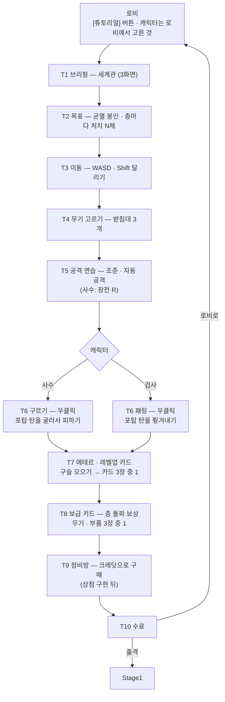

# 튜토리얼 스테이지 설계

> 작성 2026-09-30 · 성격: **설계 제안** (구현 전)
>
> 요청: "간단한 튜토리얼 및 개연성(간단한 세계관 설명 및 목표 제시)을 보여 주는 스테이지도 있으면 좋겠다.
> 튜토리얼 버튼(테스트 룸으로 들어가듯이)으로 들어가면 튜토리얼을 진행.
> 흐름: 세계관 설명 → 목표 제시 → 소총 or 무기 선택해서 공격 연습 → 구르기 or 패링 연습 → 업그레이드 카드 설명 및 정비방 설명"
>
> 관련 문서:
> - [SF-세계관-설정.md](SF-세계관-설정.md) — 대사에 쓰는 설정 · 용어 (차원 균열 · 에테르 · 보급 · 정비)
> - [상점-재화-설계.md](상점-재화-설계.md) — 정비방(상점)
> - [무기-커스터마이징-조사.md 12장](무기-커스터마이징-조사.md#12-한-판의-흐름--커스터마이징이-들어가는-자리) — 한 판의 흐름
> - [캐릭터-2종-확장-설계.md](캐릭터-2종-확장-설계.md) — 사수 구르기 · 검사 패링
> - [무기-테스트룸-구현계획.md](무기-테스트룸-구현계획.md) — 튜토리얼이 그대로 따를 테스트 룸 구조

---

## 0. 한눈에

- 로비의 **"튜토리얼" 버튼**으로 들어가는 전용 씬. **테스트 룸과 같은 방식**이다
  - 씬이 자기 플레이어를 만든다. 진행 중인 판의 플레이어는 숨겼다가 되돌린다
- 요청한 흐름은 그대로 살리고 **세 가지를 고친다**
  1. **이동 단계를 넣는다** — 흐름에 빠져 있었다
  2. **"무기 선택 · 구르기 or 패링"은 로비에서 고른 캐릭터가 정한다** — 검사는 총을 못 들고, 두 회피가 같은 키다
  3. **카드를 두 종류로 나눠** 보여 준다 — 레벨업(튜닝) 카드와 스테이지 보상(보급) 카드
- **공격이 자동**이라는 것을 반드시 알려 준다. 모르면 "클릭해도 안 쏜다"고 느낀다
- 정비방(상점)은 아직 제안 단계다. **상점이 생기기 전에는 설명 한 화면**, 생긴 뒤에 실제로 사 보게 한다
- 끝나면 **[출격 — Stage1] / [로비로]**. 튜토리얼에서 바로 실전으로 이어진다
- 3 ~ 5분. 죽지 않고, 언제든 건너뛸 수 있다
- **기존 스크립트는 고치지 않는다.** 필요한 신호(구르기 · 패링 · 레벨업 · 카드 선택)는 모두 이미 공개돼 있다 (7장)

---

## 1. 요청한 흐름 검토

| # | 요청한 단계 | 판단 | 고친 점 · 이유 |
|---|---|---|---|
| 1 | 세계관 설명 | **유지 · 짧게** | 3화면 이내, 건너뛰기 가능. 긴 글은 읽지 않고 넘긴다. **관제 AI** 가 말하는 형식으로 |
| 2 | 목표 제시 | **유지 · 두 층으로** | 최종 목표(균열 봉인 = 보스)와 **당장의 목표(층마다 처치 N체)** 를 함께. HUD 처치 진행 바를 이때 보여 준다 |
| — | (없음) | **추가: 이동** | WASD · Shift 달리기(스태미나). 다른 모든 단계의 전제다 |
| 3 | 소총 or 무기 선택 → 공격 연습 | **수정** | 무기는 **캐릭터가 정한다** — 사수는 총, 검사는 근접(검사에게 소총이 나오지 않는 규칙). 받침대 3개에서 고른다. **공격은 자동** · 조준은 마우스. 사수는 장전(R)도 |
| 4 | 구르기 or 패링 연습 | **수정** | "or"를 캐릭터로 정한다 — **사수 = 구르기, 검사 = 패링**. 둘 다 **우클릭**이다. 훈련 포탑이 몬스터 C 의 탄을 쏜다 |
| 5 | 업그레이드 카드 설명 | **둘로 나눈다** | 게임에 카드가 **두 종류**다. ① 레벨업 카드(경험치 → 공통 수치 · 스킬) ② 스테이지 보상 카드(층 돌파 → 무기 · 부품). 섞어 설명하면 헷갈린다. ①은 구슬을 직접 모아 겪게 한다 |
| 6 | 정비방 설명 | **조건부** | 상점은 아직 없다. 구현 전: 설명 한 화면 (또는 뺀다) / 구현 뒤: 튜토리얼 크레딧으로 하나 사 보기 |
| — | (없음) | **추가: 수료 · 출격** | 끝에 "출격(Stage1)" 또는 "로비로". 배운 것을 바로 쓰게 |
| — | (없음) | **추가: 건너뛰기 · 다시 보기** | 두 번째부터는 필요 없다. 단계 건너뛰기 · 튜토리얼 끝내기. 로비 버튼으로 언제든 다시 |

---

## 2. 최종 흐름



| 단계 | 완료 조건 | 시간 |
|---|---|---|
| T1 브리핑 | 대사 3장 넘김 (Space · 클릭) 또는 건너뛰기 | 20초 |
| T2 목표 | 대사 1장 + HUD 처치 진행 바 표시 | 10초 |
| T3 이동 | 바닥 표시 2곳 도착 + 달리기로 스태미나를 조금 쓰기 | 20초 |
| T4 무기 고르기 | 받침대에 들어가 무기 장착 | 15초 |
| T5 공격 연습 | 훈련 표적 3개 파괴 (사수: 장전 한 번 포함) | 40초 |
| T6 회피 | 사수: 포탑이 쏘는 동안 구르기 3번 / 검사: 패링 성공 3번 | 40초 |
| T7 레벨업 카드 | 구슬을 모아 레벨업 → 카드 1장 선택 | 30초 |
| T8 보급 카드 | 보급 카드 1장 선택 | 20초 |
| T9 정비방 | (구현 뒤) 하나 사기 / (구현 전) 설명 1장 | 10 ~ 30초 |
| T10 수료 | 버튼 선택 | — |
| | **합계** | **약 3 ~ 5분** |

---

## 3. 단계별 상세

### T1 · T2 — 브리핑과 목표

- 화면 아래 **대화 상자**. 왼쪽에 관제 AI 아이콘(우주 탐사 GUI 킷 아이콘), 오른쪽 아래 "다음 ▶ / 건너뛰기"
- 브리핑 동안은 움직이지 않는다 (시간 멈춤). ESC 설정창은 그대로 열린다
- T2 에서 HUD 의 **처치 진행 바**를 예시 값(0 / 15)으로 띄우고 테두리를 깜빡여 "여기를 채우면 다음 층"을 보여 준다

### T3 — 이동

- 바닥에 빛나는 원 2개. 하나씩 켜진다
- 두 번째 원은 조금 멀리 두고 "Shift 로 달리면 빠르다 — HUD 의 스태미나를 쓴다"
- 점프(Space)는 가르치지 않는다 — 전투에 거의 쓰지 않는다

### T4 · T5 — 무기 고르기 · 공격

| | 사수 | 검사 |
|---|---|---|
| 받침대 3개 | 소총 · 기관단총 · 샷건 (쉬운 셋) | 검 · 대검 · 창 |
| 공격 설명 | "마우스 쪽을 바라본다. **사거리 안에 적이 들어오면 자동으로 쏜다**" | "사거리 안에 들어오면 **자동으로 벤다**. 가로 · 세로 베기가 번갈아 나온다" |
| 추가 | 탄창이 비면 자동 장전. **R** 로 직접 장전 — 한 번 해 보기 | 장전 없음 |
| 무기 교체 | "무기는 최대 4개. **Q · 마우스 휠**로 바꾼다" — 말로만 (무기가 하나뿐이라) | 같음 |

- 표적 3개는 사거리 밖에 세워 둔다. **다가가야 공격이 시작된다**는 것을 몸으로 알게 한다
- 표적은 부서질 때 **에테르 구슬**을 떨어뜨린다 → T7 에서 쓴다

### T6 — 회피 (캐릭터별)

**훈련 포탑**이 몬스터 C 의 탄(3갈래, 느리게)을 몇 초마다 쏜다. 피해는 아주 작고, 체력이 줄면 곧 채운다 (6장).

| | 사수 — 구르기 | 검사 — 패링 |
|---|---|---|
| 키 | **우클릭** | **우클릭** |
| 설명 | "구르는 동안은 **맞지 않는다**. 쿨타임은 HUD 의 회피 아이콘" | "탄이 닿기 직전에 누르면 **튕겨낸다**. 칼면에 비스듬히 맞으면 비스듬히 튕긴다. 쿨타임 5초" |
| 완료 | 포탑이 쏘는 동안 구르기 3번 | 패링 성공 3번 |
| 보너스 | — | 튕겨낸 탄으로 **포탑 맞히기** — "적의 탄을 되돌려 줄 수 있다" |

- 구르기에는 이미 1.5초 무적이 있다 (`PlayerMove.rollIFrame`) — 설명과 실제가 맞는다
- 패링은 성공할 때 "팅" 소리 · 불똥이 나오므로 따로 표시하지 않아도 알 수 있다

### T7 — 에테르와 레벨업 카드 (튜닝)

1. "적을 쓰러뜨리면 **에테르 구슬**이 떨어진다. 가까이 가면 빨려 온다" — T5 표적 구슬 + 모자란 만큼 더 뿌린다
2. 경험치가 차서 레벨업 → 지금 게임의 **레벨업 카드 창**이 그대로 뜬다 (시간 멈춤)
3. "카드는 **모든 무기**에 적용된다. 전투 중 몇 번이고 나온다"

- 첫 레벨업에 필요한 경험치는 10 이다 (`PlayerStats.expToNextLevel`). 표적 3개 + 추가 구슬로 10을 맞춘다

### T8 — 보급 카드 (스테이지 보상)

1. "층을 돌파하면 사령부가 **보급 캡슐**을 떨어뜨린다. 3개 중 하나를 고른다"
2. 지금 게임의 **스테이지 보상 창**이 그대로 뜬다. 튜토리얼 전용 후보(새 무기 2 + 가진 무기 강화 1)
3. "레벨업 카드는 모든 무기에, 보급은 **무기 하나**를 얻거나 키운다"

- 부품(무기 커스터마이징)이 구현되면 후보에 부품을 하나 넣는다

### T9 — 정비방

| 상점 | 튜토리얼 |
|---|---|
| **구현 전** (지금) | 설명 한 화면: "보급 뒤에는 **정비방**에 들른다 — 모은 크레딧으로 부품 · 무기 · 수리를 산다 (준비 중)" — 또는 이 단계를 뺀다 |
| **구현 뒤** | 튜토리얼 크레딧 20을 주고 상점 창을 연다. 하나 사면 완료. "크레딧은 에테르 구슬을 먹을 때 함께 쌓인다" |

### T10 — 수료

- "준비 완료. 균열 1층으로 강하한다"
- **[출격]**: 튜토리얼에서 고른 무기를 시작 무기로 넘기고 Stage1 시작 (`GameAppManager.SelectWeapon` · `StartGame`)
- **[로비로]**: 캐릭터 · 무기를 다시 고르고 싶을 때
- 수료 기록을 남긴다 (`PlayerPrefs` "Tutorial.Done") — 로비의 첫 실행 권유를 끄는 데 쓴다

---

## 4. 화면 구성 — 한 방에서 차례로

테스트 룸처럼 **방 하나**. 단계가 바뀌면 필요한 것만 나타나고, 바닥 표시가 다음 장소를 가리킨다.

```
 ┌─────────────────────────────────────────────────────┐
 │  [정비방 터미널]                        [출격 게이트] │
 │                                                     │
 │   ③ 회피 구역                 ② 사격장              │
 │   (훈련 포탑)                  (훈련 표적 3개)       │
 │                                                     │
 │   ① 착륙 지점 · 이동 표시 ○ ○      무기 받침대 ▣▣▣  │
 └─────────────────────────────────────────────────────┘

  화면: 왼쪽 위 = 지금 목표 ("표적 파괴 1 / 3")
        아래 가운데 = 관제 AI 대화 상자
        오른쪽 아래 = [다음 ▶] [건너뛰기]
```

- 다음 장소로 가는 동안에는 **바닥 화살표**만 켠다 — 글보다 빨리 읽힌다
- 가르치는 HUD(스태미나 · 쿨타임 아이콘 · 처치 진행 바)는 그 단계에서 **테두리를 깜빡인다**

---

## 5. 대사 초안 — 관제 AI

설정은 [SF-세계관-설정.md](SF-세계관-설정.md) 의 **A. 차원 균열** 기준이다. 대괄호는 자리표시다.
설정이 바뀌면 **T1 · T2 대사만** 고치면 된다.

| 단계 | 대사 |
|---|---|
| T1-1 | "조종사, 들리나. 여기는 관제 AI [이름]. [행성] 광산 최하층에 **균열**이 열렸다." |
| T1-2 | "균열에서 새어 나온 에너지 **에테르**가 죽은 전사들을 다시 일으키고 있다." |
| T1-3 | "그대는 강화 프레임 **[레인저 / 브레이커]** 의 조종사. 강하 전에 모의 전투실에서 점검한다." |
| T2 | "목표: 균열 1 ~ 3층을 돌파하고, 핵을 지키는 **수호 골렘**을 쓰러뜨려 균열을 봉인하라. 층마다 **망자 N체**를 처치하면 다음 층이 열린다." |
| T3 | "**WASD** 로 이동. 표시된 곳으로. **Shift** 를 누르면 달린다 — 스태미나를 쓴다." |
| T4 | "무기 받침대에 들어가 무기를 고르라. 무기는 최대 4개, **Q · 휠**로 바꾼다." |
| T5 (사수) | "프레임은 **마우스 쪽**을 본다. 사거리 안에 적이 들어오면 **자동으로 쏜다**. 탄창이 비면 자동 장전 — **R** 로 미리 장전할 수 있다." |
| T5 (검사) | "사거리 안에 들어오면 **자동으로 벤다**. 가까이 붙어라." |
| T6 (사수) | "포탑 사격 시작. **우클릭**으로 구르면 그동안은 맞지 않는다." |
| T6 (검사) | "포탑 사격 시작. 탄이 닿기 직전 **우클릭** — 디플렉터로 튕겨낸다. 되돌린 탄은 적을 맞힌다." |
| T7 | "쓰러뜨린 적은 **에테르**를 남긴다. 모으면 프레임 출력이 오르고, **튜닝** 하나를 고를 수 있다. 튜닝은 모든 무기에 적용된다." |
| T8 | "층을 돌파하면 사령부가 **보급 캡슐**을 보낸다. 셋 중 하나 — 새 무기, 또는 가진 무기 강화." |
| T9 | "보급 뒤에는 **정비방**. 에테르와 함께 쌓인 크레딧으로 부품 · 무기 · 수리를 산다." |
| T10 | "점검 완료. 균열 1층으로 강하한다. 행운을." |

- 한 화면 두 줄 이내. 굵게 표시한 **키 · 용어**는 색을 달리한다
- 용어는 세계관 문서 용어집을 따른다. "사수 · 검사"를 쓸지 프레임 이름을 쓸지는 그 문서의 결정을 따른다

---

## 6. 실패하지 않게

| 장치 | 내용 |
|---|---|
| 죽지 않는다 | 체력이 30% 아래로 내려가면 채운다 (`PlayerStats.AddHP`). 게임 오버 창을 두지 않는다 |
| 구역 밖 | 시작 위치로 되돌린다 (테스트 룸과 같은 `PlayerMove.ReturnToSafePosition`) |
| 막혔을 때 | 한 단계에서 20초 동안 진척이 없으면 힌트를 다시 띄우고 바닥 화살표를 깜빡인다 |
| 건너뛰기 | 대사 건너뛰기 · **단계 건너뛰기** · **튜토리얼 끝내기** (바로 수료 화면) |
| 설정창 | ESC 설정창은 그대로 — 열면 멈추고 닫으면 이어진다 |
| 다시 보기 | 로비 버튼은 수료 뒤에도 남는다 |
| 첫 실행 권유 (선택) | 로비에 처음 들어오면 "튜토리얼을 먼저 해 보시겠어요?" 한 번 — 수료 기록이 있으면 띄우지 않는다 |

---

## 7. 구현 구조

### 7-1. 테스트 룸을 그대로 따른다

| 테스트 룸 | 튜토리얼 |
|---|---|
| `TestRoomEntry` — 로비 버튼이 씬을 연다 | `TutorialEntry` — 같은 방식 |
| `TestRoomManager` — 자기 플레이어 생성, 진행 중인 판의 플레이어는 숨겼다 복구, 구역 밖 복귀, 나갈 때 정리 | `TutorialManager` — 같은 뼈대 + **단계 진행** |
| `TestRoomDummy` — 부서지지 않는 표적 | `TutorialTarget` — 체력이 있고 **부서지면 에테르 구슬** |
| `TestWeaponPickup` — 받침대 | 그대로 재사용 (캐릭터에 맞는 3종만) |
| `TestRoomSetup` · `CharacterSetup` — 씬을 만드는 도구 | `TutorialSetup` — 같은 방식으로 씬을 만든다 (멱등) |

**새로 만드는 것** (`Scripts/Tutorial/`)

| 파일 | 역할 |
|---|---|
| `TutorialManager` | 세션 + 단계 목록을 차례로 진행 |
| `TutorialStep` (단계마다) | 대사 · 켤 오브젝트 · 완료 조건 |
| `TutorialDialogUI` | 대화 상자 · 다음 · 건너뛰기 |
| `TutorialObjectiveUI` | 왼쪽 위 지금 목표 |
| `TutorialTarget` | 부서지는 표적 → 구슬 |
| `TutorialTurret` | 몬스터 C 의 탄을 쏘는 포탑 |
| `Editor/TutorialSetup` | 씬 · 빌드 목록 · 로비 버튼 |

### 7-2. 완료 조건 — 이미 있는 신호로 판단한다

| 판단 | 쓰는 것 (읽기 · 구독만) |
|---|---|
| 도착 | 플레이어 위치 |
| 달리기 | `PlayerMove.IsSprinting` · `Stamina` |
| 무기 장착 | `GameEvents.OnWeaponsChanged` · `OnWeaponSwapped` |
| 장전 | 손에 든 무기의 `IsReloading` |
| 표적 파괴 | `TutorialTarget` 이 알린다 |
| 구르기 | `PlayerMove.IsRolling` 이 켜지는 순간 |
| 패링 성공 | `ParryController.OnParryResolved(true)` |
| 레벨업 · 카드 선택 | `GameEvents.OnPlayerLevelUp` · `OnUpgradeSuccess` |
| 보급 카드 | 튜토리얼이 `GameEvents.OnStageRewardOpen` 을 보내고 `OnStageRewardApplied` 를 기다린다 |
| 포탑 탄 | `RangedProjectile.Initialize` (몬스터 C 와 같은 탄) |
| 출격 | `GameAppManager.SelectWeapon` · `StartGame` |

→ **기존 스크립트 수정 없이** 만들 수 있다.

### 7-3. 씬에 함께 넣을 것

| 넣을 것 | 이유 |
|---|---|
| 레벨업 카드 창 · `UpgradeManager` · `GameManager` | 레벨업하면 `GameManager` 가 카드 창을 열고 시간을 멈춘다. 테스트 룸에는 없다 |
| 스테이지 보상 창 · `StageRewardManager` + 튜토리얼 전용 후보 풀 | T8 |
| `PoolManager` · `SoundManager` | 테스트 룸과 같다 |
| 적 관리자(`EnemyManager`) · 내비메시 | **넣지 않는다** — 표적 · 포탑으로 충분하다. 실전 연습 웨이브를 넣을 때만 |

- `GameManager` 를 넣어도 괜찮다 — 처치 목표(`StageManager`)가 없으니 스테이지 클리어 · 다음 씬 이동이 일어나지 않는다
- 레벨업 카드 효과는 튜토리얼 플레이어에게만 걸리고, 나갈 때 플레이어와 함께 사라진다

### 7-4. 씬 · 로비 버튼

- 새 씬 `Tutorial.unity` 를 빌드 목록 **맨 끝**(테스트 룸 뒤)에 넣는다
  - 다음 스테이지를 "빌드 순서 + 1" 로 고르는 흐름에 영향이 없다
- 로비 버튼은 두 가지 방법이 있다
  - 테스트 룸 버튼처럼 도구가 로비 씬에 넣는다
  - **설정창처럼 실행 중에 만든다** (`Resources` 프리팹 + 로비에서만 표시) — 추천. 로비 씬 파일을 고치지 않아 병합 충돌이 없다
- 위치: 오른쪽 아래 "테스트 룸" 버튼 위

---

## 8. 단계별 구현 순서

| 단계 | 내용 |
|---|---|
| 1 | 방 · 대화 상자 · 목표 표시 · T1 ~ T5 (브리핑 · 이동 · 무기 · 공격) · T10 수료 |
| 2 | T6 회피 (훈련 포탑, 캐릭터별 분기) |
| 3 | T7 · T8 (레벨업 카드 · 보급 카드) — 두 창을 씬에 넣는다 |
| 4 | T9 정비방 (상점 구현 뒤) · 첫 실행 권유 · (선택) 실전 연습 웨이브 |

1단계만으로도 "세계관 · 목표 · 조작"은 전달된다.

---

## 9. 결정이 필요한 것

| 질문 | 선택지 |
|---|---|
| 세계관 문구 | 차원 균열 설정(추천)으로 확정 / 다른 설정 — T1 · T2 대사만 바뀐다 |
| 캐릭터 | **로비에서 고른 캐릭터를 따른다** (추천) / 튜토리얼 안에서 고른다 / 두 캐릭터 모두 연습 |
| 공격 연습 무기 | 캐릭터별 3종 받침대 (추천) / 시작 무기 하나로만 |
| 카드 설명 | 레벨업 · 보급 **둘 다** (추천) / 레벨업만 |
| 정비방 | 상점 구현 뒤 추가 (추천) / 설명 화면만 먼저 |
| 수료 뒤 | **출격 + 로비로** (추천) / 로비로만 |
| 첫 실행 권유 | 로비 첫 진입 때 한 번 / 버튼만 |
| 관제 AI | 이름 · 말투 · 아이콘 |
| 실전 연습 웨이브 | 넣는다 (적 관리자 · 내비메시 필요) / 뺀다 (추천, Stage1 이 그 역할) |
